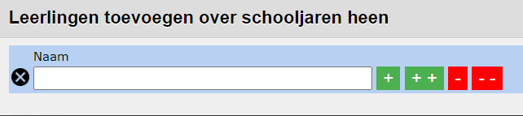

<ImageTitle img="leerlingenrekeningen.png">FAQ leerlingenrekeningen</ImageTitle>

## 1. Kan ik nog een wijziging aanbrengen aan een factuur nadat ik gefactureerd heb?

Zolang de facturen nog niet zijn overgezet naar Exact Online, kan je op leerlingniveau alles nog wijzigen.  Dat doe je als volgt:

Ga naar nota's.
Klik op het potloodje vóór de leerling waarvoor je nog iets wil wijzigen.
Je ziet nu een overzicht van alle artikelen die voor die leerling gefactureerd zijn.
Klik achteraan op het vuilnisbakje om een artikel volledig te verwijderen.
Klik op het potloodje vooraan om aantallen of prijzen te wijzigen.
Klik op de blauwe plus bovenaan om een volledig nieuw artikel toe te voegen.
Indien de facturen digitaal verstuurd zijn, kunnen de ouders via de link in het originele bericht meteen de aangepaste factuur terugvinden.

## 2. Kan ik nog een factuur opmaken voor een leerlingen die reeds is uitgeschreven?
 
Dat kan zeker! Je rekent een artikel aan zoals je dat gewoon bent (via aanrekenen of aanrekenen artikel).

**1e manier - enkel voor leerlingen die in het huidig schooljaar op de school waren ingeschreven**

Je voegt leerlingen toe via  . Standaard staat de datum van vandaag ingevuld. Nu worden enkel de leerlingen getoond die vandaag zijn ingeschreven in de school. Door dit datumveld leeg te maken, krijg je alle leerlingen te zien die dit schooljaar ingeschreven zijn (geweest), dus ook de leerlingen die ondertussen terug uitgeschreven zijn. Je kan zoeken op de naam van de leerlingen door die in te typen in het eerste zoekveld.  De leerling toevoegen doe je met één van de groene plustekens. 

**2e manier - ook mogelijk om leerlingen over de schooljaren heen toe te voegen**

Via deze knop  kan je alle leerlingen zoeken die ooit ingeschreven zijn geweest in de school, dus ook leerlingen die zijn uitgeschreven tijdens één van de vorige schooljaren. Hier kan je enkel zoeken op de naam van de leerlingen. Het volstaat om een deeltje van de naam in te geven en op enter te drukken. De leerling toevoegen doe je opnieuw met één van de groene plustekens. 

## 3. Attesten kinderopvang - Voor leerlingen die uitgeschreven zijn, worden geen leerplichtverantwoordelijken opgehaald.  

Dat klopt! De reden dat we geen juiste relatie kunnen koppelen aan uitgeschreven leerlingen, is omdat we die informatie niet in Toolbox hebben voor de voorbije jaren. Deze informatie komt namelijk pas door sinds de vernieuwing van onze koppeling met Informat. De oplossing om deze informatie toch op te halen, is door in de module Instellingen van Toolbox tijdelijk twee parameters aan te passen:

Instellingen - schooljaar - Schooljaar Informat leerlingen: stel dit in op 2021-22
Instellingen - Informat - Referentiedatum leerlingen: stel dit in op een datum in het schooljaar 2021-22, bv. 05-09-2021
Ga nu naar de module Synchronisatie leerlingen en voer daar de eerste stap ‘Informat uitlezen’ uit.

Pas nu in de instellingen > Informat > Referentiedatum leerlingen aan naar een datum later in het schooljaar, bv. 25-05-2022 en voer opnieuw de eerste stap van de synchronisatie uit.

Nu kan je die datum in de instellingen terug wissen en het schooljaar terug instellen op 2022-23.

NOOT: wijzigingen aanbrengen in de module Instellingen kan alleen door een beheerder. Indien je zelf geen beheerder bent in Toolbox, vraag je dit aan de beheerder van jouw school. 

Je kan de attesten 'zonder relatie' selecteren en in één keer verwijderen. Daarna klik je op de rekenmachine om de ontbrekende attesten opnieuw aan te maken. Normaal gezien zou je nu de attesten mét een relatie zien staan.

Als dat niet zo is, dan moet je mogelijk nog eens synchroniseren in het vorige schooljaar maar met een datum die binnen de loopbaan van die leerling ligt. Je kan die loopbaan makkelijk opvragen door op het leerlingnummer te klikken. Als een leerling bv. slechts een loopbaan heeft van 1/1/2022 tot en met 30/03/2022, dan hebben we die gegevens niet opgehaald. Immers, onze referentiedata lagen buiten deze periode. Als je dan terug synchroniseert met het vorige schooljaar én een datum binnen de loopbaan van die leerling (bv. 3/1/2022), dan zouden we alle informatie moeten hebben.

Als dat toch niet zo is, dan moeten we even nakijken of er iets fout zit in de relaties in Informat.

Volgend jaar zal dit probleem zich overigens niet stellen aangezien we die informatie nu dus reeds hebben.

Mocht dit niet lukken: laat het ons even weten via toolbox@kobavzw.be. We proberen dan zo snel mogelijk te helpen om deze ontbrekende informatie toe te voegen.