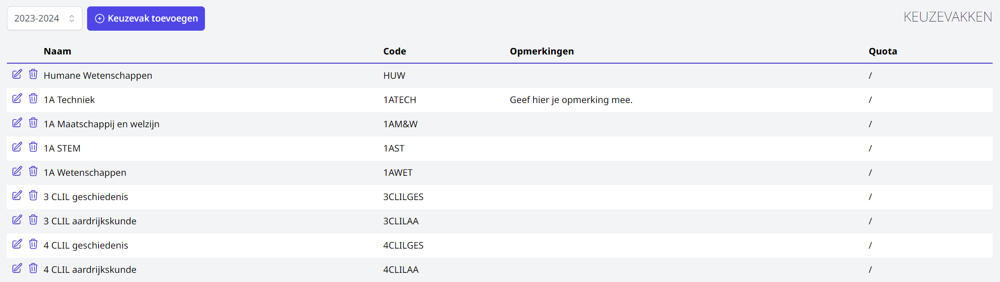

Alvorens te kunnen starten met de module Inschrijvingen moeten er een aantal zaken worden ingesteld. Deze instellingen moeten in principe slechts éénmaal worden geconfigureerd, zolang er geen structurele zaken worden gewijzigd.

## Rechten toekennen aan gebruikers   

Rechten voor een module worden toegekend via de tegel [gebruikersbeheer](/gebruikersbeheer). De gebruikersrechten voor de module Inschrijvingen zijn opgesplitst in 'inschrijvingen beheer' en 'inschrijvingen gebruik'.

Voor de eindgebruiker is 'inschrijvingen gebruik' voldoende. Deze gebruikers kunnen nieuwe inschrijvingen ingeven, thuisinschrijvingen voltooien, eigen leerlingen herinschrijven, de inschrijvingen opvragen en opvolgingsacties toevoegen.

Het 'inschrijvingen beheer' laat toe om een aantal beheerstaken te kunnen uitvoeren, zoals het aanmaken studierichtingen, instellen van quota, toevoegen van documenten, keuzevakken, samenstellen van nieuwe pagina's (zoals het intakeformulier) per studierichting, thuisinschrijvingen aan- en uitzetten, …

## Instelling module
      
Alvorens je aan de slag kan met de module Inschrijvingen moeten er eerst een aantal zaken worden ingesteld in de module Instellingen. Opgelet! Enkel een Toolbox-beheerder heeft toegang tot deze module.

## Keuzevakken aanmaken
 

Via deze weg stel je alle mogelijke keuzevakken in. Selecteer eerst het schooljaar waarvoor je het keuzevak wil toevoegen. Automatisch wordt het schooljaar getoond dat werd ingesteld in de module Instellingen > Inschrijvingen. Dit kan je hier nog wijzigen. Klik vervolgens op 'Keuzevak toevoegen'.  

<Thumbnails img={[
    require('./inschrijvingen_keuzevakken2.png').default, 
]} />

Geef je keuzevak een naam, code en stel eventueel een quota in. Het quota is niet verplicht. 

Het keuzevak is op dit ogenblik nog niet gekoppeld aan een jaar of studierichting. Als een keuzevak slechts in één jaar of richting voorkomt, volstaat het om enkel de naam op te geven. Indien je wil werken met quota en/of een keuzevak komt in meerdere jaren of studierichtingen voor, kan je het jaar of de studierichting in de naam verwerken.

Je hebt ook de mogelijkheid om een opmerking toe te voegen. Deze opmerking wordt getoond tijdens het inschrijvingsproces. Je kan hier relevante info noteren voor de personeelsleden die helpen met de inschrijvingen. 

OPGELET! Indien je werkt met quota telt elke inschrijving mee, ongeacht de studierichting waaraan dit keuzevak gekoppeld is. Wanneer je een keuzevak (bv. CLIL geschiedenis) in meerdere jaren of studierichtingen aanbiedt, maak je per jaar of per studierichting een apart keuzevak aan. 

<Thumbnails img={[
    require('./inschrijvingen_keuzevakken3.png').default, 
]} />

Alle keuzevakken worden per schooljaar getoond in een handig overzicht. Daar zie je de benaming, code, opmerkingen en quota. Je kan een keuzevak wijzigen door vooraan op het potloodje klikken. Een keuzevak kan via het vuilbakje volledig verwijderd worden zolang er nog geen inschrijvingen aan gekoppeld zijn. 

  