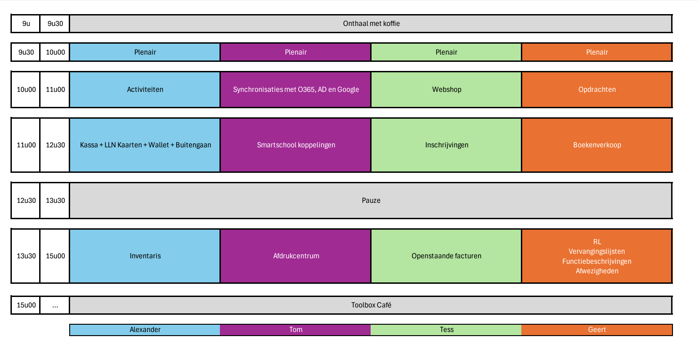

<ImageTitle img="calendar.png">Opleidingskalender</ImageTitle>

Bekijk hier onze aankomende opleidingen. 
Afgelopen webinars kan je steeds onderaan terugvinden alsook in de handleiding van de betreffende module. 

Wil je op de hoogte blijven van ons aanbod aan opleidingen, webinars en van alle nieuwigheden in Toolbox? Houd dan zeker en vast onze nieuwsbrief in de gaten. Ontvang je geen nieuwsbrief? Vraag dan aan je Toolbox-beheerder (terug te vinden in Toolbox via het vraagteken) om jou toe te voegen als contactpersoon in Toolbox. 

Heb je een suggestie voor een Toolbox-opleiding? Laat het ons weten via toolbox@kobavzw.be. 

## Geplande opleidingen en webinars schooljaar 2024-2025

### TOOLBOXDAG 
**Donderdag 7 november** gaat onze Toolboxdag door in Malle. De inschrijvingen hiervoor zijn afgesloten wegens overdonderend succes. 
Alle deelnemers krijgen later nog een mail met hun programma voor die dag. 
We verwachten heel wat collega's, dus het wordt een gezellige drukte. 
Probeer zoveel mogelijk te carpoolen om parkeerproblemen te beperken. 

**Op het programma:**

*Klik op de afbeelding om ze te vergroten.*

Per sessie (tijdsblok) kon je een keuze maken uit 4 verschillende (groepen van) modules. Het is niet verplicht om aan elke sessie deel te nemen. 

#### Sessie 1 van 9u30 - 11u00 (inclusief plenair gedeelte) 

- **Activiteiten** 
Schooluitstappen aanvragen, aanwezige leerlingen aanduiden, onkosten snel en eenvoudig doorrekenen via de leerlingenrekeningen, attesten voor de mutualiteit afleveren,… Het zijn slechts enkele mogelijkheden van onze Activiteitenmodule. We leggen de focus ook op het gebruik van tags die het potentieel van deze module enorm uitbreiden.  
- **Synchroniseren met Office365, ActiveDirectory en Google** 
Accounts aanmaken, up-to-date-houden, … Toolbox kan het allemaal. Tijdens deze sessie tonen we je alle mogelijkheden van onze synchronisatiemodules.  
- **Webshop** 
Maak een online winkeltje voor je vlaaienslag, mosselfeest, schoolfuif, … Je krijgt meteen boter bij de vis door de koppeling met POM (betaalprovider) en de financiële verwerking is een fluitje van een cent door de rechtstreekse koppeling met Exact Online. Deze module heeft het afgelopen jaar enorm geboomd! Zij die het nog niet gebruiken of nog vragen hebben over deze module: welkom!  
- **Opdrachten** 
Een module die je deze periode van het jaar niet zal gebruiken maar die op het einde en het begin van het schooljaar heel wat tijd kan besparen in het leggen van de complexe urenpuzzel: wie geeft welk vak aan welk klas en hoeveel uren heb ik daarvoor nodig?  

#### Sessie 2 van 11u00 - 12u30 

- **Kassa, leerlingenkaarten, wallet en buitengaan** 
Toolbox gebruiken om artikels te verkopen aan leerlingen of personeel? Of de kassamodule gebruiken om het uitleveren van artikels te registreren en nadien aan te rekenen? Het kan perfect!
Combineer dit met de module Leerlingenkaarten uit Toolbox of de digitale leerlingenkaarten uit Smartschool om via de Wallet te betalen of om te registreren wie tijdens de middagpauze buiten mag. We vertellen je er alles over tijdens deze sessie.  
- **Smartschool koppelingen** 
Groepen aanmaken met leraren die lesgeven aan een klas, co-accounts in bulk aanmaken of door een administratief medewerker laten beheren zonder dat die beheerder in Smartschool moet zijn, foto’s uploaden in Smartschool, leraren automatisch aanmaken, co-accounts opvolgen… Het is allemaal mogelijk met Toolbox.  
- **Inschrijvingen** 
Deze module is op enkele jaren tijd zeer volwassen geworden. Niet alleen kan je nieuwe leerlingen inschrijven en rechtstreeks overzetten naar Informat, je kan ook eigen leerlingen opvolgen en leerlingen in klassen indelen. Kom er alles over te weten in deze sessie.  
- **Boekenverkoop** 
Als school de schoolboeken in bulk bestellen en zelf uitleveren aan de leerlingen kan enorm veel geld opleveren. Deze module helpt je bij het hele proces: het opstellen van de boekenlijsten, het registreren van de bestellingen, het opvolgen van het uitleveren en het maken van de facturen. Deze module kan het allemaal!  

#### Sessie 3 van 13u30 - 12u30 
- **Inventaris** 
Heel wat scholen zijn ondertussen aan de slag met de Inventarismodule. Tijdens deze sessie geven we je wat tips en tricks om nog meer uit deze module te halen. Ook de vernieuwde koppeling met Signpost M4S komt aan bod waardoor het opvolgen en doorrekenen van herstellingen een pak eenvoudiger wordt. Aangezien er in deze module ook heel wat mogelijkheden zijn tot financiële verwerking, is deze sessie zeker ook interessant voor personen die leerlingenrekeningen maken of voor boekhoudkundig medewerkers.  
- **Afdrukcentrum** 
Onze gratis tegenhanger van het Smartschool afdrukcentrum: we geven je graag een overzicht van de mogelijkheden en de koppelingen die mogelijk zijn.  
- **Openstaande facturen** 
Geen nieuwigheden in deze module maar wel een stevige opfrissing en een heel pak nuttige tips om je facturen vlot op te volgen.  
- **RL, vervangingslijsten, functiebeschrijvingen, afwezigheden**
Een hele reeks aan modules passeert tijdens deze sessie de revue. De must-see voor elke personeelsverantwoordelijke.  

#### Toolbox café vanaf 15u00
We sluiten de dag af met de interessantste sessie: het Toolbox café. Bij een hapje en een drankje kan je al je vragen stellen aan de Toolbox cafébazen. 

**Waar:** KOBA - Nooitrust 4 - 2390 Malle  
**Doelgroep:** ICT'ers, administratief medewerkers, boekhouders, medewerkers personeelsadministratie, directeurs ... IEDEREEN WELKOM!  

### WEBINAR en HANDS-ON SESSIE Fiscale attesten kinderopvang
Ouders kunnen belastingsvermindering krijgen voor uitgaven voor kinderopvang buiten de normale schooluren en dit tot de 14de verjaardag van het kind. In het onderwijs gaat dat voornamelijk om uitgaven voor naschoolse opvang, middagtoezicht en (facultatieve) reizen die plaatsvinden in weekends en tijdens schoolvakanties. Scholen moeten hiervoor een attest uitreiken aan de ouders. Dit attest moet eveneens digitaal via Belcotax-on-web bezorgd worden aan de fiscus.

Kom in de webinar te weten hoe je fiscale attesten voor kinderopvang maakt in Toolbox. Heb je na de webinar nog graag wat extra uitleg of ondersteuning bij het opmaken van de fiscale attesten? Sluit dan aan bij de hands-on sessie die doorgaat in Malle. Tijdens deze sessie staan we je bij met raad en daad terwijl jij de fiscale attesten opmaakt. Om aan de hands-on sessie te kunnen deelnemen, is het noodzakelijk om vooraf de webinar te bekijken. Onze webinars worden steeds opgenomen en na afloop gepubliceerd in de handleiding. Als je de webinar niet live kan volgen, kan je die achteraf dus nog herbekijken. 

- Wanneer: 
    - Webinar: dinsdag 10 december 2024 om 10u
    - Hands-on sessie: donderdag 9 januari 2025 om 9:30u 
- Waar: 
    - Webinar: Online
    - Hands-on sessie: KOBA - Nooitrust 4 - 2390 Malle 
- Voorkennis: 
    - Webinar: basiskennis van de module Leerlingenrekeningen vereist
    - Hands-on sessie: De webinar live hebben gevolgd of achteraf de opname bekeken hebben 
- Doelgroep: administratief en boekhoudkundig medewerkers die verantwoordelijk zijn voor het opstellen van de fiscale attesten voor kinderopvang
- Duur: 
    - Webinar: +/- 1u à 1,5u
    - Hands-on sessie: We helpen je zo lang als nodig is. 
- Inschrijven noodzakelijk door te klikken op de bijhorende link:
    - webinar: [inschrijflink **webinar** Fiscale attesten kinderopvang](https://events.teams.microsoft.com/event/4aea1f15-5ab9-4e01-9432-40f730df3a57@1e34ee9c-f746-42e1-8f41-f79f0a6a678d)
    - Hands-on sessie: [inschrijflink **hands-on sessie** Fiscale attesten kinderopvang](https://www.kobavzw.be/events_subscription.php?EVENT_KEY=K?934AB$1716452787M?Q7872546171)

### OPLEIDINGEN Module Leerlingenrekeningen

#### Basisopleiding Leerlingenrekeningen 

   Leer van A-Z de kneepjes van het factureren in Toolbox. Volgende topics komen aan bod: Synchroniseren met Informat, artikelen beheren, schoolinstellingen wijzigen, factureren, crediteren, importeren uit andere programma's, openstaande facturen opvolgen. De opleiding is inhoudelijk anders voor basisonderwijs dan voor secundair onderwijs. Let bij het inschrijven dus op dat je de juiste opleiding kiest. 
    - Beschikbare data:  
        - Dinsdag **4 februari 2025** voor **basisonderwijs** - [Klik op deze link om in te schrijven](https://www.kobavzw.be/events_subscription.php?EVENT_KEY=K?934AB$1716452915M?Q5192546171)
        - Donderdag **6 februari 2025** voor **secundair onderwijs** - [Klik op deze link om in te schrijven](https://www.kobavzw.be/events_subscription.php?EVENT_KEY=K?934AB$1716453272M?Q2723546171)
    - Waar: KOBA - Nooitrust 4 - 2390 Malle 
    - Doelgroep: nieuwe medewerkers leerlingenrekeningen - geen voorkennis vereist 
    - Duur: dagopleiding (van 9:00u - 16:00u) met broodjeslunch 
    - Vooraf inschrijven vereist door te klikken op de link bij de gewenste datum. 

#### Herhalingsopleiding Leerlingenrekeningen 

    Je hebt de basisopleiding reeds gevolgd en bent al bekend met de module Leerlingenrekeningen. In deze opleiding worden een aantal zaken uit de basisopleiding opgefrist, met de focus op de meest efficiënte en correcte werkmethode. Ook de module Openstaande facturen komt daarbij aan bod. De opleiding is inhoudelijk anders voor basisonderwijs dan voor secundair onderwijs. Let bij het inschrijven dus op dat je de juiste opleiding kiest. 

    - Beschikbare data:  
        - Dinsdag **4 februari 2025** voor **basisonderwijs** - [Klik op deze link om in te schrijven](https://www.kobavzw.be/events_subscription.php?EVENT_KEY=K?934AB$1716453141M?Q1413546171)
        - Donderdag **6 februari 2025** voor **secundair onderwijs** - [Klik op deze link om in te schrijven](https://www.kobavzw.be/events_subscription.php?EVENT_KEY=K?934AB$1716453343M?Q3433546171)
    - Waar: KOBA - Nooitrust 4 - 2390 Malle 
    - Voorkennis: basiskennis van de module Leerlingenrekeningen vereist 
    - Duur: halve dag telkens van 9:00u - 12:30u
    - Vooraf inschrijven vereist door te klikken op de link bij de gewenste datum. 

## Recente webinars

### WEBINAR Inventaris: organisatie opstart schooljaar
Maak je gebruik van de module Inventaris om de administratie van Digisprong op te volgen? Met de opstart van het schooljaar staat er weer heel wat te gebeuren:

- Nieuwe leerlingen en leraren ontvangen een toestel van de school.
- Contracten worden opgemaakt en ondertekend.
- Waarborgfacturen worden opgesteld.
- (Periodieke) huurbedragen worden aangerekend.  

Herbekijk hier de webinar van 20 juni 2024.

<Youtube url="https://www.youtube.com/embed/fRLeYLWoYvQ"/>

### WEBINAR Inventaris: organisatie einde schooljaar
Heb je het voorbije schooljaar gebruik gemaakt van de module Inventaris om de administratie van Digisprong op te volgen? Je hebt bv. toestellen toegewezen aan leerlingen en/of personeel. Dan staat er - met het einde van het schooljaar in zicht - in deze module weer heel wat te gebeuren. Binnenkort leveren bepaalde leraren en leerlingen hun toestel in en moet er administratief heel wat afgehandeld worden:
- Contracten moeten worden stopgezet.
- Eventuele schade wordt vastgesteld.
- Herstellingen worden geregistreerd en al dan niet doorgerekend aan de gebruiker.
- Waarborgen worden gecrediteerd.

Herbekijk hier de webinar van 13 juni 2024.

<Youtube url="https://www.youtube.com/embed/J0-ujbDxxgY"/>

### WEBINAR Opdrachten

Kom in deze webinar alles te weten over de gloednieuwe module **Opdrachten**. Deze module laat toe om op een eenvoudige manier een verdeling te maken van de (les)uren voor het nieuwe schooljaar in het **secundair onderwijs**. Je start met het aanmaken van klassen en groepen. Daaraan koppel je de nodige vakken en bepaal je per vak het aantal in te richten (les)uren. Vervolgens koppel je aan elk uur de gewenste leraar. 

In deze module is het eveneens mogelijk om heel wat info te verzamelen over de leraar m.b.t. diens opdracht, zoals eventuele verloflofstelsels en vastbenoemde uren. Daarnaast wordt er bij het toewijzen van de lesuren automatisch gepondereerd, waardoor je eenvoudig kan opvolgen hoeveel uren er nog toegewezen moeten worden aan een bepaalde leraar. Ook de niet-gesubsidieerde uren (plage- en nuluren) kan je via deze module toekennen. 

Naast het toewijzen van de lesopdrachten aan de titularissen, kan je ook uren doorschuiven naar vervangers. Via de individuele personeelsfiches behoud je steeds het overzicht over wie welke les effectief zal geven en hoeveel uren een personeelslid al toegewezen heeft gekregen.

In het onderdeel 'Rapportage' heb je toegang tot heel wat bruikbare informatie zoals een overzicht van alle ingerichte uren, alle uren waarvoor nog geen leraar gevonden is, de leraren per klas, ... Daarbovenop kan je ook exports maken richting andere software. 

Herbekijk hier de webinar van donderdag 18 april 2024.

<Youtube url="https://www.youtube.com/embed/NeD0so2ouP0"/>

### WEBINAR Inschrijvingen 
Met behulp van de module [Inschrijvingen](/inschrijvingen) kan je nieuwe leerlingen voor je school inschrijven of je bestaande leerlingen herinschrijven voor het nieuwe schooljaar. Deze module werd ontwikkeld om op een eenvoudige manier en op maat van de school de nodige gegevens van de leerling te verzamelen. Het uitgangspunt is dat deze module wordt gebruikt door verschillende personeelsleden (leraren) die komen helpen bij de inschrijvingen, maar geen toegang hebben tot het administratief pakket. 

Deze module biedt de mogelijkheid om te werken met thuisaanmeldingen, kan de eID van de leerling inlezen, houdt rekening met maximumcapaciteiten en laat ook zien welke documenten de leerling moet meekrijgen voor de studierichting waarvoor hij/zij inschreef. In het geval van een weigering (geen plaats meer in de gewenste studierichting), kan meteen een weigeringsattest afgeleverd worden.

De school kan eigen pagina's samenstellen volgens het principe van Forms om zo de gewenste gegevens van de leerling op te vragen. Deze pagina's kunnen volledig op maat van de school worden ingesteld met tekstvelden, checkboxen, ja/nee-velden, verplichte en niet-verplichte velden,… en vormen zo een volwaardige vervanger voor het intakeformulier.

Dankzij de koppeling met Informat kunnen de gegevens van de leerlingen met een druk op de knop worden ingelezen in het administratief pakket.

Herbekijk hier de webinar van donderdag 11 januari 2024.

<Youtube url="https://www.youtube.com/embed/IR0RwlyWsSQ"/>

### WEBINAR Fiscale attesten kinderopvang
Ouders kunnen belastingsvermindering krijgen voor uitgaven voor kinderopvang buiten de normale schooluren en dit tot de 14de verjaardag van het kind. In het onderwijs gaat dat voornamelijk om uitgaven voor naschoolse opvang, middagtoezicht en (facultatieve) reizen die plaatsvinden *in weekends en tijdens schoolvakanties*. Scholen moeten hiervoor een attest uitreiken aan de ouders. Dit attest moet eveneens digitaal via Belcotax-on-web bezorgd worden aan de fiscus. 

Herbekijk hier de webinar van dinsdag 19 december 2023.

<Youtube url="https://www.youtube.com/embed/0RT98-WFmhA"/>

### WEBINAR Onkosten <Text color="green">(NIEUWE MODULE)</Text>

Maak kennis met de gloednieuwe onkostenmodule. Deze module is een aanvulling op de modules Fietsvergoeding en Openbaar vervoer en stelt personeelsleden in staat om ook hun terugbetaling van onkosten voor dienstverplaatsingen en eigen aankopen digitaal aan te vragen. Het gebruik van deze module is een must-have om correcte fiscale attesten voor personeelsleden te kunnen afleveren. 

Herbekijk hier de webinar van donderdag 30 november 2023.

<Youtube url="https://www.youtube.com/embed/8IpTae6CyTs"/>

### WEBINAR Openstaande facturen

De module [Openstaande facturen](/openstaande_facturen) biedt de mogelijkheid om onbetaalde schoolrekeningen op te volgen nadat ze verwerkt zijn in de module Leerlingenrekeningen. Vanuit deze module kunnen herinneringen verstuurd worden naar de ouders (via mail, smartschool of per brief). Per leerling kan men opvolgingsacties, (af)betalingsregelingen en bijkomende informatie registreren. De synchronisatie met Exact Online (boekhoudpakket) maakt het mogelijk om steeds met actuele boekhoudkundige gegevens te werken zonder dat er een account voor EOL nodig is. In deze webinar wordt de module van A tot Z toegelicht. 

Herbekijk hier de webinar van donderdag 16 november 2023.

Klik [hier](./ppt.pdf) om de powerpoint te raadplegen die gebruikt werd tijdens de webinar. 

<Youtube url="https://www.youtube.com/embed/BQG5s6uKPQI"/>

### WEBINAR Webshop 

Via deze module is het mogelijk om één of meerdere webshops aan te maken. In elke webshop kan je artikels beschikbaar stellen voor verkoop en voorzien van toepasselijke teksten en afbeeldingen. Bovendien is het mogelijk om tijdvakken in te stellen bv. voor de afhaling van een bestelling. Dankzij de koppeling met Exact Online kunnen betaalde bestellingen overgezet worden met één druk op de knop. Ze worden tevens automatisch afgepunt.

Herbekijk hier de webinar van dinsdag 19 september 2023.

<Youtube url="https://www.youtube.com/embed/lkp0GUcc8F4"/>

### WEBINAR Activiteitenmodule

Maak kennis met onze gloednieuwe module [Activiteiten](/activiteiten). Via deze module kunnen leraren op een eenvoudige manier uitstappen of activiteiten aanvragen voor bepaalde klassen. Dit verloopt via een goedkeuringsflow waarbij de aanvraag terecht komt bij één of meerdere goedkeurders. Leraren kunnen bij de aanvraag heel wat informatie opgeven, waaronder de klas(sen), begeleidende leraren, lesuren die wegvallen, kostprijs van de uitstap,... Daarenboven kan men ook registreren welke leerlingen effectief hebben deelgenomen. 

Dankzij een rechtstreekse koppeling met de module Leerlingenrekeningen is het mogelijk om een goedgekeurde activiteit te importeren waardoor die niet meer manueel moet worden aangemaakt. De aanrekening krijgt meteen de juiste titel (naam van de activiteit) en kostprijs per leerling mee. De uitstap wordt bovendien enkel aangerekend aan de leerlingen die effectief hebben deelgenomen. Per uitstap worden er eveneens automatisch attesten voor de mutualiteit gegenereerd. 

Begeleidende leraren en deelnemende klassen zijn onmiddellijk na goedkeuring van de aanvraag zichtbaar in de modules [Vervangingslijsten](/vervangingslijsten) en [Afwezigheden](/afwezigheden/afwezigheden/) waar eventueel een vervangende leraar gekoppeld kan worden. Leraren die vrijkomen omwille van de afwezigheid van een klas, worden getoond als 'beschikbaar' en kunnen ingezet worden als vervanger. 

Aan de hand van een volledig overzicht kan de directie, administratie en/of boekhouder de activiteiten mee opvolgen.

Herbekijk hier de webinar van donderdag 14 september 2023.

<Youtube url="https://www.youtube.com/embed/AlygYE6E5oI"/>

### WEBINAR (Mijn) Afwezigheden/ Vervangingslijsten/ Wachten & toezichten/ Digital signage

In het onderwijs ziet geen enkele lesdag er hetzelfde uit. Leraren melden zich ziek, klassen gaan op uitstap, ... Het is soms een hele klus om dit administratief in goede banen te leiden. Toolbox biedt enkele handige tools aan om je hier een handje bij te helpen. Ontdek ze allemaal in de webinar over het registreren en opvolgen van afwezigheden, het organiseren van wacht- en toezichtbeurten en het opmaken van vervangingslijsten. Dit alles komt met tal van communicatiemogelijkheden zoals berichten naar collega's en leerlingen en via digitale schermen. 

Raadpleeg [hier](powerpoint_afwezigheden.pdf) de powerpoint die gebruikt werd tijdens de webinar. 

Herbekijk hier de webinar van vrijdag 23 juni 2023.

<Youtube url="https://www.youtube.com/embed/vxjhXLlep_w" />

### WEBINAR Kassa & Wallet/ Leerlingenkaarten /Buitengaan

Herbekijk hier de webinar van dinsdag 13 juni 2023 i.v.m. de modules Kassa & Wallet gelinkt aan de modules Leerlingenkaarten en Buitengaan. 

<Youtube url="https://www.youtube.com/embed/iA7ukwVDmls" />

### WEBINAR Inventaris

Herbekijk hier de webinar van donderdag 8 juni 2023 i.v.m. de module Inventaris.

<Youtube url="https://www.youtube.com/embed/BvTgHH81QKk" />

 

