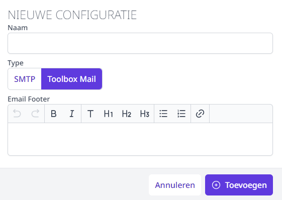
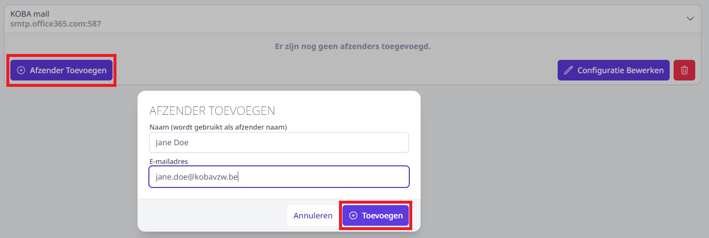
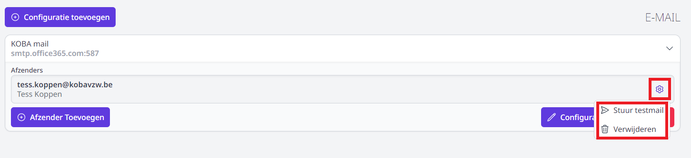

Om de mails te kunnen versturen, moeten de e-mailsettings worden ingevuld in de module Instellingen > E-mail. Deze module is enkel toegankelijk voor Toolbox-beheerders. Om na te gaan wie beheerder is in een Toolbox, klik in het startscherm op het vraagteken rechts bovenaan.

- Geef deze configuratie een naam.
- Kies welk type mail je wil configureren (SMTP of Toolbox Mail).

    - **SMTP**: Vul de SMTP-servergegevens in alsook de gebruikersnaam en het bijhorende paswoord van het account van waaruit je de mails wil versturen.  
    
    <Thumbnails img={[
    require('./email1.PNG').default, 
    ]} />

    - **Toolbox mail**: Deze eenvoudige en veilige manier van mailen moet eenmalig door Toolbox geconfigureerd worden. Neem hiervoor contact op met het Toolbox support team via toolbox@kobavzw.be. Eens de Toolbox mail is ingesteld, volstaat het om een naam in te geven voor deze mailconfiguratie. 

    

- Voeg minimaal één afzender toe. Deze zal je in andere modules (bv. module Activiteiten of Inschrijvingen) kunnen selecteren. 
  - Voor **SMTP** komt de afzender meestal overeen met de account die je voor de configuratie hebt opgegeven. Als je met SMTP werkt, stel je in de meeste gevallen per afzender een nieuwe e-mailconfiguratie in. 
  - Bij het gebruik van de **Toolbox mail** volstaat het om de mail éénmalig te configureren. Vervolgens kan je meerdere afzenders instellen zolang het domein van het e-mailadres overeenkomt met het ingestelde domein. 

 

- Klik achteraan op het tandwiel om een **testmail** te versturen vanuit een afzender. 
- Klik eveneens achteraan op het tandwiel om de **afzender te verwijderen**. 

 