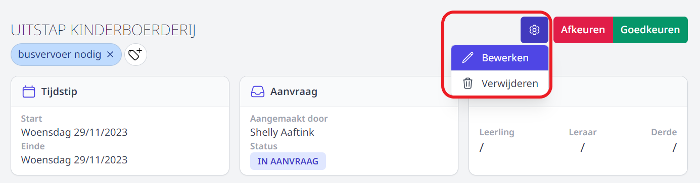
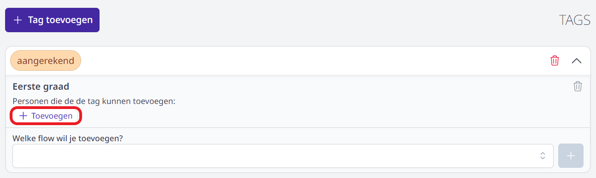

## Gebruikersbeheer

Om aanvragen te kunnen indienen of goedkeuren via de module Activiteiten zijn er **geen bijkomende gebruikersrechten nodig**. Elk personeelslid met toegang tot Toolbox zal deze module kunnen gebruiken op voorwaarde dat ze geactiveerd is. Dat doe je via de module Instellingen => modules.

Om goedkeuringsflows aan te maken, goedkeurders en derden te beheren of een overzicht van alle activiteiten te raadplegen is het gebruikersrecht **activiteiten_beheer** noodzakelijk. Gebruikersrechten kan je toekennen via de module [Gebruikersbeheer](/gebruikersbeheer).

## Goedkeuringsflow aanmaken

Alvorens leraren een activiteit kunnen aanvragen, moet er minimaal één goedkeuringsflow bestaan. Aan zo'n goedkeuringsflow moet minstens één goedkeurder (bv. een directeur) worden gekoppeld. Deze goedkeurder kan optioneel van elke nieuwe aanvraag op de hoogte gebracht worden via e-mail of Smartschool. 

- Ga in de module Activiteiten naar <LegacyAction img="beheer1.PNG"/>.  

- Klik op **Flows** en vervolgens op **Flow aanmaken**. Indien er reeds een flow bestaat, kan je die bekijken en/of aanpassen via het pijltje achteraan <LegacyAction img="PijlOnder.png"/>.

    

- Geef de flow een naam (bv. eerste graad, bovenbouw, kleuterschool, ...) en klik op **Aanmaken**.

    

- Klap de flow open door achteraan op <LegacyAction img="PijlOnder.png"/> te klikken. Je kan een flow volledig verwijderen door op het vuilnisbakje te klikken.

    

- Vul het gewenste **type communicatie** in om een automatisch bericht te versturen bij elke nieuwe aanvraag in de flow. 
    - Indien je berichten wil versturen via Smartschool, selecteer je achteraan het gewenste Smartschoolplatform. Dit platform moet ingesteld zijn in de module **Instellingen** => Smartschool. 
    - Om te kunnen versturen via e-mail, moeten de e-mailinstellingen ingevuld zijn in de module **Instellingen** => [E-mail](/e-mail/). Ook de afzenders kan je in die module aanmaken. De mail wordt verstuurd naar het e-mailadres dat voor het personeelslid is opgegeven in het administratief pakket (Infomat/Wisa). In eerste instantie wordt dat van het type 'school' genomen. Als dat ontbreekt, zal het privé of domicilie e-mailadres gebruikt worden. Klik [hier](/e-mail/) om te lezen hoe je de mail kan configureren.

  

- Voeg één of meerdere **goedkeurders** toe door minimaal 3 karakters in het tekstveld te typen. Vervolgens wordt er een lijst getoond met personeelsleden met deze karakters in hun naam. Uit die lijst kan je de gewenste goedkeurder selecteren. Opslaan is niet nodig, dat gebeurt automatisch. Een goedkeurder hoeft niet noodzakelijk een beheerder te zijn. Lees [hier](/aanvraag_goedkeuren_afkeuren) hoe een goedkeurder een aanvraag kan behandelen. 

    

- Behalve goedkeurders is het ook mogelijk om bijkomende ontvangers in te stellen. Deze personeelsleden kunnen de aanvragen niet goedkeuren, maar worden samen met de aanvrager op de hoogte gebracht van de goedkeuring en dit voor elke goedgekeurde activiteit in de flow (op voorwaarde dat er een communicatietype is ingesteld). Kies voor deze personeelsleden de rol 'Verwittigd bij goedkeuring'. 

    

- De tekst die je ingeeft bij **Omschrijving Sjabloon** wordt standaard getoond bij het starten van een nieuwe aanvraag. In dit veld kan je per wachtrij reeds meegeven wat je verwacht dat de aanvrager hier invult. Je kan eveneens een link toevoegen naar een webpagina door een stukje tekst te selecteren en te klikken op de knop <LegacyAction img="link.PNG"/>. 

    

- Het is mogelijk om alle activiteiten die aanvraagd én goedgekeurd werden via activiteitenmodule weer te geven in een **kalender**. Kopieer daarvoor de beschikbare link in de flow. 

    

    Voor Microsoft ga je naar de Outlook kalender en klik je bij agenda's op 'Agenda toevoegen => Van Internet'. 

    

    Vervolgens verschijnt er een pop-up. In dit veld plak je de link die je kopieerde in de flow van de activiteitenmodule. 

    

## Derden 

Het kan voorkomen dat personen die niet in dienst zijn van de school of niet voorkomen in het administratief pakket (Informat of Wisa) een activiteit mee begeleiden. Denk aan oud-leraren, stagiairs, vrijwilligers, ... 

Als beheerder is het mogelijk om via de knop **Beheer** derden toe te voegen, gegevens van een derde te wijzigen (bv. telefoonnummer of e-mailadres) of die volledig te verwijderen.

Een aanvrager zonder beheersrechten kan vervolgens de derde selecteren bij het toevoegen van een activiteit. Wanneer de derde nog niet is aangemaakt, kan de aanvrager zelf dit ook rechtstreeks in het aanvraagscherm doen. Wanneer de derde is toegevoegd heeft de aanvrager geen machtiging meer om de gegevens van deze derde aan te passen of de derde te verwijderen. Klik [hier](/activiteiten/aanvragen/) meer info over het aanvragen van een activiteit. 

## Activiteiten (overzicht)

Als beheerder kan je **alle** aankomende en afgelopen, goedgekeurde en afgekeurde activiteiten alsook de activiteiten in opmaak raadplegen. Ga hiervoor naar **Beheer => Activiteiten**. De activiteiten zijn chronologisch gerangschikt. Bovenaan kan je eventueel filteren op klas, flow, naam van de activiteit of gekoppelde tag(s).

- Klik op de naam van een activiteit om ze te openen. Via het tandwiel rechts bovenaan kan je de activiteit vervolgens bewerken of verwijderen. Goedkeurders van de flow kunnen via deze weg een ingediende aanvraag ook goed- of afkeuren.
- Klik op de status achteraan om de historiek van de goedkeuringsflow te raadplegen. Bij (voorlopig) afgekeurde activiteiten kan je via deze weg de motivatie voor weigering terugvinden. 

 

## Tags

Het is mogelijk om eigen tags aan te maken. Die tags kunnen per flow en volledig op maat van de school door een beheerder worden ingesteld. Aan elke tag kunnen personeelsleden gekoppeld worden die de tag mogen gebruiken. De tags kunnen doorheen de hele aanvraagprocedure worden toegevoegd of verwijderd. Dit maakt het mogelijk om bepaalde taken m.b.t. de activiteit (bv. aanvraag busvervoer, controle preventie, aangerekend in de leerlingrekeningen...) eenvoudig op te volgen. In het overzicht van alle activiteiten kan er gefilterd worden op één of meerdere tags. 

- Om de tags aan te maken of te bewerken, ga je naar **Beheer => Tags** en klik op **Tag toevoegen**.

    

- Geef de tag een naam, kies een kleur en klik op **Toevoegen**. 

    <Thumbnails img={[
        require('./tag2.png').default, 
    ]} />

- Open de tag met het pijltje <LegacyAction img="PijlOnder.png"/> achteraan en koppel de goedkeuringsflow(s) waarin je deze tag beschikbaar wil stellen. 
- Selecteer de gewenste flow uit de lijst en voeg die toe met het plusteken achteraan. 
- Het is mogelijk om op deze manier meerdere flows te koppelen. De tag zal enkel in de gekoppelde flow(s) gebruikt kunnen worden.

    

- Voeg per gekoppelde flow de persoon of groep toe die de tag moet kunnen gebruiken. Je kan kiezen uit 'Iedereen', 'Flow beheerders', of een specifiek personeelslid. Indien je kiest voor een specifiek personeelslid, moet je in een volgende stap het personeelslid selecteren uit een lijst. Je kan ook meerdere groepen en/of personeelsleden toevoegen. 

    
    
   
