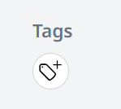
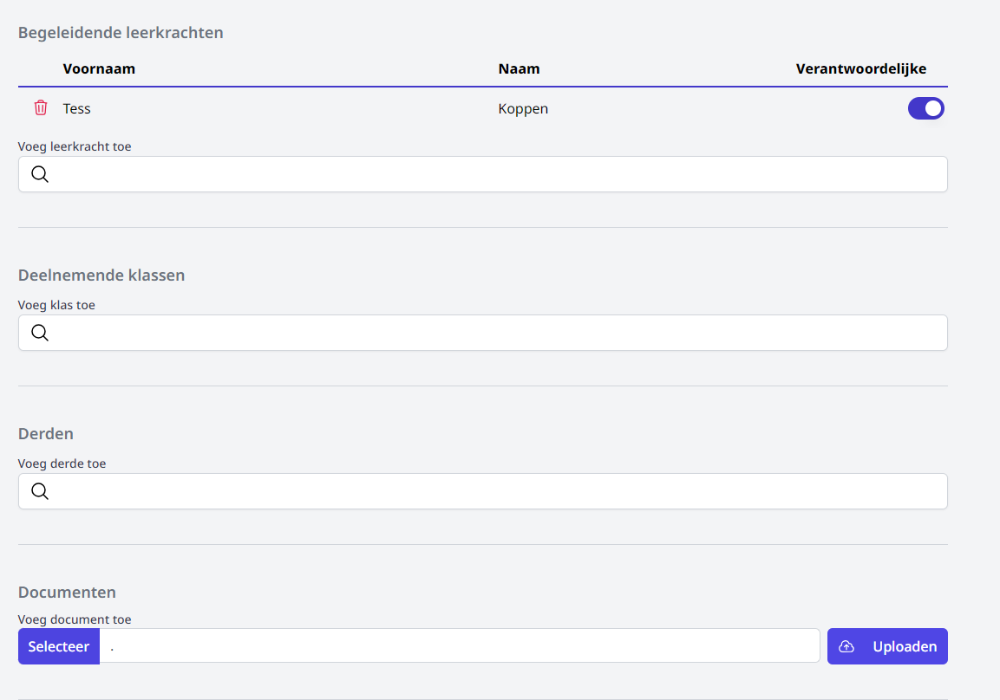
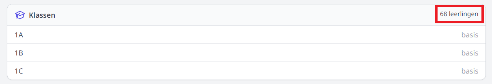
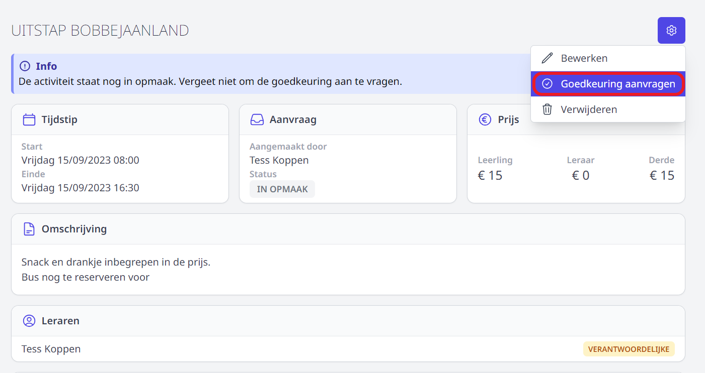
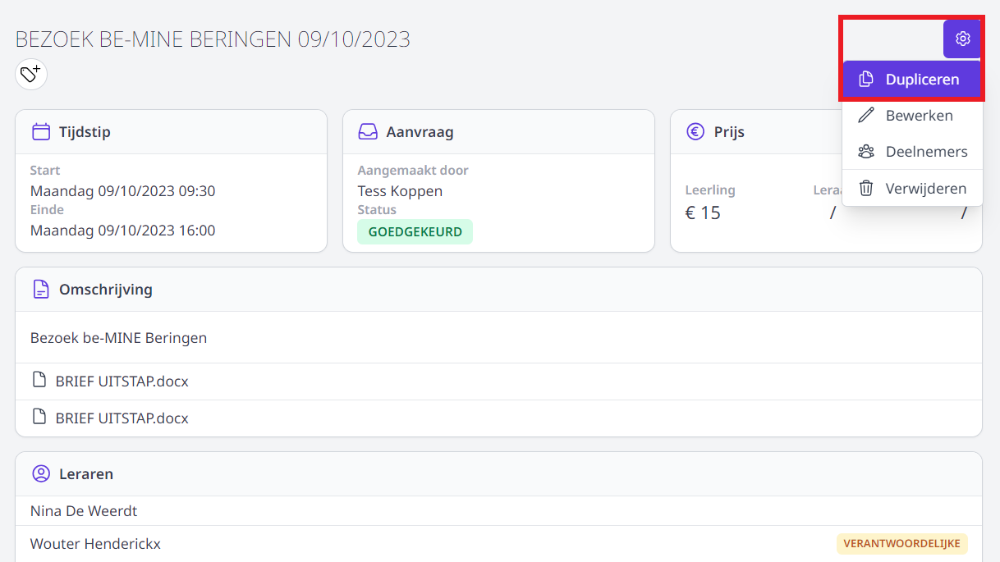

Bekijk hier de instructievideo i.v.m. het aanvragen en opvolgen van een activiteit. Onder de video vind je meer tekst en uitleg.

<Youtube url="https://www.youtube.com/embed/cLpQIccHMgM" />

## 1. Activiteit toevoegen

Klik  op **Activiteit toevoegen** om een nieuwe activiteit aan te vragen.

Vul minimaal alle velden met een * in en selecteer een flow. Indien er geen flow beschikbaar is, kan er geen activiteit aangevraagd worden. Neem in dat geval contact op met de persoon die de activiteiten op school moet goedkeuren. 

De wegvallende lesblokken worden enkel getoond indien de module [Lessenrooster](/lessenrooster) gebruikt wordt. Hier kan je aangeven over welke lesuren de activiteit zich verspreid. Standaard worden alle lesblokken aangeduid als 'vallen weg'. Begeleidende leraren en deelnemende klassen zijn vervolgens onmiddellijk na goedkeuring van de aanvraag zichtbaar in de modules [Vervangingslijsten](/vervangingslijsten) en [Afwezigheden](/afwezigheden/afwezigheden/) waar eventueel een vervangende leraar gekoppeld kan worden. Leraren die vrijkomen omwille van de afwezigheid van een klas, worden getoond als 'beschikbaar' en kunnen ingezet worden als vervanger. 

Klik op **Toevoegen**.

### a. Tags toevoegen

Indien de school werkt met tags (labels horende bij de aanvraag) kan je die toevoegen nadat de activiteit is aangemaakt. In dat geval wordt het volgende icoon getoond. Wanneer de school geen tags gebruikt, wordt het icoon niet getoond en kan je meteen deelnemende klassen en begeleidende leraren toevoegen.  

- Voeg één of meerdere tags toe door op het icoon te klikken.
- Selecteer de gewenste tag(s).

    <Thumbnails img={[
        require('./tag2.png').default, 
    ]} />

### b. Klassen en leraren toevoegen

Nadat de activiteit is aangemaakt, kan je onderaan de begeleidende leraren en klassen toevoegen door te klikken in het tekstveld en enkele karakters uit de naam van de leraar of klas in te typen. 

De aanvrager wordt steeds standaard vermeld als begeleidende leraar. Dit kan eenvoudig ongedaan gemaakt worden door achteraan op de blauwe schuifknop te klikken <LegacyAction img="buttonBlue.PNG"/>. Een begeleidende leraar kan terug verwijderd worden door vooraan op het rode vuilnisbakje te klikken. 
 

Wanneer men een opgeslagen activiteit opnieuw opent, wordt het totaal aantal leerlingen in de toegevoegde klassen getoond. LET OP! Dit is NIET het totaal aantal aanwezige leerlingen. 

### c. Derden toevoegen

Er bestaat ook een mogelijkheid om derden toe te voegen. Dit zijn personen die niet in dienst zijn van de school of niet voorkomen in het administratief pakket (Informat of Wisa). Denk aan bv. een vrijwilliger of stagiair die meegaat als begeleider van een activiteit. Indien de derde reeds werd aangemaakt in de activiteitenmodule, kan die gevonden worden door enkele karakters uit diens naam in te typen. Is de derde nog niet gekend, dan kan je die aanmaken door te klikken dit het tekstveld bij 'derden'. Vul vervolgens minimaal alle velden met een * in en klik op **Aanmaken**. 

<Thumbnails img={[
    require('./aanvraag5.PNG').default, 
]} />

### d. Documenten toevoegen

Tot slot kunnen er nog documenten aan de aanvraag worden toegevoegd. Bv. de begeleidende brief die de ouders meekrijgen of de factuur van de activiteit.

1. Klik op 'Selecteer'.
2. Selecteer het document van op je computer. Nagenoeg alle bestandsformaten zijn toegelaten. 
3. Klik op 'Uploaden'. 
4. Het document wordt erboven toegevoegd. Het kan geopend worden door op de bestandsnaam te klikken en verwijderd worden via het rode vuilnisbakje. 

### e. Aanvraag indienen ter goedkeuring

Wanneer de aanvraag volledig is ingevuld, kan ze ingediend worden ter goedkeuring. Dat kan bovenaan door te klikken op **Goedkeuring aanvragen**. De aanvraag wordt nu verstuurd naar de goedkeurder van de flow. Van zodra deze de activiteit heeft goedgekeurd of afgekeurd, zal de aanvrager hiervan een bericht ontvangen in Smartschool of via mail. Het is ook mogelijk om een notificatie te ontvangen in de browser of op de smartphone. Dit moet per gebruiker apart worden ingesteld door de gebruiker zelf. Lees er hier meer over: [notificaties](/activiteiten/notificaties/).  

## 2. Activiteit dupliceren

Vele activiteiten worden jaarlijks opnieuw georganiseerd. Denk aan een sportdag, bosklassen, ... Voor dergelijke uitstappen is het ook mogelijk om een bestaande activiteit te dupliceren. Open hiervoor de activiteit die je wil dupliceren en klik rechts bovenaan op het tandwieltje en vervolgens op 'dupliceer'. De algemene gegevens worden overgenomen. Alle bijkomende gegevens zoals begeleidende leraren, deelnemende klassen, documenten, ... moeten opnieuw worden toegevoegd.

## 3. Eigen aanvraag opvolgen 

Bij het openen van de module zie je meteen een overzicht van alle toekomstige en alle afgelopen activiteiten die je reeds eerder hebt aangevraagd of waarvoor je werd toegevoegd als verantwoordelijke of begeleider. Ook de status van een activiteit is in één oogopslag duidelijk. Klik op een activiteit om die te openen en eventueel te bewerken. Op deze manier kan je een activiteit met de status 'IN OPMAAK' indienen ter goedkeuring. Ook een goedgekeurde of (voorlopig) afgekeurde activiteit kan achteraf nog gewijzigd worden. Voor een goedgekeurde activiteit kan dat bv. nodig zijn wanneer er een bijkomende begeleider/leraar meegaat. Bij een (voorlopig) afgekeurde activiteit wordt er mogelijk door de goedkeurder nog wat bijkomende informatie gevraagd. Na het wijzigen van de afgekeurde activiteit, kan die opnieuw ingediend worden ter goedkeuring.

:::caution Ter info
Bij een goedgekeurde activiteit kan de **flow** en de **datum waarop de activiteit doorgaat** niet meer worden aangepast. Als dit nodig zou zijn, dien je een volledig nieuwe aanvraag in. Dit kan eventueel door de bestaande activiteit te dupliceren. 
::: 

Door achteraan op de status te klikken, wordt er een historiek getoond. 

<Thumbnails img={[
    require('./aanvraag3.PNG').default, 
]} />

Er zijn verschillende statussen mogelijk:
- **In opmaak**: de leraar is bezig met het opmaken van de activiteit. De aanvraag is nog **niet** ingediend ter goedkeuring.
- **In aanvraag**: De activiteit in ingediend ter goedkeuring. De goedkeurder werd hiervan op de hoogte gebracht via e-mail of Smartschool (indien ingesteld in de goedkeuringsflow). 
- **Goedgekeurd**: De activiteit is goedgekeurd. 
- **Afgekeurd**: Klik op de status om te lezen waarom de activiteit (voorlopig) werd afgekeurd. Open de afgekeurde activiteit om ze te wijzigen. Daarna kan de activiteit opnieuw ingediend worden ter goedkeuring. 

## 4. Deelnemers toevoegen aan een activiteit

Klik [hier](/activiteiten/aanwezigheden/) voor meer info over het registreren van aanwezige deelnemers. 