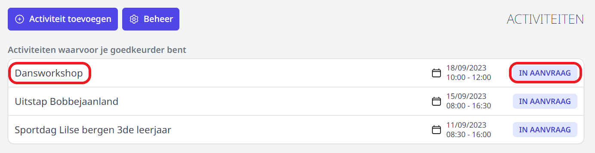
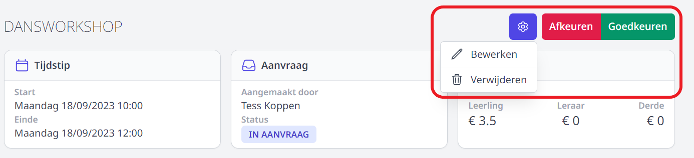

Wanneer een leraar een activiteit heeft aangevraagd, wordt de persoon die de activiteit moet goedkeuren hiervan op de hoogte gebracht via een bericht in Smartschool of via e-mail (afhankelijk van hoe dit is ingesteld in de [goedkeuringsflow](/activiteiten/voorbereiding/#goedkeuringsflow-aanmaken)).

Bij het openen van de module Activiteiten ziet men meteen voor welke activiteiten men goedkeurder is en wat de status is van de aanvraag. Je kan steeds een historiek opvragen door achteraan op de status te klikken. 

- Klik op de naam van een activiteit om de **details van de aanvraag te bekijken** en/of een activiteit 'IN AANVRAAG' goed- of af te keuren. 
- Indien de school gebruik maakt van tags, worden de (door de aanvrager) toegevoegde tags bovenaan weergegeven. 
- Tags kunnen door iemand met rechten op de tag (meer info klik [hier](/activiteiten/voorbereiding/#tags)) worden verwijderd of toegevoegd. Zo kan een tag 'busvervoer nodig' door de verantwoordelijke vervangen worden door de tag 'busvervoer in orde'. 
- Klik rechts bovenaan op het tandwiel om de activiteit te **bewerken of te verwijderen**.
- Klik rechts bovenaan om de activiteit **goed- of af te keuren**. 
Wanneer je een activiteit **afkeurt**, heb je de mogelijkheid om meer info mee te geven. Zo kan het voorkomen dat er bv. info ontbreekt bij de aanvraag. De aanvrager ontvangt vervolgens een bericht van deze beslissing. Daarna kan die de aangevraagde activiteit wijzigen en opnieuw indienen ter goedkeuring.  
Wanneer een activiteit is **goedgekeurd**, ontvangt de aanvrager alsook alle medeverantwoordelijken en eventuele toegevoegde derden een bericht van deze beslissing op voorwaarde dat digitale communicatie werd ingesteld op de flow. 

<Thumbnails img={[
    require('./verwerking3.PNG').default, 
]} />

:::caution Overlappende activiteiten
Er is een **controle** voorzien op overlappende activiteiten. Wanneer leraren of klassen op hetzelfde moment zijn ingepland voor meerdere activiteiten, zal er een melding worden getoond.
:::