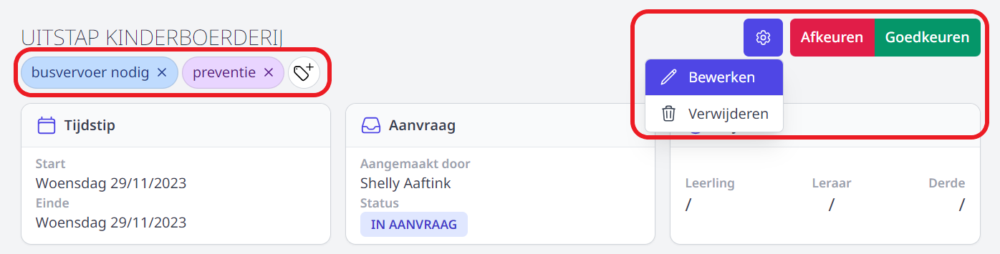

Wanneer een leraar een activiteit heeft aangevraagd, wordt de persoon die de activiteit moet goedkeuren hiervan op de hoogte gebracht via een bericht in Smartschool of via e-mail (afhankelijk van hoe dit is ingesteld in de [goedkeuringsflow](/activiteiten/voorbereiding/#goedkeuringsflow-aanmaken)).

Bij het openen van de module Activiteiten ziet men meteen voor welke activiteiten men goedkeurder is en wat de status is van de aanvraag. Je kan steeds een historiek opvragen door achteraan op de status te klikken. 

- Klik op de naam van een activiteit om de **details van de aanvraag te bekijken** en/of een aanvraag 'IN OPMAAK' goed- of af te keuren. 
- Klik rechts bovenaan op het tandwiel om de activiteit te **bewerken of te verwijderen**.
- Klik rechts bovenaan om de activiteit **goed- of af te keuren**. Wanneer je een activiteit afkeurt, heb je de mogelijkheid om meer info mee te geven. Zo kan het voorkomen dat er bv. info ontbreekt bij de aanvraag. De aanvrager vervolgens ontvangt een bericht van deze beslissing. Daarna kan die de aangevraagde activiteit wijzigen en opnieuw indienen ter goedkeuring.  

<Thumbnails img={[
    require('./verwerking3.PNG').default, 
]} />
