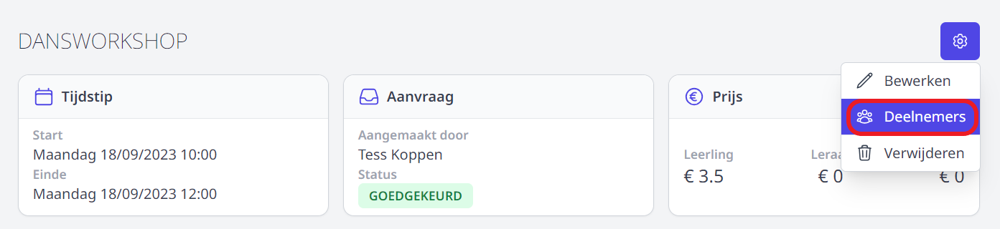
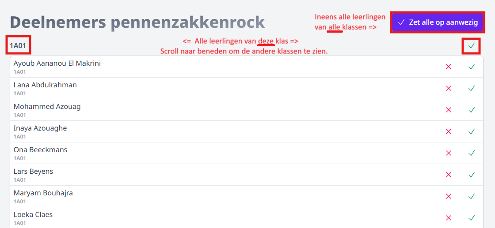
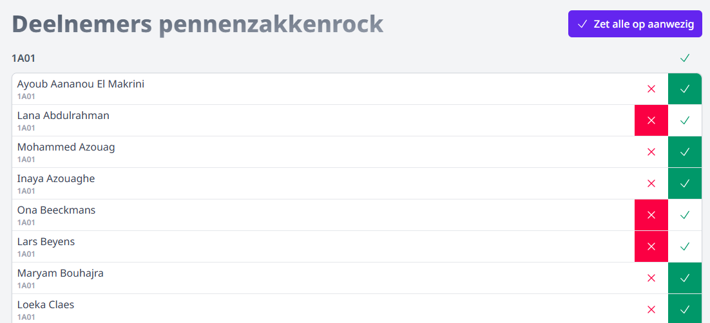

Je kan voor elke activiteit registreren welke leerlingen effectief hebben deelgenomen. Deze gegevens kunnen via een druk op de knop overgenomen worden in de module Leerlingenrekeningen. Op die manier wordt de activiteit automatisch enkel aan de deelnemende leerlingen aangerekend. 

- Open de activiteit om deelnemers toe te voegen. Klik hiervoor in het beginscherm op de naam van de activiteit.
- Klik rechts bovenaan op het tandwieltje en selecteer 'deelnemers'. De leerlingen van de klassen die aan de activiteit gekoppeld zijn, worden getoond. 

- Zet met één klik **alle leerlingen van alle klassen** op aanwezig met behulp van de bovenste blauwpaarse knop of vink de leerlingen één voor één aan. Het is mogelijk om alle leerlingen ineens op aanwezig te zetten en vervolgens één of enkele leerlingen te wijzigen naar afwezig met behulp van het rode kruisje. Opslaan is niet nodig. 

    De deelnemers kunnen ook in bulk **per klas** worden geregistreerd. Gebruik hiervoor het groene vinkje net boven de klaslijst. 

    

    **Het resultaat:**

    

