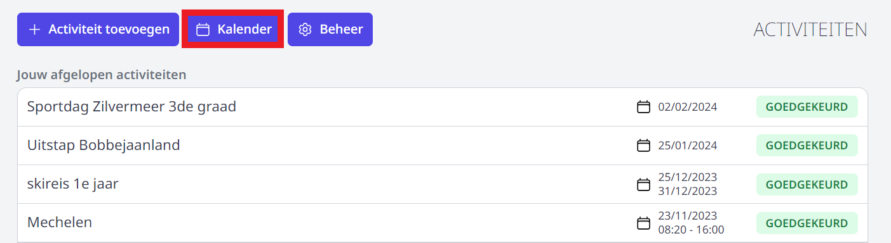
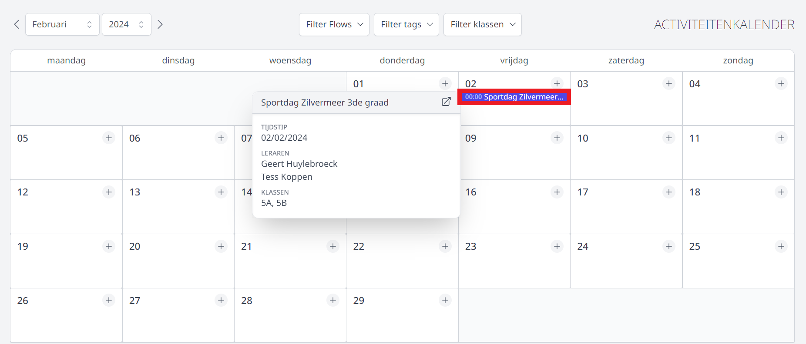
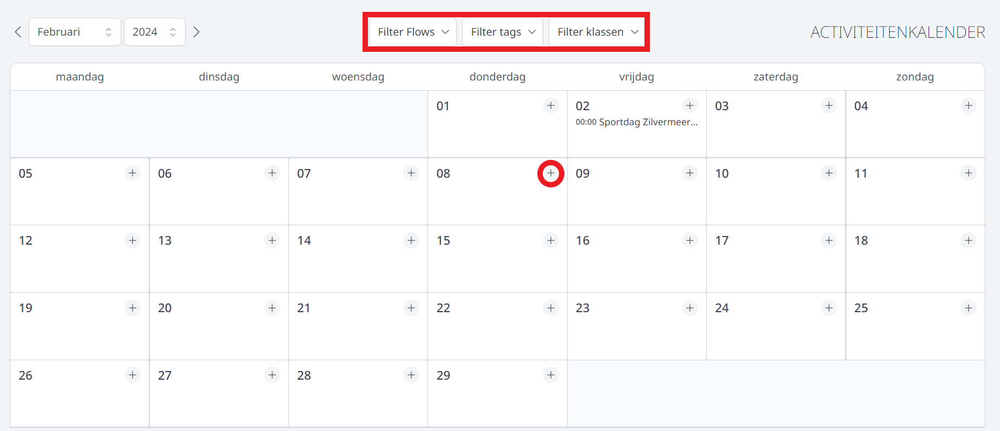

In de activiteitenmodule is een kalender voorzien waarin alle activiteiten per dag worden weergegeven.

Standaard worden alle activiteiten van de huidige maand getoond. 

Door in de kalender op de naam van de activiteit te klikken, worden er meer details weergegeven. 

Om het aantal getoonde activiteiten te reduceren of om een specifieke weergave te bekomen, kan je filteren op **flow, toegevoegde tags of klas(sen)**. 

Het is eveneens mogelijk om alle activiteiten die aanvraagd én goedgekeurd werden via activiteitenmodule weer te geven in een externe kalender zoals die van Google of Outlook. Gebruik hiervoor de link die je terugvindt in de betreffende **flow** bij het onderdeel **Beheer**. Klik [hier](/activiteiten/voorbereiding/#goedkeuringsflow-aanmaken) voor meer info. 