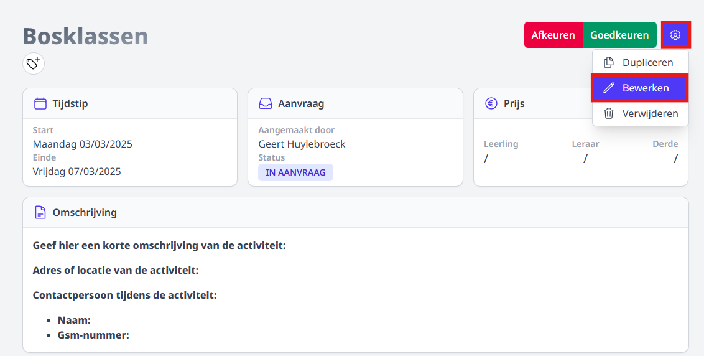
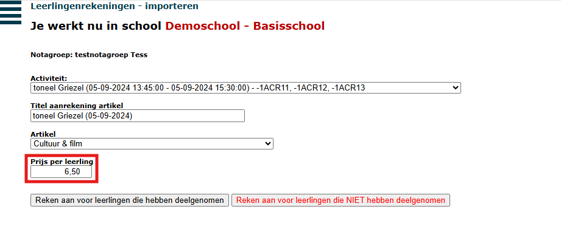
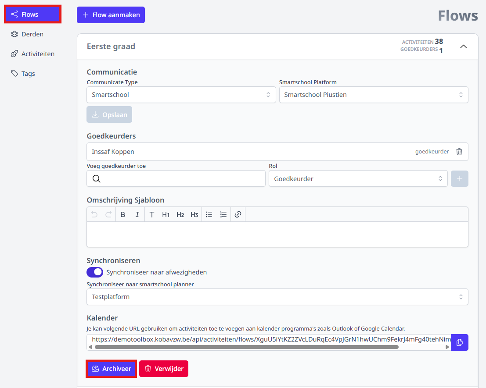
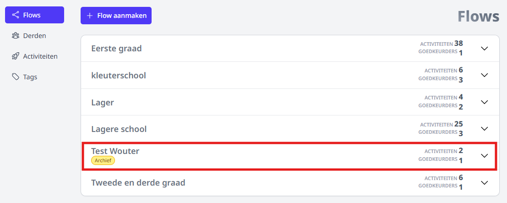

<ImageTitle img="activiteiten.png">FAQ</ImageTitle>

## 1. Kan ik na de goedkeuring van een activiteit de deelnameprijs per leerling nog ingeven of aanpassen?

Dat kan zeker. 

De prijs is geen verplicht veld en mag dus zelfs blanco blijven. Na het aanmaken of goedkeuren van de activiteit kan de prijs nog ingevuld of aangepast worden. Ook bij het importeren van de activiteit in de leerlingenrekeningen kan de prijs nog aangepast worden. De activiteit kan apart geïmporteerd worden voor de deelnemende en de niet-deelnemende leerlingen. Op die manier kan men voor de niet-deelnemende leerlingen een verschillende prijs aanrekenen indien nodig. 

#### In de module Activiteiten:
Klik rechtsboven op het tandwieltje en vervolgens op bewerken. 

#### In de module Leerlingenrekeningen:
Selecteer de gewenste notagroep waarin je de kost wil aanrekenen. Ga vervolgens naar het menu **Importeer** en wijzig de prijs alvorens te importeren. 

## 2. Kan ik een flow verwijderen?
Van zodra een activiteit gekoppeld is aan een flow, kan die flow niet meer verwijderd worden. 
Wanneer een flow niet meer gebruikt mag worden door personeelsleden, kan die door een gebruiker met het gebruikersrecht 'activiteiten_beheer' gearchiveerd worden. OPGELET! Een gearchiveerde flow kan niet meer opnieuw geactiveerd worden. De gekoppelde activiteiten blijven nog wel steeds raadpleegbaar op de gebruikelijke plekken en worden dus niet mee gearchiveerd. 

 

## 3. Ik heb een activiteit gekoppeld aan een verkeerde flow. Kan ik nog van flow wisselen? 
Nee, aangezien elke flow zijn eigen instellingen heeft, kan die na het aanmaken van de activiteit niet meer aangepast worden. Je zal de huidige activiteit moeten verwijderen en opnieuw aanvragen in de juiste flow. 

## 4. Er nemen meerdere klassen deel aan een activiteit. Kan ik de aanwezigheden van de deelnemende leerlingen per klas ingeven?
Ja, dat kan voor alle klassen ineens, maar ook per klas apart. Klik [hier](/activiteiten/aanvragen/#4-deelnemers-toevoegen-aan-een-activiteit) voor meer info.

