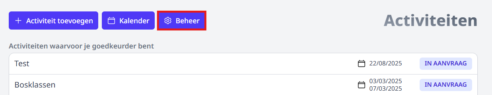
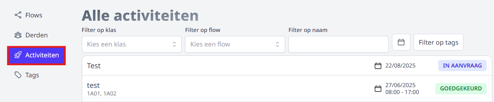

Een gebruiker met de rechten 'activiteiten_beheer' kan alle aankomende en afgelopen, goedgekeurde en afgekeurde activiteiten alsook de activiteiten in opmaak raadplegen. 

- Klik in de activiteitenmodule op het tandwiel 'Beheer'. Is deze knop niet zichtbaar, dan beschik je niet over de juiste rechten om het overzicht te kunnen raadplegen. 

    

- Klik vervolgens op het menu 'Activiteiten'. 

    

- Klik [hier](/activiteiten/voorbereiding/#activiteiten-overzicht) voor meer info m.b.t. zoeken en filteren in de resultatenlijst. 
