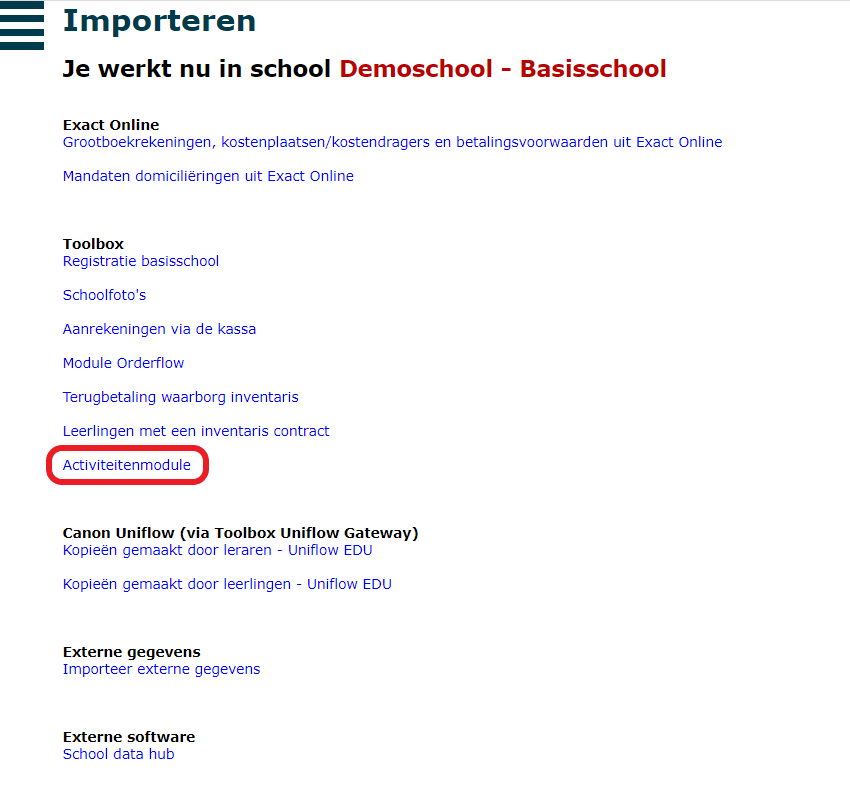
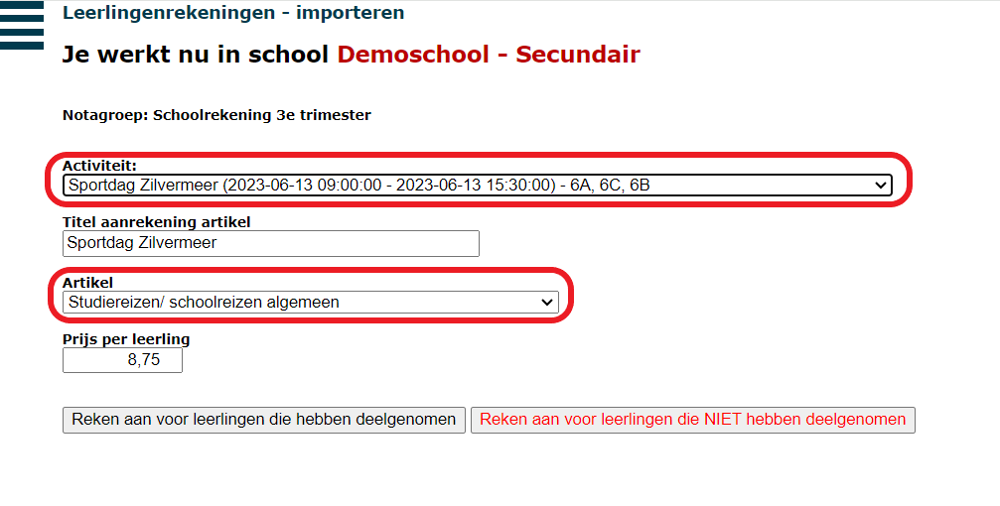
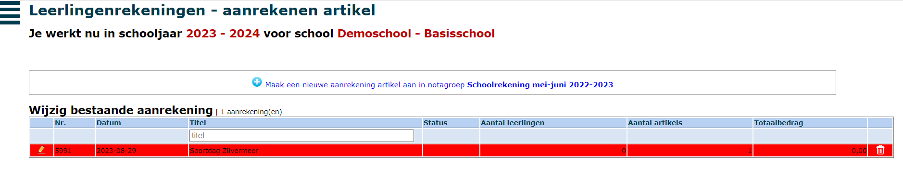
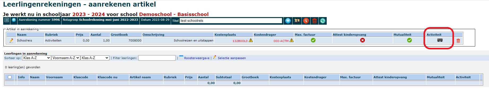
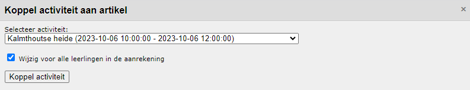

Dankzij de rechtstreekse koppeling met de module Leerlingenrekeningen is het mogelijk om een goedgekeurde activiteit te importeren waardoor die niet meer manueel moet worden aangerekend. De aanrekening krijgt meteen de juiste titel (naam van de activiteit) en kostprijs per leerling mee. De uitstap kan bovendien zowel worden worden geïmporteerd voor leerlingen die effectief hebben deelgenomen als voor leerlingen die niet aanwezig waren tijdens de activiteit. De import voor deze twee groepen gebeurt apart, waardoor het mogelijk is om voor de afwezigen een andere prijs te hanteren. Nadat de import heeft plaatsgevonden, kan alles nog gewijzigd worden via het menu 'Aanrekenen artikel'. 

Het koppelen van een activiteit in de module Leerlingenrekeningen kan op 2 manieren.

## 1. Via het menu IMPORTEER

- Open de module Leerlingenrekeningen en selecteer de notagroep waarin je de activiteit wil importeren.
- Ga naar het menu IMPORTEER. 
- Selecteer onder de rubriek Toolbox de 'Activiteitenmodule.'

  

- Selecteer uit de lijst de activiteit die je wil importeren.

- De velden **Titel aanrekening artikel** en **Prijs per leerling** worden automatisch ingevuld indien ingevuld in de activiteitenmodule. Als dat niet het geval is, kunnen die gegevens hier nog worden ingegeven. De titel van de aanrekening is eveneens de tekst die op de factuur getoond wordt. Die kan hier eventueel nog aangepast worden. 
- Selecteer een **Artikel** uit de lijst. Deze lijst bevat alle artikels uit de module Leerlingenrekeningen. Het artikel mag vrij generiek zijn en hoeft geen details te bevatten over de activiteit (naam en prijs). Enkel de boekhoudkundige gegevens moeten overeenstemmen. Je kan dus voor elke activiteit met dezelfde boekhoudkundige parameters één en hetzelfde artikel gebruiken. De titel en de prijs worden overgeschreven met de gegevens uit de module Activiteiten. 

  

  Je kan kiezen om de activiteit enkel te importeren voor de leerlingen die geregistreerd zijn als 'aanwezig'. Je kan optioneel de activiteit nog een tweede keer importeren, maar dan voor de leerlingen die geregistreerd werden als 'afwezig'. Voor deze leerlingen kan je een andere titel en prijs meegeven. De titel is tevens de benaming die op de factuur gebruikt wordt. 

- Wanneer de activiteit is geïmporteerd, kan je ze terugvinden via het menu **AANREKENEN ARTIKEL**. Wanneer er zowel voor aanwezige als voor afwezige leerlingen werd geïmporteerd, zullen er twee aparte aanrekeningen terug te vinden zijn. Via het potloodje vooraan kan je alle parameters nog wijzigen. Bv. leerlingen toevoegen of verwijderen, de prijs of de naam van een activiteit aanpassen, boekhoudkundige parameters wijzigen,... 

  

:::caution opmerking
Je kan een activiteit meermaals importeren. Merk je een fout op, dan kan je de aanrekening in de module Leerlingenrekeningen volledig verwijderen en de (aangepaste) activiteit opnieuw importeren. Je kan er ook voor kiezen om de aanpassingen rechtstreeks in de module Leerlingenrekeningen aan te brengen.   
:::

## 2. Vanuit het menu AANREKENEN (ARTIKEL)

Je kan ook op de gebruikelijke manier een artikel aanrekenen via het menu => Aanrekenen of Aanrekenen artikel. Volg hierbij de gekende werkwijze voor het toevoegen van een activiteit. Je vult hierbij zelf de prijs in die de leerlingen moeten betalen; die wordt niet overgenomen uit de module activiteiten.
- Maak een nieuwe aanrekening aan in de geselecteerde notagroep.
- Geef de aanrekening een titel.
- Selecteer een artikel uit de generieke artikellijst. Dit artikel mag zeer algemeen zijn, bv. schoolreis, toneel, ... Zolang de boekhoudkundige parameters maar overeenkomen met de activiteit die je zo meteen gaat koppelen.
- Wanneer je een artikel hebt geselecteerd, zie je achteraan volgend icoon <LegacyAction img="train.png"/>. Klik op dit icoon om een activiteit uit de activeitenmodule te koppelen. 

  

- Selecteer de gewenste activiteit uit de lijst. Indien er reeds leerlingen waren toegevoegd aan de aanrekening, kan je de parameters (naam, prijs, ...) ook meteen wijzigen voor deze leerlingen door de checkbox aan te vinken. Als je dat niet doet, zullen de gegevens van het oorspronkelijk geselecteerde artikel voor deze leerlingen behouden blijven. 

  

- Van zodra je een activiteit gekoppeld hebt, zal het icoon rood kleuren <LegacyAction img="busred.png"/>.

