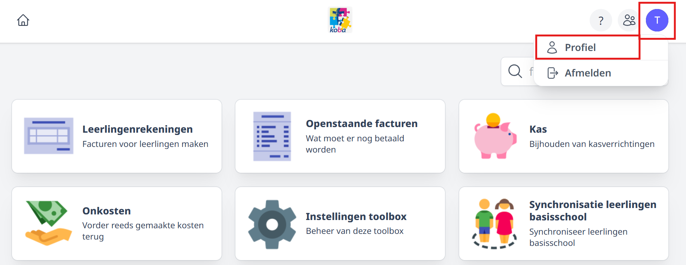
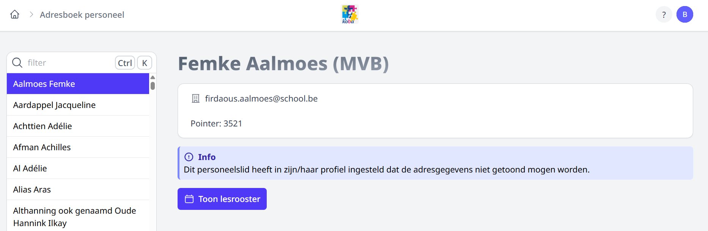

<ImageTitle img="adresboek.png">Adresboek personeel</ImageTitle>

In het adresboek vind je de volgende personeelsgegevens terug:
- naam
- foto (indien opgeladen in de module Fotolijst leraren)
- adres
- woonplaats
- contactgegevens (e-mail & telefoonnummer)
- personeelsnummer (uniek nummer dat ook in Informat en Exact Online gebruikt wordt)
- stamboeknummer
- gebruikersnaam (van Toolbox)
- lessenrooster (indien opgeladen in de module Lessenrooster)

Deze gegevens worden opgehaald uit het softwarepakket voor personeelsadministratie (Wisa of Informat). Indien er in het adresboek gegevens ontbreken, kunnen die aangevuld worden in het administratief pakket en zullen ze na synchronisatie ook in Toolbox beschikbaar zijn.

Eens de module Adresboek geactiveerd is, hebben alle personeelsleden meteen toegang tot deze module. Er moeten dus geen bijkomende rechten toegekend worden. Dat wil echter niet zeggen dat alle bovenstaande personeelsgegevens voor iedereen zichtbaar zijn. Een personeelslid kan zelf instellen of zijn persoonsgegevens in het adresboek getoond mogen worden aan andere personeelsleden. Dat kan via het profiel rechtsbovenaan in het startscherm van Toolbox. 
 

   
 

Via deze weg kan een personeelslid eveneens zijn **paswoord** voor Toolbox wijzigen, zijn persoonlijk **lesrooster** (indien opgeladen in de module Lessenrooster) en zijn **functiebeschrijving** (indien aangemaakt via de module Functiebeschrijvingen in Toolbox) raadplegen. 

Indien een personeelslid ervoor kiest om zijn gegevens **niet** te tonen in het adresboek, zijn voor alle andere personeelsleden enkel de naam en het lesrooster van dit personeelslid zichtbaar.

## Bepaalde gebruikers toegang geven tot alle informatie

Aan de hand van het gebruikersrecht **adresboek_bekijk_alle_adressen** (in de module Gebruikersbeheer) kan je bepaalde personeelsleden toegang geven tot alle informatie die terug te vinden is in het adresboek. Dit kan handig zijn voor administratief personeel dat contact moet kunnen opnemen met personeelsleden, zonder dat men toegang heeft tot het pakket voor personeelsadministratie (Informat of Wisa). Een bijkomende licentie voor dat pakket is niet meer nodig, het volstaat nu om deze medewerkers toegang te geven tot het betreffende adresboek in Toolbox.

