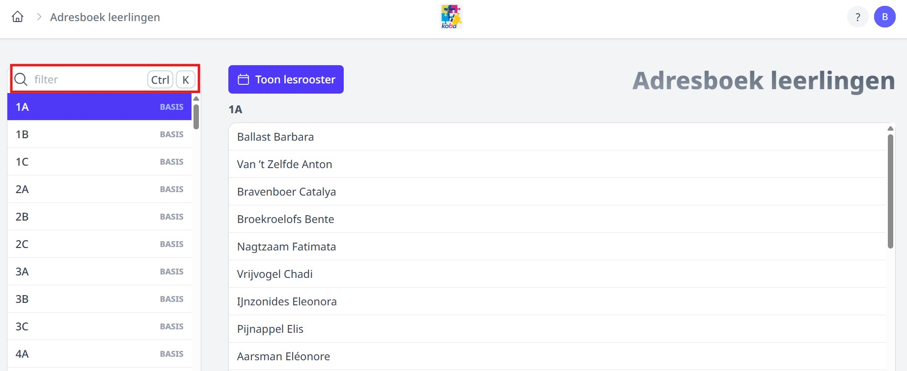
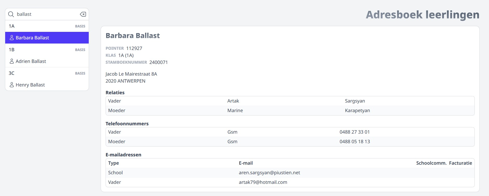

<ImageTitle img="adresboeklln.png">Adresboek leerlingen</ImageTitle>

In het adresboek vind je de volgende leerlinggegevens terug:
- naam
- foto (indien opgeladen)
- klas
- intern nummer (uniek nummer dat ook in Informat en Exact Online gebruikt wordt)
- adres
- woonplaats
- telefoonnummer(s)
- e-mailadres(sen) (incl. aanduiding of een e-mailadres gebruikt wordt voor schoolcommunicatie en/of facturatie)
- relaties (vader/moeder/...)
- lessenrooster (indien opgeladen in de module Lessenrooster)

Deze gegevens worden opgehaald uit het softwarepakket voor leerlingenadministratie (Wisa of Informat). Indien er in het adresboek gegevens ontbreken, kunnen die aangevuld worden in het administratief pakket en zullen ze na synchronisatie ook in Toolbox beschikbaar zijn.

Eens de module Adresboek geactiveerd is, hebben alle personeelsleden meteen toegang tot deze module. Er moeten dus geen bijkomende rechten toegekend worden. Dat wil echter niet zeggen dat alle bovenstaande leerlingengegevens voor iedereen zichtbaar zijn. Zonder bijkomende rechten ziet men enkel de naam van de leerling, klas, en pointer (intern nummer uit Informat).

## Bepaalde gebruikers toegang geven tot alle informatie

Aan de hand van het gebruikersrecht **adresboek_bekijk_alle_adressen_leerlingen** (in de module Gebruikersbeheer) kan je bepaalde personeelsleden toegang geven tot alle informatie die terug te vinden is in het adresboek. Dit kan handig zijn voor administratief personeel dat contact moet kunnen opnemen met ouders, zonder dat men toegang heeft tot het pakket voor leerlingenadministratie (Informat of Wisa). Een bijkomende licentie voor dat pakket is niet meer nodig, het volstaat nu om deze medewerkers toegang te geven tot het betreffende adresboek in Toolbox.

Via het zoekveld linksboven kan je zoeken op klas of op naam van een leerling.

  

  