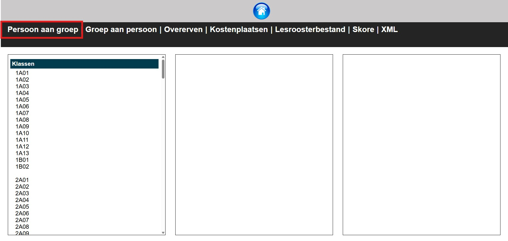

Vooraleer je gebruik kan maken van het afdrukcentrum in Toolbox, moet er een koppeling gemaakt worden tussen enerzijds Toolbox en anderzijds Canon Uniflow OF Ricoh MyQ. Voor de opstart kan je rekenen op de begeleiding van het Toolbox-team en de leverancier van de toestellen. 

Daarnaast moet de printsoftware (Uniflow of MyQ) opgevuld worden met de nodig informatie zoals leraren, leerlingen, klassen, koppelingen tussen klassen en leraren, ... Dit kan op een heel eenvoudige manier via de modules **Uniflow Edu** (voor Canon) of **MyQ** (voor Ricoh) in Toolbox. 

## Afdrukcentrum koppelen 

Voor de koppeling van het afdrukcentrum met Canon of Ricoh neem je contact op met de Toolbox-helpdesk en de leverancier van de apparaten.  

### Canon Uniflow
In de module **Instellingen** vul je bij Afdrukcentrum > Algemeen een paswoord in. Dit paswoord vul je ook in het afdruksysteem in. Het laat toe om de afdrukken op een veilige manier op te halen.

Als endpoint vul je https://mijn.toolbox.be/public/afdrukcentrum/ in. In deze url vervang je *'mijn.toolbox.be*' door de naam van je eigen Toolbox. Zorg dat de Ref overeenkomt met de instellingen in de import van gebruikers in Canon Uniflow.


### Ricoh MyQ

Neem contact op met Ricoh en/of Toolbox voor meer info. 

## Provisioning: Uniflow EDU & MyQ

Toolbox kan via de **module Uniflow Edu (in Toolbox)** de nodige informatie aanleveren om een Canon Uniflow op te vullen. Voor Ricoh MyQ kan men hiervoor de **module MyQ (in Toolbox)** gebruiken. Via deze modules wordt er een XML gegenereerd die Uniflow/MyQ kan inlezen. In die XML zit onder andere deze informatie:

- Leerlingen
- Personeel
- Externen
- Klassen en subgroepen
- Koppeling tussen leerlingen en klassen
- Koppeling tussen personeel en klassen (wie ziet welke klassen)
- Koppeling tussen personeel en kostenplaatsen

Per persoon worden meerdere parameters meegestuurd: e-mailadres, login, pointer (uniek nummer uit Informat of Wisa), nummer betaalkaart, pincode, ... 


:::danger belangrijk
Maak je gebruik van het afdrukcentrum in Toolbox, gebruik dan sowieso één van hogervermelde modules voor de provisioning. 

Om toegang te krijgen tot één van deze modules moeten respectievelijk de gebruikersrechten *uniflow_edu* of *myq* worden toegekend door een beheerder in Toolbox. 

De configuratie en het gebruik van de modules **Uniflow EDU** en **MyQ** in Toolbox is identiek. Daarom wordt er in de handleiding verder gebruik gemaakt van de benaming **Uniflow/MyQ**. Hiermee wordt steeds verwezen naar beide afzonderlijke modules. 
:::

### Configuratie

Vooraleer je de module **Uniflow EDU** of **MyQ** kan gebruiken, moeten er een aantal zaken ingesteld worden in de module **Instellingen > Uniflow/MyQ**.

- Bij **Schooljaar** vul je het huidige schooljaar in. Gebruik hiervoor het formaat: 2025-26.
- Vul de instellingen onder **School** in: referentie, korte naam en volledige naam. Raadpleeg hiervoor de handleiding van Uniflow/MyQ.
- Om de **XML** te kunnen ophalen, moet er eerst een unieke (willekeurige) sleutel worden aangemaakt.  Die vul je hier in. 
- Standaard wordt als **loginnaam** de gebruikersnaam die Toolbox genereert meegestuurd (zie Synchronisatie leraren en leerlingen) . Je kan bijkomend nog een extra loginnaam meesturen die afwijkt van de gebruikersnaam zodat Uniflow/MyQ ook hier op kan koppelen.
- Toolbox zal ook de **pincode** van elke gebruiker meegeven. In het veld **Samenstelling pincode** kan je invullen hoe die pincode moet worden opgebouwd. Je kan daar gebruik maken van enkele variabelen om de code wat meer te personaliseren.
    

- Als je gebruik maakt van de module **Synchronisatie Externen**, dan kan je kiezen om die externen ook toe te voegen aan de XML. Zo kunnen externe gebruikers zoals Stagiairs, CLB medewerkers, ... ook toegang krijgen tot Uniflow. In deze module kan men externen ook een specifieke rol geven, nl. die van leraar of leerling. Die rol bepaalt welke mogelijkheden de externe heeft op het kopieertoestel: mag klassen selecteren (leraar) of niet (leerling). In de module **Instellingen > Uniflow/MyQ** kan je dit ook algemeen instellen voor alle externen. OPGELET! Dit kan enkel voor de rol van leerling.  

    

- Ook voor externen definieer je de **samenstelling van de pincode**. Voor externen is het wenselijk om een **prefix** voor het gebruikersnummer te bepalen. Zo heeft de externe steeds een uniek volgnummer dat niet kan overlappen met het volgnummer van leerlingen of leraren. 
- Tot slot is het mogelijk om ook subgroepen uit Informat mee te sturen met de XML alsook klasvertalingen uit Smartschool. Na het opladen van de XML kunnen deze groepen gebruikt worden in het afdrukcentrum van Toolbox en op de printapparaten in de school.  

    

### Klassen, groepen, leraren, ... koppelen

Via de **modules Uniflow EDU en MyQ in Toolbox** kan je de XML opvragen en nakijken. Via die module kan je ook personeelsleden koppelen aan klassen/groepen en andersom. Op die manier krijgen zij slechts een beperkte lijst van klassen/groepen te zien op de display van de printer of copier. Je kan die koppeling ook importeren via een lesroosterbestand of via Skore waardoor je de koppelingen niet meer manueel moet leggen. Ze worden dan automatisch overgenomen uit het andere bestand.

In de loop van het schooljaar kan je nieuwe gebruikers (bv. interims) klassen laten overerven.

#### 1. Personen aan groepen koppelen (manueel)


- Selecteer de gewenste klas in de linkerkolom. 
- Vervolgens zie je in de middelste kolom welke gebruikers er reeds gekoppeld zijn aan deze klas. Die kan je 'ontkoppelen' door simpelweg op de naam te klikken. 
De gebruikers in de rechterkolom zijn (nog) niet gekoppeld aan de geselecteerde klas. 
- Selecteer de gewenste gebruikers en klik bovenaan op de tekst 'Voeg geselecteerde personen toe'. 
- Klik op de tekst 'Niet gekoppelde gebruikers' om alle gebruikers ineens te selecteren. 
- Herhaal deze handeling voor alle klassen. 


#### 2. Groepen aan personen koppelen (manueel)


- Selecteer de gewenste gebruiker in de linkerkolom.
- Vervolgens zie je in de middelste kolom welke klassen/groepen er reeds gekoppeld zijn aan deze gebruiker. Die kan je 'ontkoppelen' door simpelweg op de naam van de klas te klikken. De klassen/groepen in de rechterkolom zijn (nog) niet gekoppeld aan de geselecteerde gebruiker. 
- Klik op de gewenste klas en ze wordt onmiddellijk toegevoegd aan de middelste kolom. 
- Herhaal deze handeling voor alle gebruikers. 


#### 3. Overerven


Start er in de loop van het schooljaar een interimaris, dan moet je voor deze gebruiker niet opnieuw manueel alle koppelingen leggen. Je kan de groepen van de titularis laten overerven. 

In onderstaand voorbeeld is Femke Aalmoes interimaris en Batman Alix de titularis die afwezig is. 
- Klik in de linkerkolom op de naam van de interimaris. 
- De middelste kolom zal vermoedelijk leeg blijven, aangezien er voor de interimaris waarschijnlijk nog geen gekoppelde klassen/groepen zijn.
- Klik vervolgens in de rechterkolom op de titularis waarvan je de koppelingen wil overnemen. 
- In de middelste kolom worden nu de gekoppelde klassen getoond. Die zijn op dit moment overgeërfd en dus ook gekoppeld aan de interimaris.  


#### 4. Kostenplaatsen


Het is mogelijk om kostenplaatsen te definiëren die vervolgens gebruikt kunnen worden in het Toolbox afdrukcentrum en op de printers en copiers in de school. Aan de kostenplaatsen zijn geen boekhoudkundige parameters gekoppeld en is er geen verwerking naar Exact Online voorzien. 

- Klik bovenaan op <LegacyAction img="pluscircle.png" text ="Kostenplaats toevoegen"/> om een nieuwe kostenplaats in te stellen. 

- Klik op <LegacyAction img="edit.png"/> om de naam van een bestaande kostenplaats te wijzigen.
- Klik op <LegacyAction img="remove.png"/> om een kostenplaats te verwijderen. 

#### 5. Lesroosterbestand


Wil je de koppelingen tussen leraren en (klas)groepen niet manueel maken, dan kan je een roosterbestand uploaden. Indien er reeds een roosterbestand werd opgeladen via de module **Lessenrooster**, dan kan je dat hier terugvinden. Wanneer er meerdere roosterbestanden beschikbaar zijn, kan je het gewenste roosterbestand selecteren. Het is ook mogelijk om op deze plek een nieuw roosterbestand te uploaden. 

Voor de import kan je kiezen naar 'Gegevens importeren zoals ze in het bestand voorkomen' of 'Klassen omzetten naar hoofdletters'. In de praktijk wordt er meestal gekozen voor de eerste optie. Dan moet de klasbenaming in het roosterbestand wel exact overeenkomen met de benaming in Informat en bijgevolg ook in Toolbox. De import is hoofdlettergevoelig, dus als in de ene software 3A ZWA en in de andere 3A ZWa wordt gebruikt, zal de koppeling niet automatisch worden overgenomen. In dat geval kies je best voor de tweede optie, nl. 'Klassen omzetten naar hoofdletters'. 

:::danger belangrijk
Bij de start van het nieuwe schooljaar, kan je best **alle bestaande koppelingen** tussen leraren en (klas)groepen **wissen**. Hiervoor zijn verschillende opties voorzien. Zo kan je er ook voor kiezen om enkel de handmatig gelegde koppelingen te wissen of enkel de koppelingen o.b.v. de import van het lessenrooster. 
:::

#### 6. Skore


Ook via Skore kan je automatisch koppelingen leggen tussen leraren en (klas)groepen om die vervolgens over te nemen naar de printsoftware. 
Om de koppeling via Skore te laten verlopen, moet de koppeling tussen Toolbox en Smartschool actief zijn. Het ophalen van gegevens uit Skore verloopt steeds in twee stappen. 

1. Klik eerst op '**Haal gegevens uit Skore op**'. Hiermee worden de koppelingen opgehaald, maar nog overgenomen in Toolbox. 
2. Klik vervolgens op '**Genereer koppelingen op basis van Skore**'. Met deze actie worden de koppelingen effectief overgenomen in Toolbox en bijgevolg ook in de XML. 

#### 7. XML


Via deze knop kan je de XML opvragen en nakijken. 

### XML Ophalen in Canon Uniflow
 
Recente versies van Uniflow kunnen de basisgegevens van de school rechtstreeks (automatisch) uit Toolbox ophalen. Je dient enkel de URL van Toolbox, de referentie van de school en de sleutel in te vullen. De periodiciteit van het ophalen kan ook ingesteld worden in Uniflow. In oudere versies moet de XML nog wel op regelmatige basis manueel worden ingeladen worden in Uniflow.

**Base Data service endpoints**


**Print Center service endpoints**


Oudere versies van Uniflow dienen nog gebruik te maken van het PowerShell script hieronder dat via een Windows taak bijvoorbeeld elke nacht de XML ophaalt en aan Uniflow aanlevert.

```powershell
[Net.ServicePointManager]::SecurityProtocol = [Net.SecurityProtocolType]::Tls12
$wc = New-Object System.Net.WebClient
$wc.DownloadFile('https://mijn.toolbox.be/uniflow_edu/publicGetUniflowEDUXML.php?key=UNIEKESLEUTEL','c:\uniflowedu.xml')

if (Test-Path -Path "c:\uniflowedu.xml") {
    Move-Item -Path "c:\uniflowedu.xml" -Destination "C:\Program Files (x86)\Common Files\NT-ware Shared\Data\EduPlatform\BaseData\uniflowedu.xml"
} 
```

In dit script moet je enkele zaken wijzigen:
- `mijn.toolbox.be` vervangen door het adres van je Toolbox
- `UNIEKESLEUTEL` vervangen door de sleutel die je in de instellingen hebt opgegeven
- het `-Destionation` path instellen naar de Uniflow Hotfolder. Die is afhankelijk van de versie van Uniflow.

Zet dit script in de map c:\Scripts\getCanonEDUXML.ps1

Maak vervolgens een Windows taak aan die dit script dagelijks uitvoert. We vragen om dit bij voorkeur tussen 23u en 6u te laten lopen om onze systemen niet te veel te overbelasten. We vragen ook om dit maximaal twee keer per dag uit te voeren.


