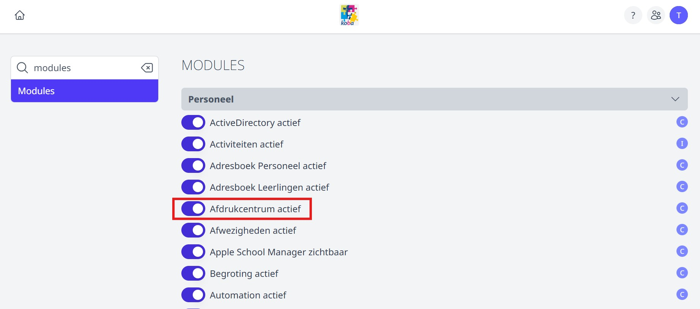
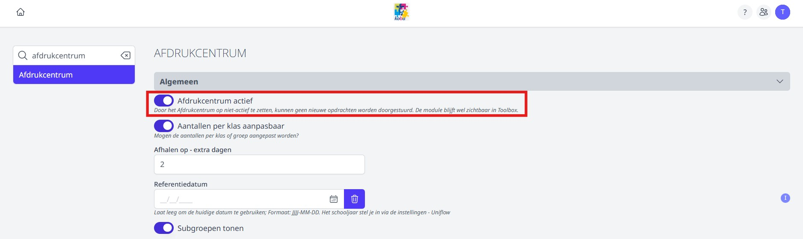
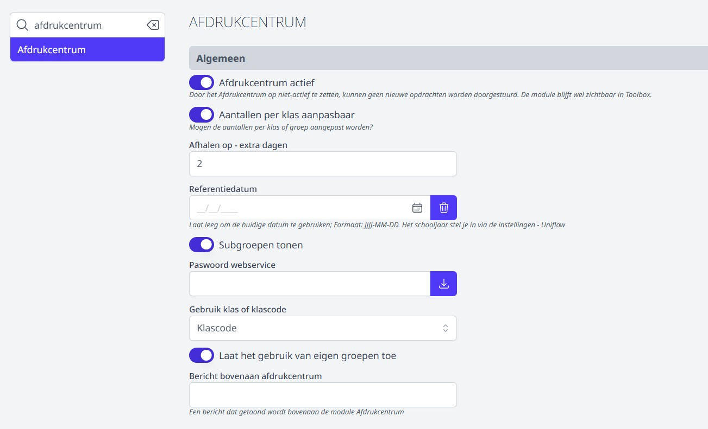
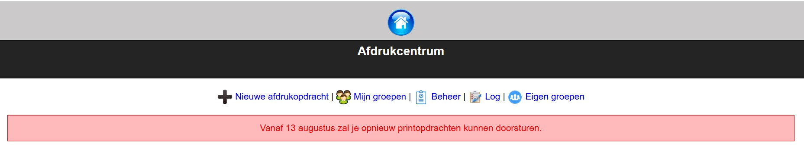
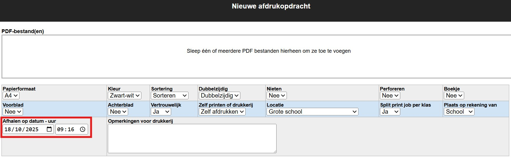
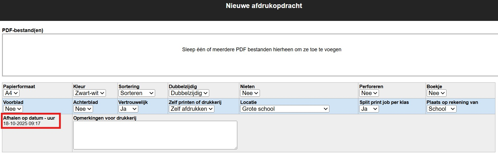
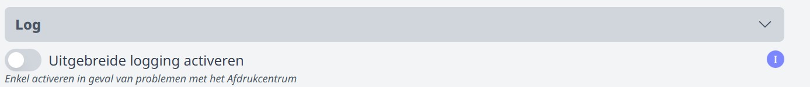
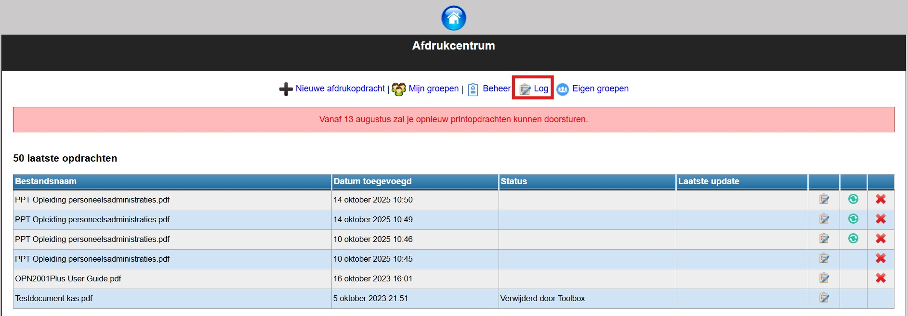

## Module activeren

Vooraleer je in Toolbox een module kan gebruiken, moet die eerst geactiveerd worden. Dat kan via de module **Instellingen > Modules**. Daar zet je de module 'Afdrukcentrum' actief. Deze module is enkel toegankelijk voor een beheerder in Toolbox. Wie beheerder is in jouw Toolbox, kan je terugvinden bij het vraagteken rechtsboven op de homepage van Toolbox. 

## Gebruikersrechten toekennen

Wanneer de module geactiveerd is, hebben alle personeelsleden meteen toegang tot het afdrukcentrum. Er moeten geen bijkomende gebruikersrechten worden toegekend. Wanneer in de module **Instellingen > Afdrukcentrum** het afdrukcentrum actief is, kunnen de leraren nieuwe printopdrachten doorsturen. Wanneer de module op die plek op non-actief is gezet, kunnen er vanaf het moment van deactiveren geen nieuwe printopdrachten meer worden doorgestuurd. De module blijft wel zichtbaar in Toolbox en eerdere printopdrachten blijven beschikbaar.

Er bestaat wel het gebruikersrecht *'afdrukcentrum_beheer'*. Door dit recht toe te kennen via de module [Gebruikersbeheer](./gebruikersbeheer) geef je de gebruiker bijkomende rechten in het afdrukcentrum. Zo kan een beheerder de printopdrachten, inclusief de afwerkingsmogelijkheden, van alle personeelsleden raadplegen. Daarnaast kan een beheerder een rapport met gelogde activiteiten op alle printapparaten opvragen alsook alle 'eigen groepen' bekijken en eventueel verwijderen. De werking van al deze functionaliteiten wordt toegelicht in het luik [Beheerder van het afdrukcentrum](/beheer).

## Algemene instellingen

Vooraleer je het afdrukcentrum via Toolbox kan gebruiken, moeten er nog een aantal zaken geconfigureerd worden in de module **Instellingen > Afdrukcentrum**. Zoals eerder vermeld, is deze module enkel toegankelijk voor een beheerder in Toolbox. Wie beheerder is in jouw Toolbox, kan je terugvinden bij het vraagteken rechtsboven op de homepage van Toolbox. 

### 1. Algemeen
Onder dit luik vind je een aantal algemene instellingen terug. We overlopen de mogelijkheden onder de afbeelding.

- **Afdrukcentrum actief**: Wanneer deze functie geactiveerd is, kunnen leraren printopdrachten doorsturen. Indien niet actief, kunnen er geen nieuwe printopdrachten worden doorgestuurd, maar blijven de reeds aangevraagde printopdrachten wel beschikbaar. 
- **Aantallen per klas aanpasbaar**: Wanneer deze functionilteit actief is, kan de leraar de aantallen per klas zelf aanpassen. 
- **Afhalen op - extra dagen**: Hier kan je ingeven tot hoeveel dagen op voorhand een personeelslid een printopdracht kan aanvragen. Laat je dit veld leeg, dan kan er ook last minute nog een printopdracht gegeven worden. Stel je hier zoals in het voorbeeld '2 dagen' in, dan zal de printopdracht door een operator van het afdrukcentrum op school binnen de 2 werkdagen verwerkt worden. 
- **Referentiedatum**: Dit veld moet enkel in de zomervakantie ingevuld worden om al te kunnen printen voor klassen en leerlingen van het nieuwe schooljaar. Als referentiedatum vul je dan 01/09/20** in. Vanaf 1 september maak je het datumveld terug leeg, zodat steeds de huidige datum als referentiedatum gebruikt wordt. Lees hierover meer in het onderdeel [Opstart schooljaar](/opstart_schooljaar#9-afdrukcentrum).
- **Subgroepen tonen**: Wanneer dit actief staat, worden ook alle subgroepen uit Informat getoond in het Afdrukcentrum. Ze kunnen dan geselecteerd worden als groep voor een printopdracht.
- **Paswoord webservice**: Dit paswoord wordt door Toolbox voorzien en ingevuld bij de koppeling van het afdrukcentrum.  
- **Klas of klascode**: Wanneer je kiest voor 'klas' wordt de volledige naam van de klas getoond in het Afdrukcentrum (bv. 4 Maatschappij en Welzijnswetenschappen). Bij de optie 'gebruik klascode' wordt de afkorting van de klasnaam getoond (bv. 4 MWW). Deze gegevens haalt Toolbox op uit Informat. Wil je klasnamen of klascodes aanpassen, dan doe je dat rechtstreeks in Informat waarna je opnieuw moet synchroniseren in Toolbox. 
- **Eigen groepen**: Wanneer je het gebruik van eigen groepen toelaat, kunnen gebruikers zelf groepen met leerlingen samenstellen die ze vervolgens kunnen gebruiken als groep in het Afdrukcentrum. Dat kan handig zijn voor groepen die geen klas- of subgroep zijn in Informat. Denk hierbij bv. aan een vaste groep leerlingen die onder de middag deelneemt aan een bepaalde activiteit, de leerlingenraad, ... 
- **Bericht bovenaan het afdrukcentrum**: De tekst die je hier ingeeft, wordt getoond aan de gebruikers in de module 'Adrukcentrum'. Zo kan je de module in de zomervakantie bv. tijdelijk deactiveren en de volgende tekst tonen.

    

### 2. Printopties

Hier stel je alle afwerkingsmogelijkheden van het afdrukcentrum in. Per afwerkingsmogelijkheid zijn er steeds 2 zaken in te stellen. 
- De afwerkingsmogelijkheid **activeren of deactiveren**. Indien gedeactiveerd, zal een gebruiker de standaardwaarde niet kunnen wijzigen bij het opmaken van een printopdracht in het afdrukcentrum. 
- Een **standaardwaarde** voor de afwerkingsmogelijkheid instellen. Wanneer er bv. wel in kleur afgedrukt kán worden en deze afwerkingsmogelijkheid bij gevolg actief is, kan je de standaardwaarde voor een print wel als 'grayscale' instellen. Gebruikers drukken dan standaard in grijswaarden af, maar kunnen bij het opmaken van de printopdracht de waarde nog wel wijzigen naar 'kleur'. Mogen gebruikers deze instelling niet zelf wijzigen, dan deactiveer je de afwerkingsmogelijkheid en stel je op deze plek ook de standaardwaarde in.  

Meer uitleg over enkele opties vind je terug onder de afbeelding.

<Thumbnails img={[
    require('./instelling5.jpg').default, 
    require('./instelling6.jpg').default, 
]} />
*Klik op de afbeelding op te vergroten.*

- **Sortering**: 
    - Collate on = sorteren
    - Collate of = niet sorteren
    Deze functionaliteit werkt niet voor Canon Uniflow. 
- **Voorblad/Achterblad**: Er wordt een extra pagina voor en achter toegevoegd. 
- **Vertrouwelijk**: Deze functionaliteit werkt niet voor Canon Uniflow. 
- **Zelf printen of drukkerij**:
    - Followyou = zelf printen. De leraar kan na het geven van de printopdracht inloggen op een printapparaat en de opdracht zelf afprinten. 
    - Printoperator = drukkerij. De printopdracht zal afgehandeld worden door de drukkerij/kopiedienst/printoperator van de school. 

- **Toon datumselectie**: De datum voor het ophalen van de printopdracht in de drukkerij wordt automatisch berekend op basis van het aantal dagen dat ingesteld is bij het voorgaande luik **Algemeen** in de module 'Instellingen > Afdrukcentrum > Algemeen > Afhalen op - extra dagen'. Wanneer de optie 'Toon datumselectie' is geactiveerd, kunnen gebruikers zelf de afhaaldatum wijzigen bij het opmaken van de printopdracht. Staat de optie uit, dan krijgen gebruikers het afhaalmoment te zien, maar kunnen ze het niet aanpassen.
    
    *Toon datumselectie aan:*
     

    *Toon datumselectie uit:*
     

- **Locatie**: Heb je op meerdere locaties een drukkerij, dan kan je die verschillende locaties instellen, zodat gebruikers van het afdrukcentrum de gewenste locatie kunnen selecteren. Voor het opgeven van de standaardwaarde, komt 1 overeen met locatie 1 enz. 

- **Boekjes via zelf afdrukken**: Als laatste kan je aangeven of personeelsleden een boekje zelf mogen afprinten of enkel via de drukkerij. **Canon** biedt deze functionaliteit niet aan. Bij **Ricoh** kan men deze functie activeren op voorwaarde dat het printtoestel is uitgerust met een boekjesfinisher.  

### 3. Log

Wanneer er zich problemen voordoen met het afdrukcentrum, kan je deze optie activeren. Vervolgens kan een gebruiker met het recht 'afdrukcentrum_beheer' de uitgebreide logs raadplegen in de module **Afdrukcentrum**. 
Vergeet deze optie na afloop niet terug uit te zetten. 

