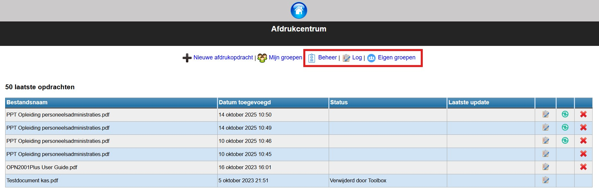
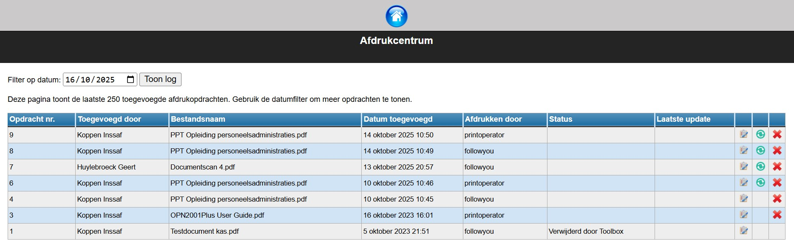
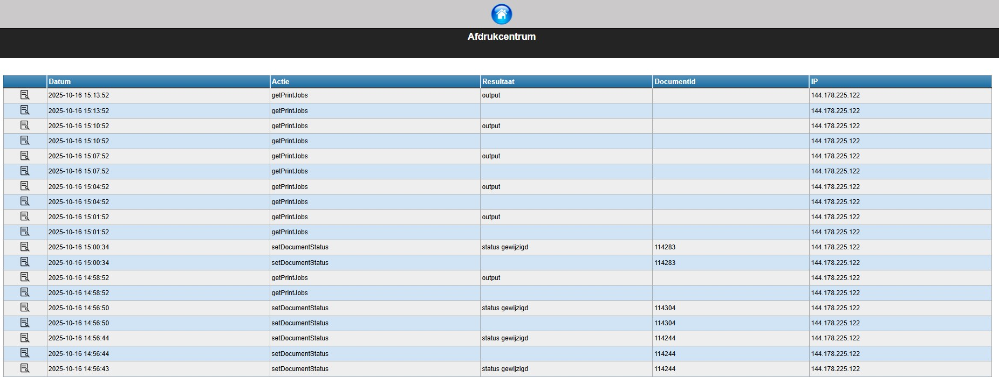
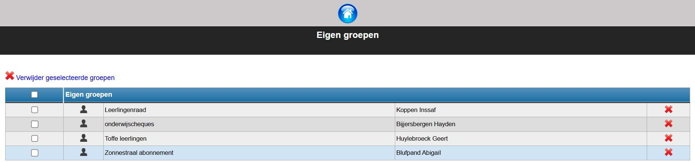

Een gebruiker met de rechten *'afdrukcentrum_beheer'* krijgt in de module Afdrukcentrum enkele extra functionaliteiten te zien. 

## Beheer

Via de knop 'Beheer' ziet een beheerder in het afdrukcentrum niet alleen de eigen printopdrachten, maar ook die van alle andere gebruikers. Standaard wordt er gefilterd op 'vandaag'. Er kan een andere datum worden ingevuld of het datumveld kan ook leeggemaakt worden. Dan worden alle logs getoond.

- De beheerder kan de details van de printopdracht bekijken via volgend icoontje <LegacyAction img="list.png"/>: documentnaam, printerinstellingen, geselecteerde klassen, etc. 

- Met behulp van het <LegacyAction img="syncGreen.png"/> icoontje kan men opdrachten, die omwille van een storing, niet werden opgehaald door de printer, opnieuw doorsturen. 
- Men kan opdrachten verwijderen door gebruik te maken van het <LegacyAction img="remove.png"/> icoontje, zolang die niet werd opgehaald door de printer. 

## Log 

Onder dit menu kan een beheerder de logs van de printopdrachten raadplegen. Dit is een zeer globale logging. Het is ook mogelijk om een meer gedetailleerde log op te vragen. Hiervoor moet die optie worden geactiveerd via de module 'Instellingen > Afdrukcentrum > Logs (helemaal onderaan)'. Deze functie kan best enkel geactiveerd worden wanneer er problemen zijn met het afdrukcentrum. Van zodra de problemen zijn opgelost, deactiveer je deze functie best meteen. Er wordt namelijk een zeer grote hoeveelheid data verwerkt wanneer de optie actief is. Dat zal de performantie van Toolbox aanzienlijk vertragen. 

*Klik op de afbeelding om te vergroten.*

## Eigen groepen

Een beheerder in het afdrukcentrum kan de ['eigen groepen'](/printopdracht#2-eigen-groepen) van alle gebruikers bekijken en ook verwijderen. In het overzicht wordt de naam en de eigenaar van de groep weergegeven. 

- Gebruik het <LegacyAction img="remove.png"/> icoon achteraan om de overeenkomstige groep te verwijderen.

- Selecteer meerdere groepen met behulp van de checkboxen vooraan en verwijder ze tegelijk door gebruik te maken van het <LegacyAction img="remove.png"/> icoon bovenaan.
- Via het <LegacyAction img="person.png"/> icoon kan je bekijken welke leerlingen er deel uitmaken van de groep. 

*Klik op de afbeelding om te vergroten.*