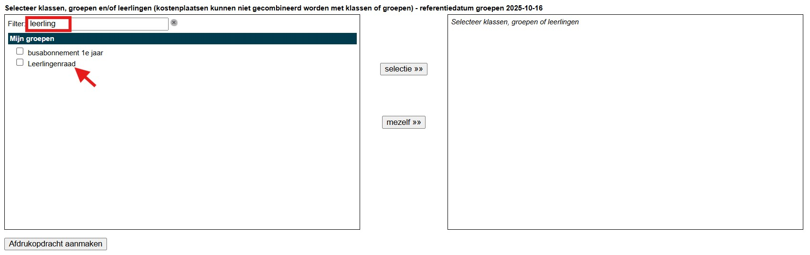

Van zodra je bent aangemeld in Toolbox vind je het afdrukcentrum terug op het startscherm. Het afdrukcentrum van Toolbox kan ook via een rechtstreekse link in het smartschoolplatform worden gebruikt. Voor meer informatie hierover contacteer je de lokale ICT coördinator. 

Selecteer het **Afdrukcentrum** op het startscherm van Toolbox. Bij het openen van de module zie je een overzicht van de laatste 50 eigen printopdrachten. 

- Het icoontje <LegacyAction img="list.png"/> rechts dient om de details van de printopdracht weer te geven: documentnaam, printerinstellingen, geselecteerde klassen, etc. 

- Met het icoontje <LegacyAction img="syncGreen.png"/> rechts kan de leerkracht opdrachten, die omwille van een storing, niet werden opgehaald door de printer, opnieuw doorsturen. 
- Met het icoontje <LegacyAction img="remove.png"/> rechts kan de leerkracht opdrachten verwijderen uit het afdrukcentrum zolang deze niet werden opgehaald door de printer. 
- De verschillende **[statussen](/printopdracht#d-printopdracht-opvolgen---statussen)** worden later in de handleiding verduidelijkt. 

## 1. Nieuwe afdrukopdracht
Om een nieuwe printopdracht aan te maken klik op <LegacyAction img="plus.png" text="Nieuwe afdrukopdracht"/>. Vervolgens kan je PDF of PDF/A bestanden selecteren om af te drukken, de afwerkingsmogelijkheden aanduiden, klassen en leerlingen selecteren en versturen. 

*De beschikbare afwerkingsmogelijkheden kunnen verschillend zijn naargelang de door de school gekozen instellingen in Toolbox.* 

### a. PDF document opladen

Klik op het kader PDF-bestand(en) of sleep één of meerdere PDF bestanden hiernaartoe om documenten toe te voegen die men wenst af te drukken. 

:::caution Info
Om de documenten correct af te drukken raden wij ten stelligste aan om **ENKEL PDF/A BESTANDEN** te gebruiken. Dit om te vermijden dat informatie verloren gaat op het document. Het gebruik van speciale lettertypes (voor de vakken wiskunde en chemie bv.) kunnen leiden tot fouten op de afdrukken wanneer deze documenten niet correct worden omgezet naar PDF/A formaat.  
  
Ook het importeren of kopiëren van informatie op het internet in een document kan leiden tot foutieve afdrukken wanneer deze documenten niet worden bewaard als PDF/A. 

Het aanmaken van PDF/A documenten kan vandaag de dag eenvoudig in alle MS office applicaties. 
:::

Bestanden kunnen vanop je eigen computer worden geselecteerd. Je kan meerdere documenten ineens selecteren op voorwaarde dat die allemaal voor dezelfde klassen moeten worden afgedrukt. Verschillende documenten voor verschillende klassen moeten als aparte printopdrachten worden aangemaakt. 

### b. Afwerkingsmogelijkheden selecteren
Nadat de documenten zijn toegevoegd kan je de afwerkingsmogelijkheden selecteren zoals hierboven wordt getoond. De beschikbare afwerkingsmogelijkheden kunnen verschillend zijn naargelang de door uw school gekozen instellingen in Toolbox.

De meest voorkomende zijn: 
- **PAPIERFORMAAT: A4 OF A3** 
    - Opmaak document in A4 en selectie papierformaat is A4 -> document wordt op A4 afgedrukt. 
    - Opmaak document in A4 en selectie papierformaat is A3 -> document wordt vergroot tot A3 en afgedrukt op A3. 
    - Zelfde redenering voor documenten die in A3 zijn opgemaakt en selectie papierformaat is A4 -> documenten worden verkleind tot A4 en afgedrukt op A4. 
- **KLEUR: Z/W OF KLEUR** 
    - Documenten worden in kleur of zwart-wit afgedrukt naargelang de gemaakte keuze. 
- **DUBBELZIJDIG:** 
    - Indien dubbelzijdig  dan worden de documenten dubbelzijdig, lange zijde afgedrukt. 
- **NIETEN: JA/NEE** 
    - Indien JA, worden de documenten linksboven geniet. 
- **ZELF ADRUKKEN / DRUKKERlJ** 
    - Zelf printen: leerkrachten moeten zelf hun opdrachten gaan afdrukken via de beschikbare printapparaten in de school. 
    - Drukkerij: opdrachten worden centraal via een secretariaat, drukkerij of operator verwerkt.  
- **SPLIT PRINTJOB PER KLAS: JA/NEE**
    - Indien JA, dan worden de documenten netjes gebundeld per klas. M.a.w als je een document afdrukt voor meerdere klassen, worden deze in de juiste aantallen per klas gebundeld en geschrankt op de uitvoertray van het printapparaat. Optioneel is er ook nog de mogelijkheid om op elke eerste pagina van elk document, de klas of initialen van de leerkracht, mee af te drukken. Dit vereenvoudigt het uitdelen van de documenten in de klas. 
- **PLAATS OP REKENING VAN: LEERLING / SCHOOL**
    - Hiermee wordt bepaald of de kosten van de printopdracht worden gefactureerd aan de leerlingen of de school. Vb.: examenvragen kunnen zo aan de school worden doorgerekend. Wanneer de kosten worden doorgerekend aan de school worden er geen details op leerlingniveau bijgehouden voor de rapportage. 
- **BOEKJE: JA/NEE** 
    - Deze functie kan **enkel en alleen** worden gebruikt in combinatie met de **optie drukkerij**!  
    
:::caution ter info
Zoals eerder gemeld zijn er soms meer of minder afwerkingsmogelijkheden zichtbaar voor de leerkrachten, dit in functie van de keuze gemaakt door de school. Sommige keuzes kunnen standaard in de achtergrond geselecteerd zijn en bijgevolg dan ook niet zichtbaar voor de gebruiker. Bv. soms worden er enkel afdrukken in zwart-wit toegestaan en is de keuze om in kleur af te drukken niet aanwezig. 
:::

### c. Klassen/Leerlingen/Groepen selecteren
Van zodra alle afwerkingsmogelijkheden zijn geselecteerd, kan men kiezen voor welke klassen of leerlingen de opdracht moet worden afgedrukt. Zoals in onderstaande afbeelding getoond, kan je meerdere klassen, groepen of leerlingen selecteren voor dezelfde printopdracht. Als een klas wordt geselecteerd, krijgen alle leerlingen van die klas een exemplaar. 

    :::caution opgelet
    Het is **niet mogelijk** om gelijktijdig klassen en kostenplaatsen te selecteren. Er kan max. 1 kostenplaats per printopdracht worden geselecteerd. 
    :::

- Door in de linkerkolom op de blauwe klaslink te klikken, open je de klas en krijg je de lijst met leerlingen van die klas te zien. Zo kan je bepaalde leerlingen uit de klas afvinken. Zij worden bijgevolg niet meegeteld voor het aantal afdrukken en zullen de printkosten ook niet aangerekend krijgen. Op deze manier is het ook mogelijk om slechts één of enkele leerlingen van deze klas toe te voegen aan de printopdracht. 

    

- Via dit icoontje <LegacyAction img="pijlOmhoogBlauw.png"/> kan je de klaslijst weer dichtklappen. 

- De <Text color="red">'rode leerling'</Text> uit het voorbeeld is enkel administratief ingeschreven op de school en heeft ook die status gekregen in de module [Leerlingenrekeningen](/leerlingenrekeningen/Inschrijvingen/#status) > Inschrijvingen > Kolom 'Persoonsstatus'. Leerlingen met deze status worden niet meegerekend voor de printopdrachten via het afdrukcentrum van Toolbox. Ook wanneer de klaslijst niet wordt uitgeklapt en dus enkel de klasnaam wordt aangevinkt, wordt de leerling niet meegeteld in het af te drukken totaal. De printkosten worden bijgevolg ook niet doorgerekend aan deze leerling. 

- Via de filter boven de lijst met klassen kan je makkelijk zoeken op de naam van een leerling. 
- Je kan eigen groepen aanmaken via **Mijn groepen** op het startscherm van de module **Afdrukcentrum**. Eigen aangemaakte groepen kunnen gebruikt worden om documenten af te drukken via het afdrukcentrum en zijn eveneens beschikbaar op het printapparaat voor het maken van kopieën. 

- Zet de gewenste klassen, leerlingen en/of groepen over van de linker- naar de rechterkolom met de knop 'Selectie' 

- In het rechterdeel van het scherm kan je dan per klas het aantal geselecteerde leerlingen en kopieën aanpassen. De kosten voor de printopdracht worden verdeeld over alle leerlingen van de geselecteerde klassen, iedere leerling krijgt een evenredig deel van de kost. Wanneer een leerling een extra exemplaar wenst kan dit door het aantal te verhogen bij deze leerling. Dit extra exemplaar wordt dan enkel aan die persoon aangerekend. Je kan hier ook leerlingen verwijderen door op het rode kruisje te klikken indien ze geen exemplaar nodig hebben. 

- Klik linksonder op 'Afdrukopdracht aanmaken' om de printopdracht te bevestigen. 

### d. Printopdracht opvolgen - statussen
Van zodra de printopdracht is ingesteld en aangemaakt, komt men in onderstaand scherm terecht. 
Wanneer er is gekozen voor 'zelf afdrukken' is de opdracht enkele minuten later beschikbaar op het printapparaat. 

Aan de hand van de verschillende statussen is het mogelijk op de printopdracht op te volgen. 

- De kolom **Status** geeft de verschillende statussen van de printopdracht weer. Er zijn aparte statussen voor printopdrachten die men zelf afdrukt en printopdrachten welke door een operator (drukkerij) worden verwerkt. Indien de status leeg is, werd de opdracht nog niet opgepikt door het printapparaat. 

- Statussen voor opdrachten die door de gebruiker zelf worden afgedrukt: 
    - **Zelf afdrukken - ontvangen**: de opdracht werd aangemaakt en is klaar om door de leerkracht afgedrukt te worden. 
    - **Zelf afdrukken - klaar**: de opdracht werd correct afgedrukt en verwerkt voor accounting. 
    - **Zelf afdrukken - fout**: de opdracht kan niet worden verwerkt. 

- Statussen voor opdrachten die door de drukkerij worden verwerkt: 
    - **Drukkerij - ontvangen**: de opdracht werd aangemaakt en verstuurd door de leerkracht en staat klaar om door de operator verwerkt te worden.
    - **Drukkerij - klaar**: opdracht werd correct afgedrukt en verwerkt voor accounting en kan worden afgehaald in de drukkerij. 
    - **Drukkerij - fout**: de opdracht kan niet worden verwerkt. 

## 2. Eigen groepen

Het is mogelijk om in het afdrukcentrum zelf groepen met leerlingen samen te stellen die niet overeenkomen met een officiële (klas)groep.
Deze groepen zijn gebruikersgebonden. Dat wil dus zeggen dat een groep die is aangemaakt door gebruiker A niet gezien of gebruikt kan worden door gebruiker B. Als er bepaalde groepen wel voor meerdere gebruikers beschikbaar moeten zijn, kan men in Informat de groep aanmaken. Die groepen worden met de synchronisatie overgenomen in Toolbox en kunnen vervolgens in het afdrukcentrum door alle gebruikers als groep geselecteerd worden. 

- Klik in het startscherm van het afdrukcentrum op **'Mijn groepen'** om 
    - een nieuwe eigen groep aan te maken;
    - een bestaande groepen te raadplegen;
    - de naam en/of samenstelling van een bestaande groep te wijzigen.

    

- Klik op <LegacyAction img="pluscircle.png" text="Eigen groep toevoegen"/> om een nieuwe groep toe te voegen en geef de groep een naam. 

    

    

- Klik op <LegacyAction img="edit.png"/> om de naam van een bestaande groep te wijzigen.

- Met behulp van <LegacyAction img="remove.png"/> kan je een bestaande groep verwijderen.

- Gebruik <LegacyAction img="person.png"/> om leerlingen toe te voegen aan of te verwijderen uit de groep. 

    

    De leerlingen in de linkerkolom behoren tot de groep en zullen automatisch geselecteerd worden wanneer de groep wordt toegevoegd aan een printopdracht via het afdrukcentrum. De prinkosten zullen bijgevolg ook worden doorgerekend aan deze leerlingen. 

    Je kan leerlingen toevoegen of verwijderen door ze aan te vinken en de pijltjes in het midden te gebruiken om ze naar de andere kolom te verplaatsen. Het is ook mogelijk om een hele klas ineens aan te vinken door de naam van de klas aan te klikken. Dit is een blauwe linktekst. 

    Wanneer de groep is toegevoegd, is ze onmiddellijk beschikbaar voor gebruik in het afdrukcentrum. Het is ook mogelijk om op de benaming van de groep te zoeken via het tekstveld bij 'Filter' zoals getoond in de afbeelding hieronder. 

    

## 3. Gebruikershandleiding Canon - Uniflow

Klik [hier](./Gebruikershandleiding_Canon_Uniflow_Toolbox.pdf) voor de complete gebruikershandleiding van Canon - Uniflow in combinatie met Toolbox. 