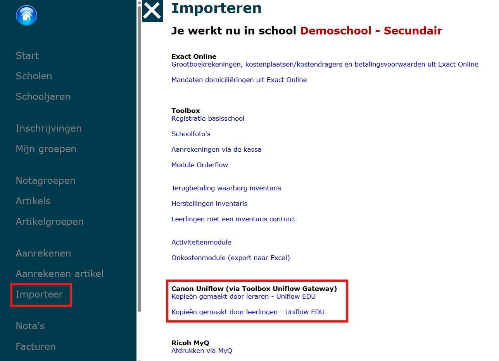

In de module Leerlingenrekeningen kan je de afdrukgegevens uit Canon Uniflow of Ricoh MyQ importeren op de schoolrekening.

- Open de **module Leerlingenrekeningen** en selecteer de **notagroep** waarin je de activiteit wil importeren.
- Ga vervolgens naar het menu **Importeer**. 

## Canon Uniflow

De kopieën voor leraren en leerlingen moeten afzonderlijk geïmporteerd worden. De werkwijze is voor beide imports dezelfde. 
- Selecteer de periode waarvoor je de afdrukken en kopieën wil importeren op de schoolrekening.
- Selecteer vervolgens het artikel uit de leerlingenrekeningen dat je hiervoor wil gebruiken. De naam van het artikel wordt getoond op de schoolrekening. De achterliggende boekhoudkundige parameters worden overgenomen naar Exact Online. De volledige lijst met beschikbare artikels is terug te vinden in het menu 'Artikels'. 
- Klik op 'Start import' om de kosten effectief te importeren. 
- De import is terug te vinden via het menu 'Aanrekenen artikel'. 

    

    :::caution ter info
    Je kan de kopiekosten uit Canon Uniflow meermaals opnieuw importeren. 
    :::

## Ricoh MyQ

Om de kopiekosten vanuit MyQ in Toolbox te kunnen importeren, moet er in MyQ een bestand gegenereerd worden via de daarvoor voorziene tool. Dat bestand kan in Toolbox ingelezen worden via de knop 'Afdrukken via MyQ' zoals getoond in de afbeelding hierboven. 
:::danger aandachtspunt
Om deze tool te activeren of bij problemen met deze tool, gelieve rechtstreeks contact op te nemen met Ricoh of MyQ. 
::: 

- **Titel aanrekening artikel**: Geef de aanrekening een naam. Deze titel is enkel voor intern gebruik en wordt niet getoond op de schoolrekening. 
- **Artikel**: Selecteer vervolgens het artikel uit de leerlingenrekeningen dat je wil koppelen. De achterliggende boekhoudkundige parameters van dit worden overgenomen naar Exact Online. De volledige lijst met beschikbare artikels is terug te vinden in het menu 'Artikels'.
- **Te importeren gegevens**: Deze gegevens haal je op uit de tool van Ricoh MyQ. Je kan de gegevens vervolgens kopiëren en in dit tekstveld in Toolbox plakken. 
    - De eerste rij moet steeds de kolomhoofding bevatten, nl. [Periode];[Pointer];[Aantal];[Naam Artikel];[Prijs]
    - Alle volgende rijen bevatten de te importeren data, bv. 06/03/2025 tot 06/03/2025;4879;12;PRINT/COPY;0,02
- **Importeer enkel leerlingen die voorkomen in vestiging**: Indien de school (in Informat) uit meerdere vestigingen bestaat én er moet voor de vestigingen apart gefactureerd worden, dan kan je hier de gewenste vestiging selecteren. In de lijst met te importeren data mogen gerust leerlingen uit de andere vestiging(en) voorkomen. Toolbox zal enkel de leerlingen importeren die voorkomen in de geselecteerde vestiging. Op deze manier hoef je zelf weinig zoekwerk te verrichten en kan je dezelfde lijst meermaals gebruiken, nl. voor elke vestiging. Indien je de data integraal wil importeren, selecteer je geen enkele vestiging.  
- Klik op 'Start import' om de kosten effectief te importeren.
- De import is vervolgens terug te vinden via het menu 'Aanrekenen artikel'.

*Klik op de afbeelding om te vergroten.*
