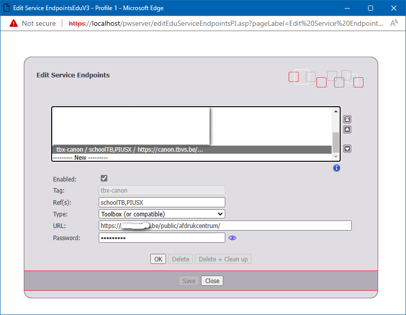

<ImageTitle img="afdrukcentrum.png">Afdrukcentrum</ImageTitle>

Door middel van het Afdrukcentrum kunnen personeelsleden afdrukopdrachten doorsturen naar een afdruksysteem zoals Canon Uniflow. Leraren kunnen op die manier hun te printen documenten als PDF reeds klaarzetten in het systeem en aanduiden aan wie de afdrukken aangerekend moeten worden.

### Afdrukcentrum koppelen
In de module Instellingen vul je bij Afdrukcentrum - Algemeen een paswoord in. Dit paswoord vul je ook in het afdruksysteem in en laat toe om de afdrukken op een veilige manier op te halen.

Als endpoint vul je https://mijn.toolbox.be/public/afdrukcentrum/ in. Zorg dat de Ref overeenkomt met de instellingen in de import van gebruikers in [Canon Uniflow](/uniflow).

