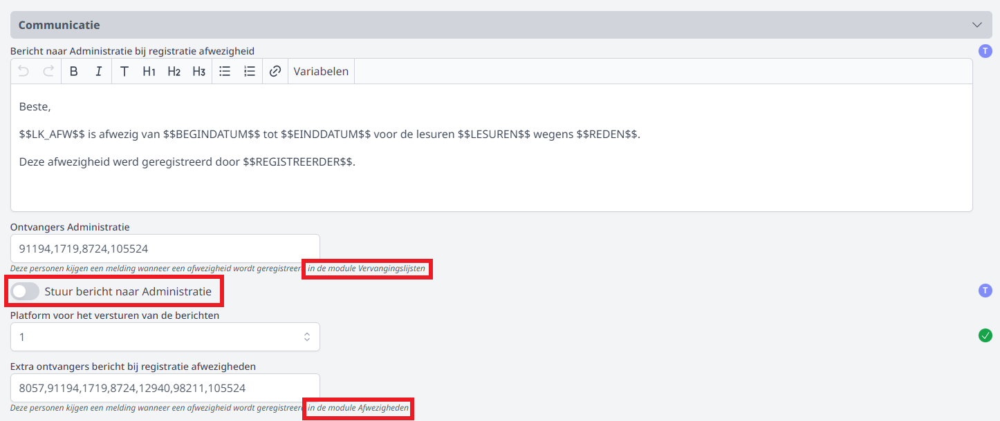
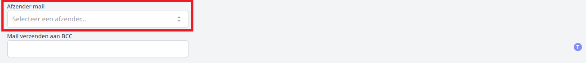
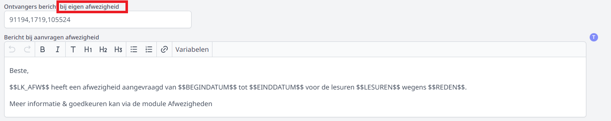
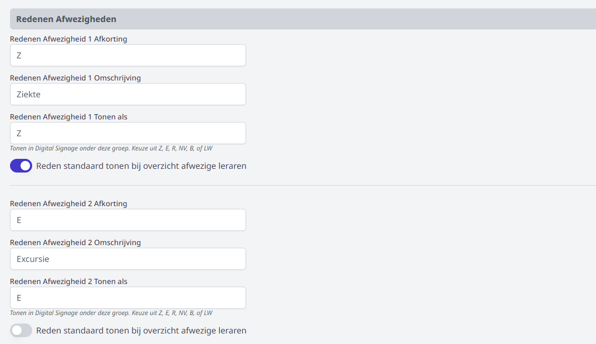

## Instellingen
Vooraleer je aan de slag kan met de modules 'Mijn afwezigheden' en 'Afwezigheden' moeten er nog een aantal algemene zaken worden ingesteld in de module Instellingen => Afwezigheden. De instellingen voor beide modules zijn hier terug te vinden. 

1. Eerst en vooral kan je voor de module 'Mijn afwezigheden' instellen tot hoeveel dagen op voorhand een leraar zijn afwezigheid kan aanvragen. Indien er geen beperking is, vul je hier 0 in. Een leraar kan in dat geval tot en met de dag van afwezigheid een aanvraag doen via deze module. 

  

2. Vervolgens kan je instellen of er collega's verwittigd moeten worden na het ingeven van een afwezigheid via de module 'Afwezigheden' of in de module 'Vervangingslijsten'. Per module kunnen er meerdere ontvangers opgegeven worden. Door gebruik te maken van de dynamische variabelen, wordt een bericht gepersonaliseerd. Wanneer je een bericht verstuurt, zullen de variabelen automatisch vervangen worden door de correcte gegevens.  
    - **Smartschool**: Je selecteert het smartschoolplatform en vult voor de ontvangers het intern nummer of de gebruikersnaam van Smartschool in (naar gelang de instelling in de betreffende Toolbox). Meerdere ontvangers worden gescheiden door een komma, zonder spatie na de komma. 
    - **E-mail**: Laat het veld 'Platform' leeg en vul onderaan de mailsettings in. Bij de ontvangers vul je de e-mailadressen in. Meerdere ontvangers worden gescheiden door een komma, zonder spatie na de komma. 

  

  

3. Ook bij het gebruik van de module 'Mijn afwezigheden' kunnen personeelsleden verwittigd worden (via Smartschool of e-mail) na het aanvragen van een afwezigheid door een leraar. Er moet minimaal een bericht verstuurd worden naar het personeelslid dat de aanvraag moet behandelen (goedkeuren of weigeren). 

  

4. Tot slot definieer je nog de mogelijke types van afwezigheden zoals ziekte, nascholing, sociaal verlof, excursie, ... Er kunnen 10 verschillende afwezigheidstypes ingesteld worden. Voor elk type geef je een zelfgekozen afkorting en een omschrijving. Indien je gebruikt maakt van de module 'Digital signage' kan je ook de categorie opgeven waaronder de afwezigheid getoond moet worden op de tv schermen. Er worden echter maar een beperkt aantal categorieën getoond. Dat zijn de volgende:

    - Z = ziekte
    - E = excursie
    - R = andere
    - B en NV = navorming
    - LW = leswissel  

  

## Gebruikersrechten toekennen
Om de module 'Afwezigheden' te kunnen gebruiken, moeten er rechten toegekend worden. Dat gebeurt door een beheerder via de module [Gebruikersbeheer](/gebruikersbeheer). Voor de module 'Mijn afwezigheden' volstaat het om de tegel te activeren (Instellingen => modules). Van zodra de module actief is, is die meteen toegankelijk voor alle personeelsleden zonder dat er bijkomende rechten toegekend moeten worden.

## Lessenrooster
Om afwezigheden correct te kunnen registreren en vervangingen te kunnen koppelen, is het noodzakelijk dat het huidige lessenrooster in Toolbox gekend is. Daarvoor moet er een exportbestand van het lessenrooster uit het roosterprogramma worden opgeladen in de module 'Lessenrooster'. Meer info over de werking van deze module vind je [hier](/lessenrooster).
