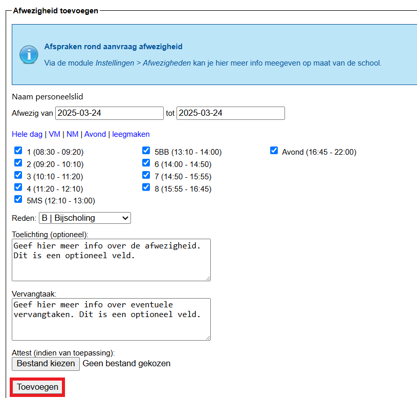
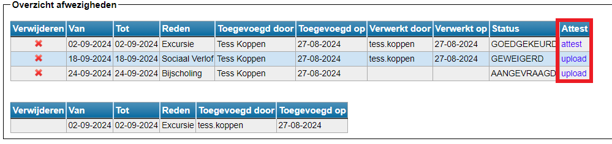

<ImageTitle img="mijnafwezigheden.png">Mijn afwezigheden</ImageTitle>

Via deze module kunnen leraren een afwezigheid aanvragen voor één of meerdere lesuren of voor een langere periode. Men kan de aanvraag eventueel staven door een document op te laden. 

Wanneer een aanvraag is ingediend, wordt die doorgestuurd naar de module 'Afwezigheden' waar iemand met toegang tot deze module de aanvraag verder kan behandelen. In de module [Instellingen](/afwezigheden/instellingen/) kan je instellen dat deze persoon bij elke aanvraag een bericht ontvangt via Smartschool of e-mail. Dat maakt een vlotte opvolging mogelijk. Je kan hier eveneens bepalen tot hoeveel dagen op voorhand een personeelslid een afwezigheid kan aanvragen. 

Indien in de module Instellingen is uitgeschakeld dat leraren hun eigen afwezigheden mogen registreren, kunnen zij in de module 'Mijn afwezigheden' enkel hun afwezigheden - ingegeven door de personeelsdienst - raadplegen. Zij hebben dan nog wel de mogelijkheid om zelf hun afwezigheidsattest op te laden of te raadplegen (indien opgeladen door de personeelsdienst).

Wanneer de tegel geactiveerd is, hebben alle personeelsleden onmiddellijk toegang. Er moeten dus geen bijkomende gebruikersrechten toegekend worden.  

## Eigen afwezigheid aanvragen

Bij de aanvraag wordt de naam van het personeelslid automatisch bovenaan getoond. Die kan niet gewijzigd worden. Een personeelslid kan via deze module dus enkel zijn eigen afwezigheid aanvragen en kan **geen** aanvraag doen in naam van een collega. 

- Stap 1: Vul de dag of periode van de afwezigheid in met behulp van de datumvelden.

- Stap 2: Duid met behulp van de blauwe linken aan of je een hele dag afwezig zal zijn of enkel in de voor- of namiddag of 's avonds (indien gedefinieerd in de lessenrooster). Het is ook mogelijk om één of enkele lesuren aan te vinken.

- Stap 3: Geef de reden van de afwezigheid op. Je kan kiezen uit een aantal vooraf gedefinieerde redenen. Deze worden vooraf ingesteld door een beheerder in de module [Instellingen](/afwezigheden/instellingen/) => Afwezigheden.

- Stap 4: Noteer in het tekstveld eventueel een toelichting bij de aanvraag en/of voeg een bestand toe. Dit zijn twee optionele functies.  

- Stap 5: Voeg de afwezigheid toe.

## Aangevraagde afwezigheid opvolgen

Wanneer een aanvraag is ingediend, verschijnt die onderaan in het bovenste overzicht met afwezigheden. Het is niet mogelijk om een aanvraag te wijzigen. Indien dit nodig zou zijn, kan je de aanvraag verwijderen via het rode kruisje <LegacyAction img="remove.png"/> en opnieuw indienen.

In het bovenste overzicht kan je de details van elke aanvraag terugvinden, alsook de status (helemaal achteraan). De persoon die bevoegd is voor het behandelen van de aanvragen, kan via de module **Afwezigheden** een aanvraag goedkeuren, weigeren of een gesprek met het betrokken personeelslid aanvragen. In dat laatste geval, zal de aanvrager hiervan verwittigd worden door middel van een smartschoolbericht.  

Het onderste overzicht bevat een lijst met reeds afgelopen of reeds goedgekeurde afwezigheden. Deze afwezigheden zullen in beide lijsten voorkomen en kunnen uit de onderste lijst niet meer verwijderd worden. De aanvraag kan/mag door het personeelslid zelf uit de bovenste lijst verwijderd worden, zodat die enkel nog in de onderste lijst bestaat, maar dat is geen vereiste. 

## Afwezigheidsattest 

Indien er reeds een attest is geüploaded (door het personeelslid zelf of door de personeelsdienst), vind je dat achteraan terug door te klikken op 'attest'. Indien er geen attest beschikbaar is, kan het personeelslid dit achteraf nog toevoegen door te klikken op 'upload'. Een attest dat later werd toegevoegd, zal ook in de module **Afwezigheden** beschikbaar zijn voor de personeelsdienst. 

Een personeelslid kan zelf geen attesten verwijderen. Indien dat nodig is, dient men de personeelsdienst te contacteren. Zij kunnen de aanpassing doen in de module 'Afwezigheden'.

