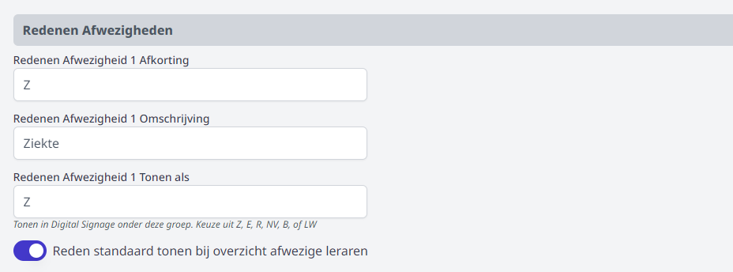
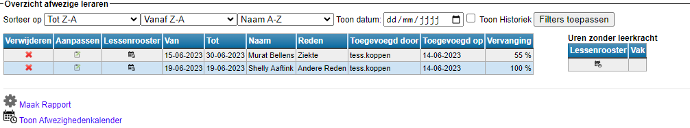
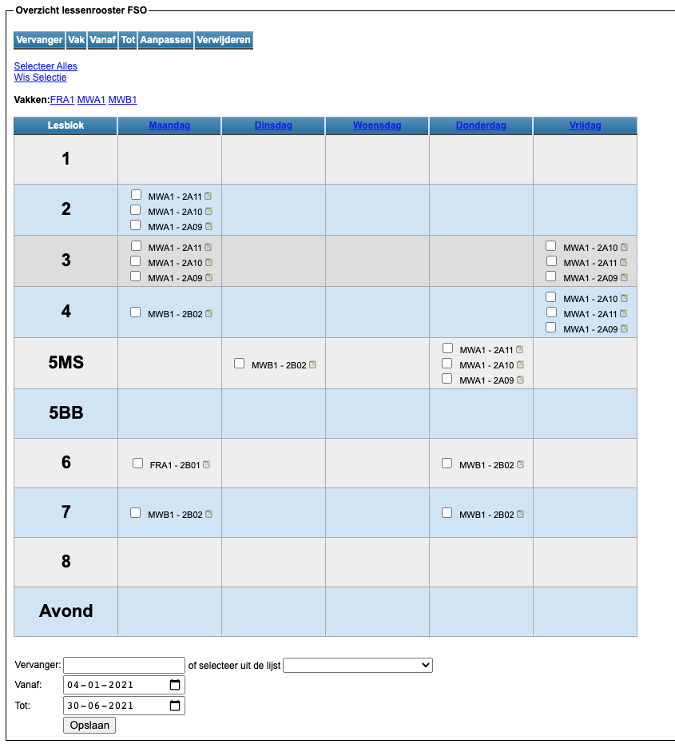
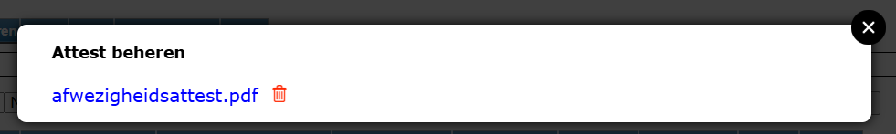
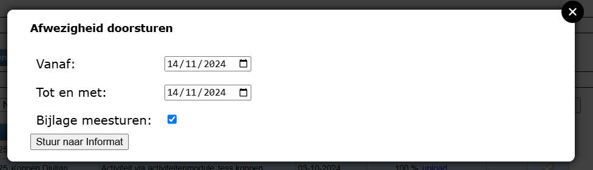
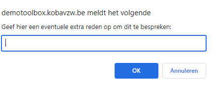
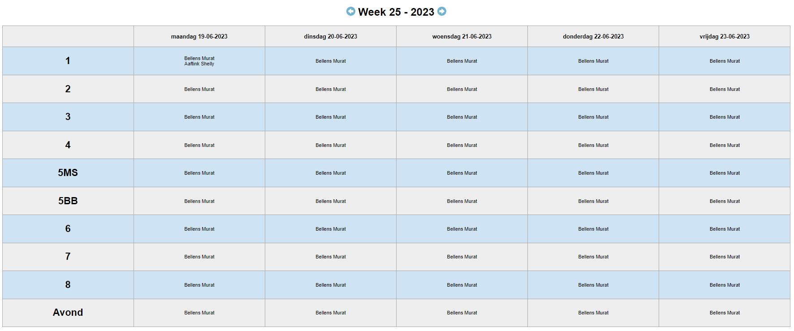
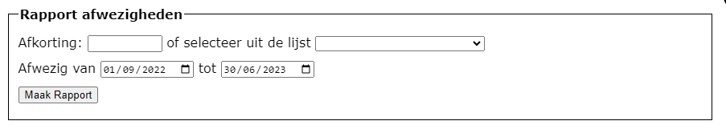
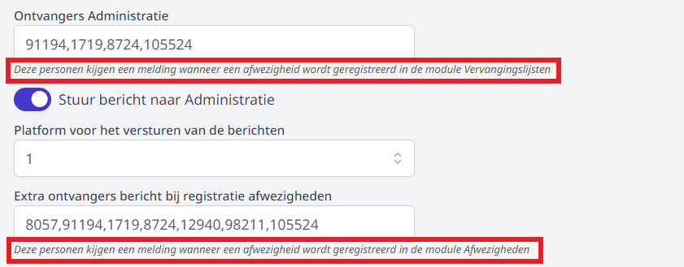

<ImageTitle img="sick.png">Afwezigheden</ImageTitle>

In deze module kan je de afwezigheid van een leerkracht registreren alsook de aangevraagde afwezigheden uit de module 'Mijn afwezigheden' behandelen (goedkeuren of weigeren) en vervangers inroosteren. 

## Afwezige leraar toevoegen

- Stap 1: Zoek de leerkracht op via afkorting of zoek hem in de lijst.
- Stap 2: Geef een reden op en een begin- en (voorlopige) einddatum. 

  Je kan zelf de verschillende redenen instellen in de module [Instellingen](/afwezigheden/instellingen/) => Afwezigheden.

  

- Stap 3: Duid aan of de leerkracht afwezig is voor een hele dag, enkel de voor- of namiddag of voor de avond (indien gedefinieerd in de lessenrooster). Het is ook mogelijk om één of enkele lesuren aan te vinken. 
- Stap 4: Voeg de afwezigheid toe.

  <Thumbnails img={[
      require('./afwezig2.png').default, 
    ]} />

## Overzicht afwezige leraren & vervanging ingeven

De afwezigheid wordt geregistreerd en komt onderaan in het overzicht te staan. In dat overzicht kan je op verschillende manieren zoeken en filteren. 

Standaard worden enkel de afwezigheden van vandaag en in de toekomst getoond. Vul een datum in om de afwezigheden op een bepaalde datum op te vragen. Door de historiek te tonen (checkbox aanvinken) worden er ook afwezigheden uit het verleden getoond. 

Enkel de afwezigheidstypes die in de module **Instellingen => Afwezigheden** ingesteld zijn als 'standaard tonen' worden automatisch getoond. Door te **filteren op redenen** kan je manueel filteren op afwezigheidstype. Hierbij is het mogelijk om meerdere of alle types tegelijk te tonen. Klik steeds op **Filters toepassen** om de gekozen filters te activeren. 

- **Verwijderen**: Via <LegacyAction img="remove.png"/> kan je een afwezigheid verwijderen in het geval die foutief was.

- **Aanpassen**: Via <LegacyAction img="edit.png"/> kan je bestaande afwezigheden aanpassen, zoals de begin- en/of einddatum of de reden van afwezigheid.

- **Lessenrooster en vervanger**: Door op deze knop <LegacyAction img="calendar.png"/> te klikken in de kolom 'Lessenrooster' krijg je helemaal onderaan het lessenrooster van de leerkracht te zien. Hier kan je een vervanger registreren voor de uren in het rooster. 

  Dit kan je ineens voor alle uren doen door 'Selecteer Alles' te kiezen. Je kan ook een vervanging ingeven voor één specifiek vak of voor alle lesuren van 1 dag door op die dag te klikken. Je kan evenees zelf de verschillende uren aanvinken of je kan slechts 1 lesuur aanpassen door op het icoontje achteraan de les te klikken.

  Onderaan kan je dan de vervanger invullen of kiezen uit de lijst en een begin- en einddatum opgeven voor die vervanging. Standaard staat hier al de begin- en einddatum van de afwezigheid ingevuld. Die kan steeds gewijzigd worden. 

  

- **Vervanging**: In het overzicht zie je per afwezig personeelslid achteraan een percentage staan, dat duidt aan hoeveel procent van de lessen van die leraar al een vervanger heeft toegewezen gekregen. Indien het personeelslid geen lessen (meer) op zijn naam heeft staan, staat hier standaard 100%.

- **Attest**: Via deze kolom kan je nagaan of er een attest beschikbaar is om de afwezigheid te wettigen. Indien beschikbaar, staat hier de blauwe linktekst 'attest'. Je kan op deze tekst klikken om het attest te downloaden. Als er geen attest beschikbaar is, wordt in diezelfde kolom 'upload' getoond. Door op deze link te klikken kan je alsnog een attest of document uploaden en aan de afwezigheid koppelen.  

  Heeft een personeelslid een foutief attest opgeladen via de module Mijn Afwezigheden, dan kan die dat NIET zelf verwijderen. Iemand met rechten in de module Afwezigheden kan dat wel. Klik op de link 'Attest' en klik vervolgens op het rode vuilnisbakje. 

  

- **Informat**: Via de kolom 'Informat' kan je afwezigheden wegens ziekte doorsturen naar Informat. Om de afwezigheid over te zetten, klik je op het grijze vinkje. Vervolgens wordt er een pop-up getoond. Daarin kan je eventueel de datum van de afwezigheid nog aanpassen, zodat die zeker overeenstemt met het afwezigheidsattest. Is er reeds een attest geüploaded (door de personeelsdienst in de module Afwezigheden of door het personeelslid zelf in de module Mijn Afwezigheden) dan wordt dat mee naar Informat gestuurd op voorwaarde dat men het vinkje 'Bijlage meesturen' aanzet. Als het overzetten geslaagd is, kleurt het vinkje in de kolom 'Informat' groen. De afwezigheid wordt doorgegeven naar elk instellingsnummer waar het personeelslid actief is. 
  
  

- **Verwerkt**: Deze kolom kan je optioneel gebruiken om je eigen manuele verwerking op te volgen. Klik op de grijze bol om aan te geven dat je de afwezigheid hebt verwerkt. De bol zal vervolgens groen kleuren.  

## Aangevraagde afwezigheden behandelen

Indien de optionele module 'Mijn afwezigheden' gebruikt wordt waarin leraren hun eigen afwezigheid kunnen aanvragen, komen alle aanvragen in het overzicht bij 'Aangevraagde Afwezigheden' te staan. De aanvragen kunnen hier goedgekeurd worden via het groene vinkje of geweigerd via het rode vinkje. Het is eveneens mogelijk om een gesprek aan te vragen. De aanvrager zal dan een bericht ontvangen met eventueel de reden voor het bijkomende gesprek. In de laatste kolom is te zien welke status de aanvraag op dit moment heeft (aangevraagd, goedgekeurd, geweigerd of gesprek). 

Door met de cursor over de reden van de afwezigheid te bewegen, kan je zien of er door het personeelslid meer info is meegegeven bij de aanvraag. 

Indien het personeelslid een attest of document heeft opgeladen, kan je dat downloaden via de link 'attest'. 

## Afwezigheidskalender

Met de functie <LegacyAction img="calendar.png" text="Toon Afwezighedenkalender"/> wordt er een weekkalender getoond met alle afwezigheden per lesuur en per dag. Via de pijltjesknoppen kan je een week vroeger of later tonen.

## Rapport afwezigheden per personeelslid

Via <LegacyAction img="configure.png" text="Maak rapport"/> wordt er een rapport getoond van alle afwezigheden van één bepaalde leraar over een nader te bepalen periode. 

## Administratieve collega's op de hoogte brengen van een afwezigheid

In de module [Instellingen](/afwezigheden/instellingen/) kan je opgeven welke personen op de hoogte moeten worden gebracht wanneer er een nieuwe afwezigheid wordt geregistreerd.
Dit kan handig zijn voor studiemeesters/roostermakers zodat zij ineens op de hoogte zijn dat er mogelijks een extra vervanging moet georganiseerd worden.

In de module [Vervangingslijsten](/vervangingslijsten) kan er door studiemeesters op een gelijkaardige manier ook iemand afwezig worden gezet. Ook voor deze module kan er via de module Instellingen opgegeven worden of de administratie hiervan verwittigd moet worden.

