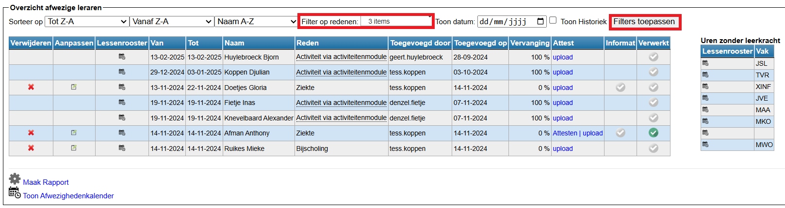
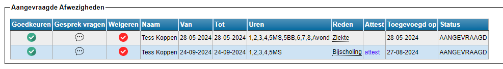

<ImageTitle img="sick.png">Afwezigheden</ImageTitle>

In deze module kan je de afwezigheid van een leerkracht registreren alsook de aangevraagde afwezigheden uit de module 'Mijn afwezigheden' behandelen (goedkeuren of weigeren) en vervangers inroosteren. 

### Afwezige leraar toevoegen

- Stap 1: Zoek de leerkracht op via afkorting of zoek hem in de lijst.
- Stap 2: Geef een reden op en een begin- en (voorlopige) einddatum. 

  Je kan zelf de verschillende redenen instellen in de module [Instellingen](/afwezigheden/instellingen/) => Afwezigheden.

  <Thumbnails img={[
    require('./afwezig1.png').default, 
  ]} />

- Stap 3: Duid aan of de leerkracht afwezig is voor een hele dag, enkel de voor- of namiddag of voor de avond (indien gedefinieerd in de lessenrooster). Het is ook mogelijk om één of enkele lesuren aan te vinken. 
- Stap 4: Voeg de afwezigheid toe.

 <Thumbnails img={[
    require('./afwezig2.png').default, 
  ]} />

### Overzicht afwezige leraren & vervanging ingeven

De afwezigheid wordt geregistreerd en komt onderaan in het overzicht te staan. In dat overzicht kan je op verschillende manieren zoeken en filteren. 

In deze lijst kan je een afwezigheid verwijderen, als die foutief was.
Je kan ook bestaande afwezigheden aanpassen, zoals de begin- en/of einddatum of de reden van afwezigheid.

In het overzicht zie je per afwezig personeelslid achteraan een percentage staan, dat duidt aan hoeveel % van de lessen van die leerkracht al een vervanger heeft toegewezen gekregen.
Indien het lessenrooster is aangepast waardoor de leerkracht geen lessen meer op zijn naam heeft staan, staat hier standaard 100%.

Door de historiek te tonen (aanvinken) worden er ook afwezigheden uit het verleden getoond. 

Via de knop in de kolom 'Lessenrooster' <LegacyAction img="calendar.png"/> krijg je het lessenrooster van de leerkracht te zien. Hier kan je een vervanger registreren voor de uren in het rooster. 

Dit kan je ineens voor alle uren doen door 'Selecteer Alles' te kiezen. Je kan ook een vervanging ingeven voor één specifiek vak of voor alle lesuren van 1 dag door op die dag te klikken.
Je kan evenees zelf de verschillende uren aanvinken of je kan slechts 1 lesuur aanpassen door op het icoontje achteraan de les te klikken.

Onderaan kan je dan de vervanger invullen of kiezen uit de lijst en een begin- en einddatum opgeven voor die vervanging. Standaard staat hier al de begin- en einddatum van de afwezigheid ingevuld. Die kan steeds gewijzigd worden. 

### Aangevraagde afwezigheden behandelen

Indien de optionele module 'Mijn afwezigheden' gebruikt wordt waarin leraren hun eigen afwezigheid kunnen aanvragen, komen alle aanvragen in het overzicht bij 'Aangevraagde Afwezigheden' te staan. De aanvragen kunnen hier goedgekeurd worden via het groene vinkje of geweigerd via het rode kruisje. Het is eveneens mogelijk om een gesprek aan te vragen. De aanvrager zal dan een bericht ontvangen met eventueel de reden voor het bijkomende gesprek. In de laatste kolom is te zien welke status de aanvraag op dit moment heeft (aangevraagd, goedgekeurd, geweigerd of gesprek). 

### Afwezigheidskalender

Met de functie <LegacyAction img="calendar.png" text="Toon Afwezighedenkalender"/> wordt er een weekkalender getoond met alle afwezigheden per lesuur en per dag. Via de pijltjesknoppen kan je een week vroeger of later tonen.

### Rapport afwezigheden per personeelslid

Via <LegacyAction img="configure.png" text="Maak rapport"/> wordt er een rapport getoond van alle afwezigheden van één bepaalde leraar over een nader te bepalen periode. 

### Administratieve collega's op de hoogte brengen van een afwezigheid

In de module [Instellingen](/afwezigheden/instellingen/) kan je opgeven welke personen op de hoogte moeten worden gebracht wanneer er een nieuwe afwezigheid wordt geregistreerd.
Dit kan handig zijn voor studiemeesters/roostermakers zodat zij ineens op de hoogte zijn dat er mogelijks een extra vervanging moet georganiseerd worden.

In de module [Vervangingslijsten](/vervangingslijsten) kan er door studiemeesters op een gelijkaardige manier ook iemand afwezig worden gezet. Ook voor deze module kan er via de module Instellingen opgegeven worden of de administratie hiervan verwittigd moet worden.

<Thumbnails img={[
    require('./afwezig5.png').default, 
  ]} />