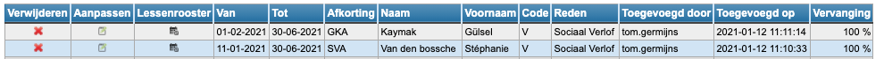
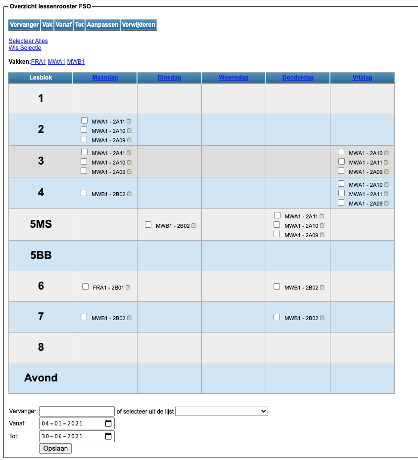

<ImageTitle img="sick.png">Afwezigheden</ImageTitle>

In deze module kan je de afwezigheid van een leerkracht registreren.

- Stap 1: Zoek de leerkracht op via afkorting of zoek hem in de lijst.
- Stap 2: Geef een reden op en een begin- en (voorlopige) einddatum. 

  Je kan zelf de verschillende redenen instellen in de module Instellingen => Afwezigheden.

  <Thumbnails img={[
    require('./afwezig1.png').default, 
  ]} />

- Stap 3: Duid aan of de leerkracht afwezig is voor een hele dag, enkel de voor- of namiddag of voor de avond (indien gedefinieerd in de lessenrooster). Het is ook mogelijk om één of enkele lesuren aan te vinken. 
- Stap 4: Voeg de afwezigheid toe.

<Thumbnails img={[
    require('./afwezig2.png').default, 
  ]} />

De afwezigheid wordt geregistreerd en komt onderaan in het overzicht te staan.

In deze lijst kan je een afwezigheid verwijderen, als die foutief was.
Je kan ook bestaande afwezigheden aanpassen, zoals de begin- en/of einddatum of de reden van afwezigheid.
Met de knop "Lessenrooster" krijg je het lessenrooster te zien van de afwezige leerkracht. 

- Stap 5: Vervangingen registreren.

In het overzicht zie je achteraan een percentage staan, dat duidt aan hoeveel % van de lessen van die leerkracht al een vervanger hebben toegewezen gekregen.
Indien het lessenrooster is aangepast waardoor de leerkracht geen lessen meer op zijn naam heeft staan, staat hier standaard 100%.

Via de knop "Lessenrooster" krijg je het lessenrooster van de leerkracht te zien. Hier kan je dan een vervanger registreren voor de uren in het rooster.

Dit kan je ineens voor alle uren doen door "Selecteer Alles" te kiezen. Je kan ook een vervanging ingeven voor één specifiek vak of voor alle lesuren van 1 dag door op die dag te klikken.
Je kan evenees zelf de verschillende uren aanvinken of je kan slechts 1 lesuur aanpassen door op het icoontje achteraan de les te klikken.

Onderaan kan je dan de vervanger invullen of kiezen uit de lijst en een begin- en einddatum opgeven voor die vervanging. Standaard staat hier al de begin- en einddatum van de afwezigheid ingevuld. Die kan steeds gewijzigd worden. 

In de module Instellingen kan je opgeven welke personen op de hoogte moeten worden gebracht wanneer er een nieuwe afwezigheid wordt geregistreerd.
Dit kan handig zijn voor studiemeesters/roostermakers zodat zij ineens op de hoogte zijn dat er mogelijks een extra vervanging moet georganiseerd worden.

In de module Vervangingslijsten kan er door studiemeesters op een gelijkaardige manier ook iemand afwezig worden gezet, ook voor deze module kan er via de module Instellingen opgegeven worden of de administratie hiervan verwittigd moet worden.

<Thumbnails img={[
    require('./afwezig5.png').default, 
  ]} />