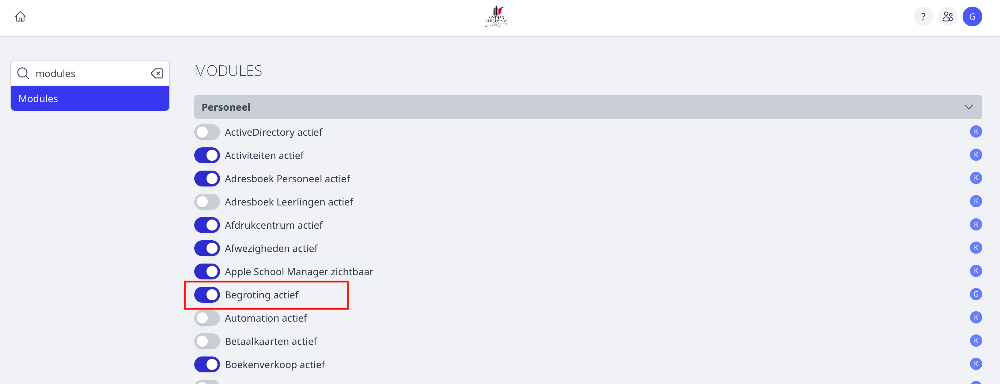

<ImageTitle img="begroting.png">Begroting</ImageTitle>

De module Begroting laat toe om op een gestructureerde manier alle investeringen te registereren. Je kan deze module gebruiken om enerzijds alle wensen op te lijsten en anderzijds om aan te duiden wat er effectief begroot zal worden.
Het idee achter deze module is dat bijvoorbeeld directies alle wensen registereren en prioritiseren en dat bijvoorbeeld een regio-boekhouder kan markeren welke wensen effectief begroot zullen worden.

## Module activeren en gebruikersrechten
Om deze optie te kunnen gebruiken moet je de module eerst activeren. Dat doe je in de instellingen - Modules personeel. Daar zet je 'Begroting' actief.

Om de module te kunnen gebruiken moet je beschikken over één van deze twee rechten:
- **begroting_invullen**: met dit recht kan je alle wensen invoeren
- **begroting_beheer**: met dit recht kan je aanduiden welke wensen effectief worden weerhouden in de begroting

## De module gebruiken

Binnen de module worden door het Toolbox-team één of meerdere scholen aangemaakt. Door te werken met meerdere scholen kan de begroting eventueel opgesplitst worden.
Als er maar één school aanwezig is, kom je meteen in het scherm om wensen in te voeren voor die school.

Door middel van de knop 'Nieuw item' kan je lijnen toevoegen. Elke lijn hangt aan een categorie. Die categorieën worden ook weer door het Toolbox-team toegevoegd.

De velden Projectnummer en bedrag subsidie zijn optioneel. De andere velden zijn verplicht.

Van zodra er items zijn toegevoegd, kan je gebruik maken van filters. Die filters laten toe om te filteren op boekjaar, prioriteit, categorie en goed- of afgekeurd.
Afhankelijk van de ingestelde filters wordt er ook een totaal berekend. Op die manier kan je de filters gebruiken om te bepalen welke items effectief begroot zullen worden.

## Lijnen effectief begroten

Als je beschikt over de permissie begroting_beheer, dan kan je de handjes vooraan elke lijn gebruiken om een lijn op te nemen in de effectieve begroting.
Het handje wordt dan groen gemaakt. Als je nu filtert op Goedgekeurd = ja, dan zie je meteen het totaalbedrag van je begroting.

Merk op: van zodra een item werd goedgekeurd kan het niet meer gewijzigd worden!

## Begroting niet uitgevoerd

Indien een lijn niet effectief werd uitgevoerd, kan je dit via het icoontje met de bankbiljetten aanduiden. De biljetten worden dan rood, net zoals de titel van de lijn.

