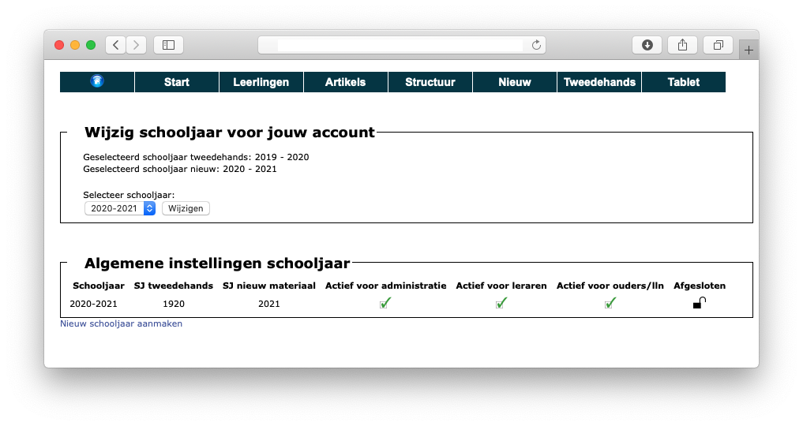

De module boekenverkoop werkt op basis van een geselecteerd schooljaar. Bij de eerste opstart moet een schooljaar worden aangemaakt. Contacteer hiervoor de Toolbox helpdesk (info@tbvs.be). Het beheer van de schooljaren gebeurt in de module Boekenverkoop zelf.

Elk schooljaar bestaat uit 3 delen die apart aan- of uitgeschakeld kunnen worden:

* **Administratie**  
Dit is de beheerdersmodule waarin je aan het werken bent. Als er maar één schooljaar aangemaakt is, is dat schooljaar altijd actief voor de administratie. Van zodra er meerdere schooljaren zijn aangemaakt, kan je instellen welk schooljaar standaard gebruikt moet worden.

* **Actief voor leraren**  
Deze instelling heeft effect op de module Materialenlijst. Die module laat toe dat leraren tegen het einde van het schooljaar doorgeven welke materialen zij voor hun vak wensen te gebruiken in het volgende schooljaar. Deze module neemt de structuur van de boekenverkoop over. Als er geen schooljaar actief is voor de leraren, kunnen zij in de module Materialenlijst geen gegevens opvragen of invullen.

* **Actief voor de ouders/lln**  
Door middel van dit vinkje kan je in het leerlingenplatform - waar de leerlingen hun bestelling plaatsen of hun tweedehandsboeken registreren - de modules Boekenverkoop en Tweedehands uitschakelen. De leerlingen krijgen dan de melding dat er geen schooljaar actief is voor die modules.

Een schooljaar kan door middel van het hangslot ook afgesloten worden. Daarmee wordt het schooljaar 'read-only'. Je kan dus alles nog opvragen maar geen wijzigingen meer doorvoeren.

Door middel van de lijst met schooljaren kan je snel wisselen van schooljaar. Die instelling is account gebonden en wordt niet bewaard na het uitloggen!

Van zodra er een schooljaar aanwezig is, is het mogelijk om de volgende schooljaren zelf aan te maken door middel van de link 'Nieuw schooljaar aanmaken'.

