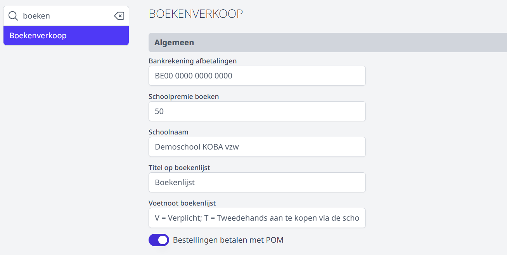
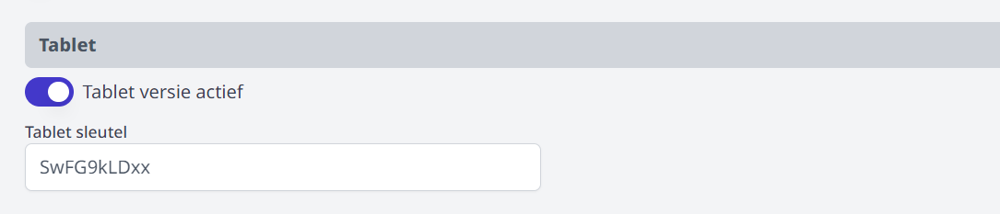
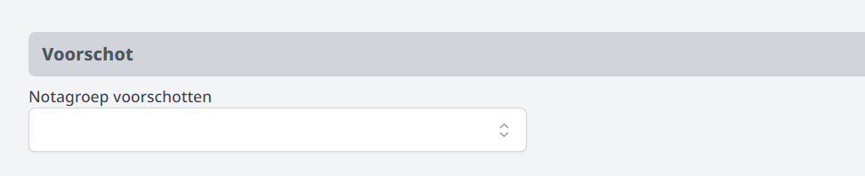
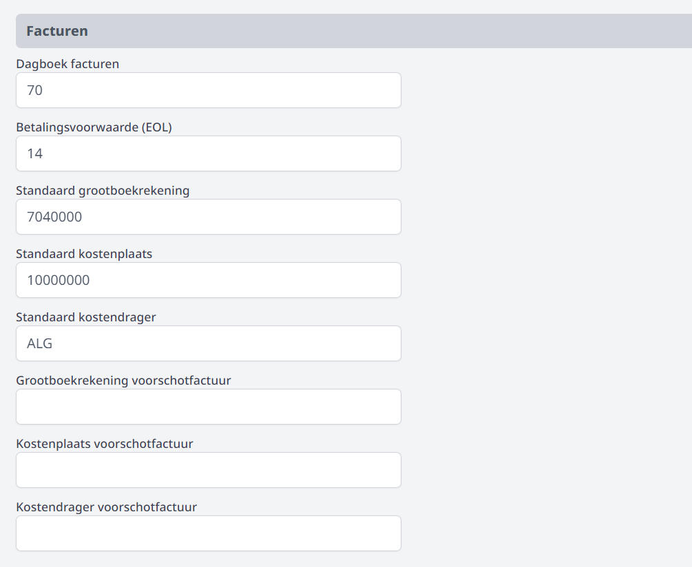
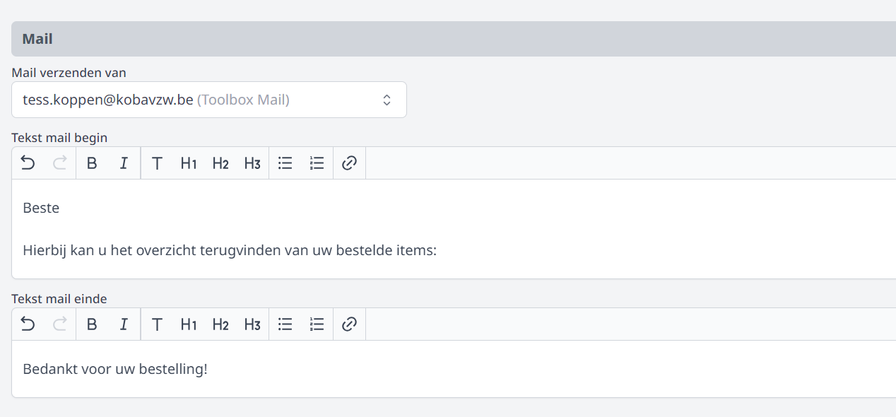
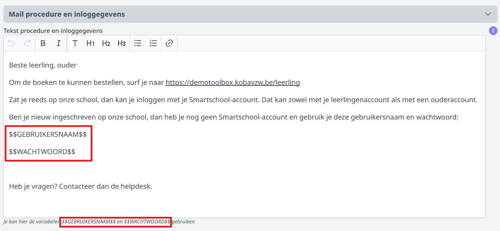
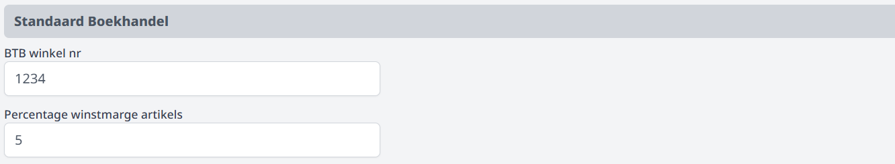

Alvorens je aan de slag kan met de module Boekenverkoop moeten er nog een aantal zaken geconfigureerd worden. 

## Gebruikersbeheer

Om de module Boekenverkoop in Toolbox te kunnen inrichten en gebruiken moet het gebruikersrecht **boekenverkoop** zijn toegekend. Gebruikersrechten kunnen toegekend worden door een beheerder via de module [Gebruikersbeheer](/gebruikersbeheer). Bij het vraagteken rechtsboven in Toolbox kan je nagaan wie die beheerder is voor jouw Toolbox. 

## Algemene instellingen

In de module **Instellingen => Boekenverkoop** kunnen een aantal algemene zaken worden ingesteld. 

### 1. Algemene en financiële parameters

- De **bankrekening** is het rekeningnummer van de school waarop de ouders moeten betalen in het geval van een afbetalingsplan. Dit rekeningnummer wordt opgenomen op het document van de afbetaling.
- Indien er een **schoolpremie** kan worden toegekend bij een afbetaling - bv. indien de school een intern fonds heeft voor armoedebestrijding - kan dat hier worden ingevuld. 
- De **Schoolnaam**, **Titel** en **Voetnoot** worden getoond op de boekenlijst. 
- **POM**: Door de optie 'Bestellingen betalen met POM' te activeren, kunnen de ouders de bestelling onmiddellijk betalen na het plaatsen van de bestelling via de webshop (Toolbox voor leerlingen). Opgelet! Om gebruik te kunnen maken van deze optie, moet er een contract afgesloten zijn met POM. Heb je nog geen contract? Gebruik dan de KOBA onboarding bij POM: [POM Onboarding](https://app.pom.be/nl/connect/koba-toolbox/tarieven)
 
- Wil je gebruik maken van de [tabletmodus](/boekenverkoop/bestelling/#5-bestelling-uitleveren) bij het uitleveren, dan kan je die hier activeren. De sleutelwaarde wordt ingevuld door Toolbox maar kan je best wijzigen naar een zelfgekozen unieke sleutel (letters en cijfers). Dit om de tabletmodus af te schermen voor ongewenste gebruikers. 

    

- Heb je in de module Leerlingenrekeningen **voorschotfacturen** gemaakt voor het boekenpakket, dan kan je die voorschotfacturen koppelen aan de module Boekenverkoop. Bij het uitleveren van de boeken zal je kunnen zien of het voorschot al dan niet voldaan is en het kunnen toevoegen als deelbetaling. Om de koppeling te maken, selecteer je in de module Instellingen de notagroep waarin je de voorschotfacturen hebt gemaakt. Hier kan maar 1 notagroep geselecteerd worden. Daarom is het belangrijk om alle voorschotfacturen in dezelfde notagroep aan te maken. 

    

- Verder kan je de **boekhoudkundige parameters** meegeven die gebruikt moeten worden voor de facturatie. Grootboekrekening, kostenplaats en kostendrager kunnen per item verschillen. Daarom is er in de module Boekenverkoop bij het menu 'Artikels => Artikels boekhouding' voorzien om deze instellingen voor elk item apart te kunnen definiëren. Vul je daar niets in, dan worden de algemene parameters uit de module Instellingen overgenomen. Vul je daar wel iets in, worden die instellingen uit het menu Artikels gebruikt. 
- Werk je met **voorschotfacturen**, vul dan ook zeker de boekhoudkundige parameters hiervoor in. Bij het toevoegen van een voorschot als deelbetaling, zal het voorschot met deze parameters in mindering worden gebracht op de factuur. 

    

### 2. E-mail
Wanneer leerlingen of ouders een bestelling plaatsen via de [webshop](/boekenverkoop/leerlingen/#2-webshop) wordt er aan het einde van de bestelling een bevestigingsmail gestuurd. Om die te kunnen versturen, moet er een afzender worden ingesteld. In de dropdownlijst kan je de gewenste afzender selecteren. Komt die afzender niet voor in de lijst, dan kan je die instellen via de module **Instellingen => E-mail**. Voor meer info, klik [hier](/e-mail) of neem contact op met de Toolbox helpdesk. 
Verder kan je ook nog de tekst vóór en na het overzicht van de bestelling instellen. 

    

### 3. Inloggegevens mailen

Nieuwe leerlingen moeten steeds inloggen in de 'Toolbox voor leerlingen' met een gebruikersnaam en wachtwoord. 
Die inloggegevens kunnen rechtstreeks vanuit de module Boekenverkoop gemaild worden naar de ouders. De tekst voor deze e-mail moet ingegeven worden in de module Instellingen > Boekenverkoop. 
Het is dan belangrijk om de variabelen $$GEBRUIKERSNAAM$$ en $$WACHTWOORD$$ op te nemen in de tekst. Die variabelen worden in de mail vervangen door de eigenlijke inloggegevens. 

Klik [hier](/boekenverkoop/leerlingen/) voor meer info over de webshop voor leerlingen en de inlogmogelijkheden.

### 4. Standaard Boekhandel

Om de bestellijst voor Standaard Boekhandel te kunnen genereren, is het nodig om helemaal onderaan het **winkelnummer** in te vullen. Dat vind je terug in de SBS-app (applicatie van Standaard Boekhandel) of via de contactpersoon. 

Daarnaast is het mogelijk om een **percentage winst (of korting)** in te stellen voor de artikels die besteld worden bij Standaard Boekhandel. Deze functie kan enkel gebruikt worden wanneer er gebruik gemaakt wordt van de automatische koppeling met het titelbestand van Standaard Boekhandel. Klik [hier](/boekenverkoop/artikels/#11-import-via-automatische-koppeling-met-titelbestand-standaard-boekhandel) voor meer informatie omtrent die koppeling. 

Bij die import wordt standaard de verkoopprijs overgenomen die voorgesteld wordt door Standaard Boekhandel. In de kolom VK (verkoopprijs) en AK (aankoopprijs) zal in dat geval dezelfde prijs getoond worden. Dit is namelijk de prijs waaraan de school het boek aankoopt bij Standaard Boekhandel en ook de prijs waaraan de school het boek verkoopt aan de leerlingen. Op die getoonde aankoopprijs krijgt de school van Standaard Boekhandel na het plaatsen van de bestelling nog een mooie korting. Vandaar dat aankoopprijs en verkoopprijs gelijk kunnen/mogen zijn. 

:::caution Ter info
Toolbox is niet op de hoogte van de gangbare kortingen. Neem hiervoor contact op met Standaard Boekhandel. 
:::
    
De school kan er echter ook voor kiezen om meer winst te nemen dan enkel de (achteraf) toegekende korting door Standaard Boekhandel en dus de verkoopprijzen op te voeren. Dat kan in Toolbox automatisch verlopen door een positief percentage in te stellen. Met een percentage van 5% rekent de school 105 euro door aan de leerling i.p.v. 100 euro zoals de voorgestelde verkoopprijs door Standaard Boekhandel. 

Andersom kan ook. Aangezien de school een behoorlijke korting krijgt van Standaard Boekhandel, kan die ervoor kiezen om een deel van de koring te delen met de leerlingen. Dat kan door een negatief percentage in te stellen. Door bv. -5% winstmarge in te stellen, zal de verkoopprijs verminderd worden en rekent de school een deel van de (achteraf toegekende) korting door aan de leerling. De gesuggereerde verkoopprijs van 100 euro wordt dan 95 euro. Opgelet! In het tekstveld mag er geen percentteken voorkomen.
Wil je geen extra winst maken of korting toekennen, dan mag het veld leeg blijven. Je kan in
 dat geval ook 0 invullen. 

