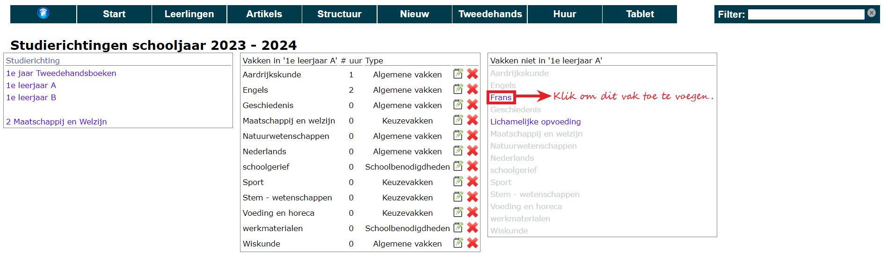

Zodra het schooljaar is aangemaakt, kan er gestart worden met het opzetten van de structuur. Die structuur is een combinatie van vakken, studierichtingen, types van vakken (bv. Algemene vakken, richtingsvakken, keuzevakken, ...) en artikels.

<Thumbnails img={[
    require('./studierichtingen.png').default, 
    require('./vakken.png').default
]} />

Bij een eerste opzet van de module is het aangewezen om te starten met het voorzien van enkele basisgegevens: lijst van studierichtingen en lijst van vakken. De helpdesk kan die lijsten (in Excel of CSV formaat) importeren op de databank om het overtypwerk te reduceren. Het koppelen van vakken aan richtingen moet echter wel in de module zelf gebeuren maar kan de volgende jaren worden overgenomen.

Als de studierichtingen en vakken klaar zitten, kan via Structuur - Studierichtingen/Vakken de koppeling gemaakt worden tussen de vakken die in een studierichting voorkomen. Dat gebeurt door in de linkse kolom de studierichting te selecteren en vervolgens in de rechtse kolom de gewenste vakken aan te vinken. De toegevoegde vakken verschijnen vervolgens in de middelste kolom en worden in de rechtse kolom in het grijs weergegeven. De niet toegevoegde vakken blijven in het blauw staan.

In de middelste kolom kan je per vak optioneel nog twee opties toevoegen: het aantal uur dat een vak wordt gegeven binnen die richting en het vaktype. Dat laatste gegeven komt vanuit de lijst van Vaktypes (te vinden onder Structuur). 

Alvorens verder te gaan, moet de lijst van artikels klaar staan. Ook die lijst kan geïmporteerd worden door de helpdesk. Volgende jaren kunnen best via de module zelf gebeuren omdat de koppeling dan ook wordt overgenomen. Indien er gewerkt wordt met de applicatie van Standaard Boekhandel, is het mogelijk om zelf de boekenlijst (Excel) te uploaden in Toolbox. Dat doe je bij 'Artikelen' via het icoon <LegacyAction img="SBS.png"/>. In SBS vind je de export bij Artikelen > Vakboeken > Uitgebreide XLSX export. 

<Thumbnails img={[
    require('./standaardboekhandel1.png').default,
    require('./standaardboekhandel2.png').default
]} />

Het artikelbestand bevat volgende velden: naam artikel (titel boek), ISBN nummer, interne code* en Verkoopprijs. Optioneel kunnen deze velden ook meegegeven worden: informatie, uiteverij, auteur(s), druk, tweedehands aan te kopen (0 of 1), tweedehands te verkopen (0 of 1). Indien het boek tweedehands kan ingeleverd worden of tweedehands verkocht wordt, moeten ook de aan- en verkoopprijzen voor categorie A en B voorzien worden. Dat wil zeggen dat er dus 4 extra velden voorzien worden: ap_cat_a, ap_cat_b, vp_cat_a, vp_cat_b. Als de school een marge wil nemen op de tweedehandsboeken, dan moet de aankoopprijs lager liggen dan de verkoopprijs van het boek.

Elk gebruikt artikel moet in het programma een interne code krijgen. Zeker als er gewerkt wordt met grote artikelbestanden met duizenden artikels, gaat het programma enkel de artikels laten zien met een interne code. De interne code bestaat uit 3 of 4 cijfers. Voor de duidelijkheid raden we aan om algemene artikels (turnbroek, rekenmachine, ...) een code die met 0 begint te geven. Bv. 001, 002. Artikels die specifiek voor een jaar zijn voorzien (boek derde jaar) laat je best beginnen met het jaar (bv. 317).

In het programma is het altijd mogelijk om artikels toe te voegen door middel van de witte plus-knop.

Achteraan elk artikel staan enkele icoontjes. Het eerste icoontje <LegacyAction img="klembord.png"/> geeft een overzicht aan welke studierichtingen/vakken een artikel gekoppeld is.
Met het tweede icoontje <LegacyAction img="edit.png"/> kan je een artikel wijzigen en met het derde icoontje <LegacyAction img="remove.png"/> kan je een artikel verwijderen.

Als een artikel tweedehands verkocht of gekocht kan worden of wanneer een boek te huur wordt aangeboden, kleuren de vinkjes bij het betreffende boek groen <LegacyAction img="vinkjeGroenRond.png"/>. Als voor een artikel informatie werd toegevoegd, verschijnt hier ook een icoontje voor <LegacyAction img="info.png"/>. Door 'niet nieuw' in te stellen, kan een boek enkel gehuurd worden en niet nieuw aangekocht. 

Wanneer een artikel tweedehands wordt aangeboden verschijnt er in het overzicht een <LegacyAction img="geld.png"/> geldzak. Door hier op te klikken kan de prijs van het tweedehandsboek worden ingesteld. De aankoopprijs is de prijs die de school betaalt wanneer het boek terug wordt overgenomen van een leerling. De verkoopprijs is de prijs die de leerling betaalt bij aankoop van het tweedehandsboek. 

Eens de artikels correct zijn ingesteld, kan je bij **Structuur > Vakken/artikels** aangeven welke artikels een leerling dient aan te kopen voor een bepaald vak in een bepaalde studierichting. Om een artikel toe te voegen, klik je op de zwarte plus achter de naam van het vak. Vervolgens krijg je een zoekvenster waarin je kan zoeken naar artikel. Vink elke toe te voegen artikel aan en sluit het venster.

Per artikel worden de bijkomende opties getoond aan de hand van vinkjes: Is het een verplicht - via de school - aan te kopen artikel? Kan het artikel tweedehands aangekocht worden? Is het te huur? Deze instellingen worden automatisch overgenomen van de artikels, maar kunnen hier nog gewijzigd worden. De wijzigingen die je hier doet, worden niet doorgevoerd naar het algemene artikelinstellingen. De verkoopprijs voor tweedehands- en huurboeken kan eveneens enkel ingesteld worden bij de artikels.  

Een artikel verwijderen uit de studierichting/vak kan via het rode kruisje.

Onderaan de lijst met vakken kan je aangeven of een studierichting klaar is voor publicatie of niet. Indien niet gepubliceerd, zullen leerlingen een melding krijgen bij het selecteren van die richting. De icoontjes voor de naam van de studierichting worden hier ook door aangepast zodat het visueel duidelijk is welke richtingen afgewerkt zijn en welke niet.

## Tweedehandsboeken

Om aan te geven welke tweedehandsboeken ingeleverd mogen worden door leerlingen, moeten er studierichtingen aangemaakt worden met in de code 'TWH'. We raden aan om voor elk jaar zo'n 'studierichting' aan te maken. Voor het vierde jaar kan de code dan zijn 4TWH en als naam '4e jaar - Tweedehands'.

Binnen die richting kan je werken met vakken maar het volstaat eigenlijk om één vak (bv. Tweedehands) te voorzien. Binnen elke tweedehands-richting voeg je de boeken toe die leerlingen mogen inleveren. Vink zeker voor elk boek de optie TWH aan in de structuur - vakken/artikels.

Om te controleren of je alle boeken hebt toegevoegd en aangevinkt, ga je naar Tweedehands - Boekenlijst. Die lijst toont alle boeken die ingeleverd mogen worden.

