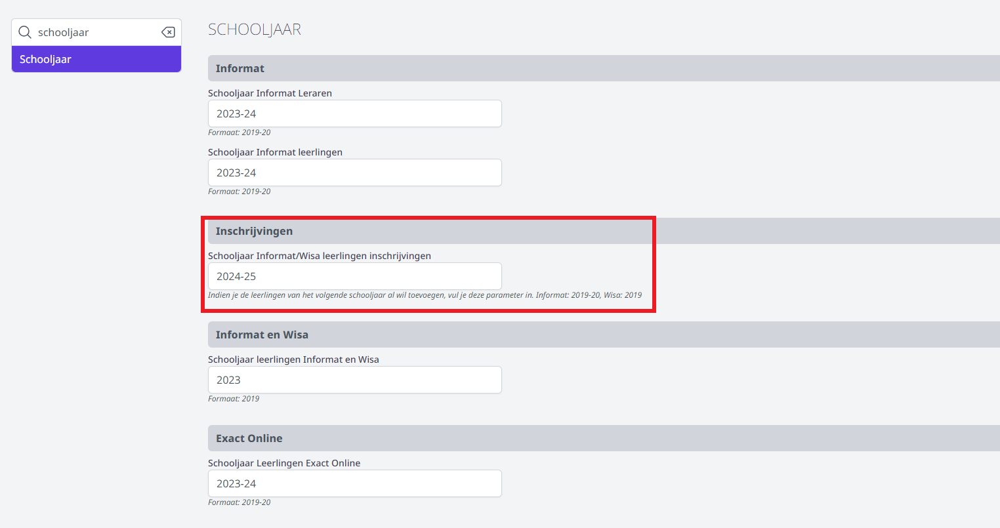
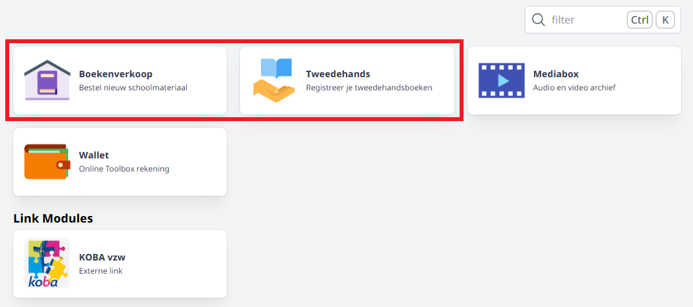

Van zodra het schooljaar is aangemaakt in de module Boekenverkoop én het schooljaar actief staat voor ouders/leerlingen, kan via de module Synchronisatie - Leerlingen de lijst van leerlingen voor de boekenverkoop worden opgevuld. Pas als een leerling een account heeft in Toolbox én ook gesynchroniseerd werd met de boekenverkoop, kan hij/zij een bestelling plaatsen!

De leerlingen worden opgehaald uit de administratieve software Informat of Wisa. 

Om op het einde van het schooljaar reeds de leerlingen van volgend schooljaar op te halen, kan je in de instellingen van Toolbox - Schooljaar het veld 'Schooljaar Informat/Wisa leerlingen inschrijvingen' invullen met het volgende schooljaar. Als dat veld is ingevuld, zal Toolbox de leerlingen voor het nieuwe schooljaar ophalen en synchroniseren. Als er dan wordt gesynchroniseerd met de boekenverkoop, komen die nieuwe leerlingen ook in de lijst terecht in klas TBINSCHR.

Het is dus belangrijk om nieuwe inschrijvingen zo snel mogelijk administratief te verwerken en te synchroniseren met Toolbox en Boekenverkoop. Idealiter wordt die taak dan ook overgelaten aan de leerlingenadministratie.

Indien een leerling niet (meteen) kan worden toegevoegd via de administratie, is het mogelijk om een leerling manueel toe te voegen aan de lijst van leerlingen. Voor die leerlingen zal het icoontje 'Overzetten' actief worden. Van zodra er voor de manueel toegevoegde leerling een 'echte' (lees: via de administratie toegevoegde) leerling wordt aangemaakt, kan de manueel toegevoegde leerling overgezet worden naar de administratieve leerling.

:::caution
Manueel toegevoegde leerlingen kunnen niet inloggen op het leerlingenplatform en kunnen dus zelf ook geen bestelling plaatsen!
:::

Leerlingen kunnen hun tweedehandsboeken registreren of nieuwe boeken bestellen via de Toolbox voor leerlingen. Die is te vinden in de submap leerling (bv. https://mijnschool.tbvs.be/leerling). Leerlingen kunnen hier ook gebruik maken van single sign on met Smartschool of Office 365.

