In het menu Tweedehands - Boekenlijst kan je opvragen welke boeken ingeleverd mogen worden door leerlingen. Staan daar geen boeken of ontbreken er, dan kan je dat in de [structuur](/boekenverkoop/structuur) corrigeren. 

## Tweedehandsboeken aanduiden als 'in te leveren' (leerling)

Leerlingen surfen naar de Toolbox voor leerlingen (https://mijnschool.tbvs.be/leerling) en loggen daar in met hun account. 
- In de module **Boekenverkoop** kunnen ze nieuwe, tweedehands- en/of huurboeken bestellen, naar gelang de instellingen in de structuur. 
- In de module **Tweedehands** kunnen leerlingen aangeven welke boeken ze wensen in te leveren. Als eerste stap wordt gevraagd naar een rekeningnummer. Indien de ingeleverde boeken niet in mindering worden gebracht van de nieuwe boekenfactuur, kunnen ze op dit rekeningnummer worden terugbetaald. Deze stap is optioneel en kan men overslaan.

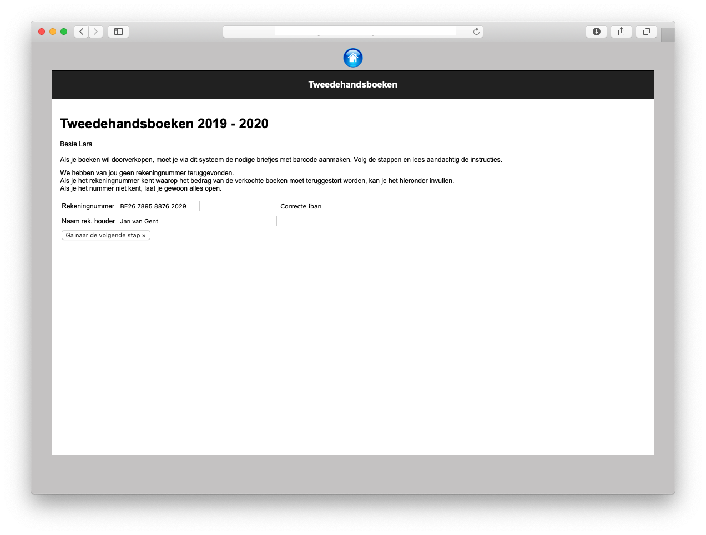

In de tweede stap krijgen ze een lijst van jaren te zien. Deze lijst bevat de studierichtingen die in de structuur werden aangeduid met afkorting TWH!

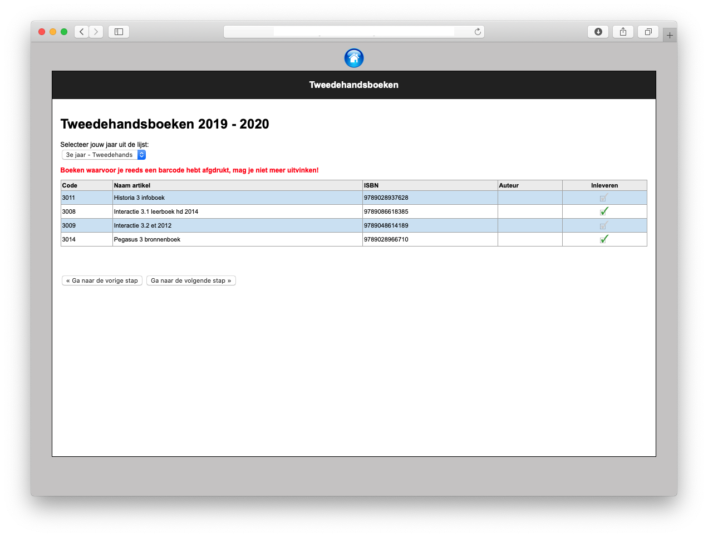

Als ze hun huidige jaar selecteren in die lijst, krijgen ze de boeken te zien die ze kunnen inleveren. Achteraan vinken ze in de kolom 'inleveren' aan welk boek(en) ze wensen in te leveren. Het vinkje wordt dan groen.
Hebben leerlingen een boek dubbel, dan mogen ze dit maar één keer aanvinken. Bij het inleveren zal er voor het dubbele boek manueel een code aangemaakt moeten worden.

In de volgende stap krijgen ze nog een overzicht van de aangevinkte boeken.

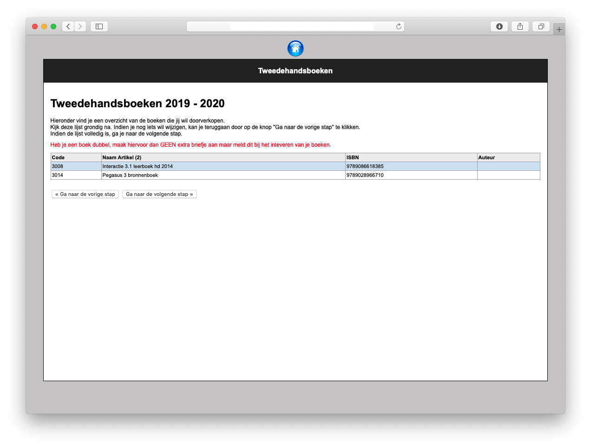

In de laatste stap krijgen ze voor elk boek een fiche met barcode te zien. Die fiche printen ze af, steken ze in het overeenkomstige boek en leveren het zo binnen.

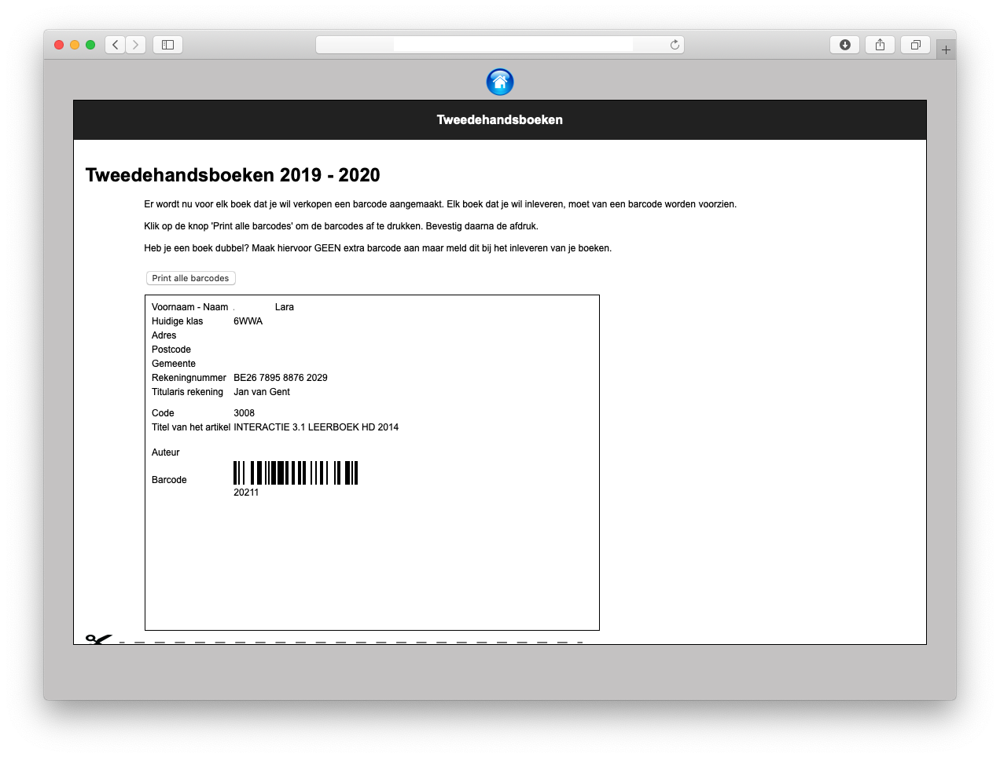
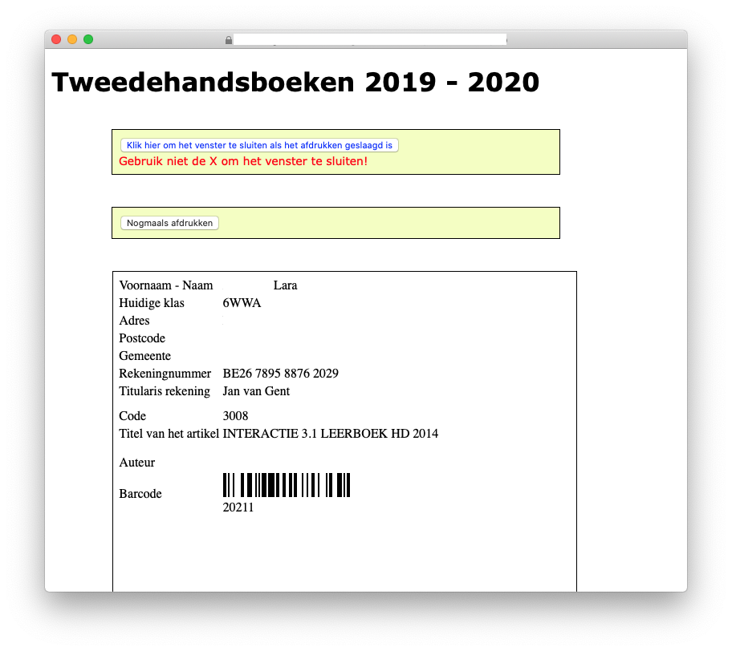
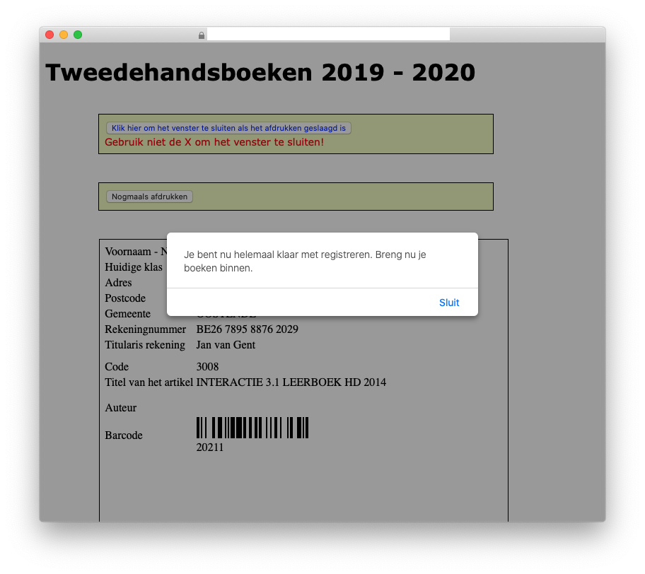

## Tweedehandsboeken inleveren

Zodra de leerling de boeken komt inleveren, kan het menu **Tweedehands - Inleveren (scannen)** gebruikt worden. Door middel van een barcodescanner kan de barcode op het inleverdocument gescand worden en wordt het boek als 'ingeleverd' gemarkeerd. Het is ook mogelijk om de code die onder de barcode staat manueel in te voeren en te enteren.

Het gescande boek komt nu in een vak 'Ingeleverde boeken' te staan. Als diezelfde leerling nog andere boeken geregistreerd heeft voor inlevering, worden die daaronder getoond in het vak 'Geregistreerde maar niet ingeleverde boeken'. Je kan verdergaan met scannen van de andere boeken.

Is een leerling een fiche kwijt of vergeten af te drukken, dan kan je ze vanuit het overzicht of het overzicht van niet ingeleverde boeken altijd afdrukken via het printer-icoon. Heeft een leerling fiches gemaakt voor boeken die toch niet ingeleverd worden, dan kan je ze door middel van het rode kruisje verwijderen. De aangemaakt barcodes zijn dan niet meer geldig!

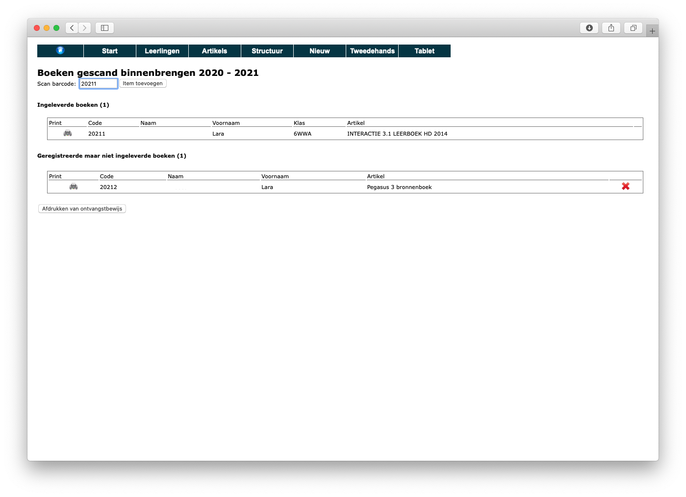
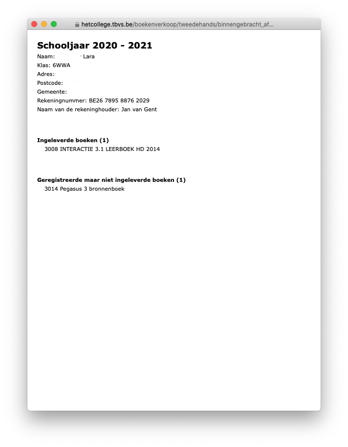

Heeft een leerling geen briefjes afgedrukt (of aangemaakt), dan ga je naar **Tweedehands - Inleveren (manueel)**. Zoek naar de leerling (op naam), klik op de plus voor zijn/haar naam en je krijgt een overzicht van boeken. Via 'Boek zoeken' kan je nu boeken toevoegen en alsnog een codebriefje aanmaken. Onderaan kan je voor de niet-ingeleverde boeken in één keer de codes genereren en afdrukken.

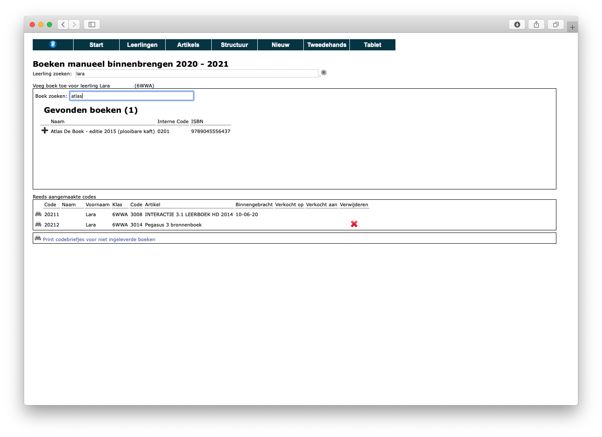

## Ingeleverde boeken categoriseren

Als de boeken zijn ingeleverd, kunnen we ze gaan sorteren in twee categorieën: A en B waarbij A de betere kwaliteit is en B de mindere. Daarna gaan we elk boek categoriseren via 'Tweedehands - Categoriseren'. Selecteer Categorie A en scan alle briefjes van de boeken in categorie A. Herhaal dit voor categorie B boeken. In het overzicht kan je altijd terugvinden welke categorie een boek heeft gekregen (of nog moet krijgen).

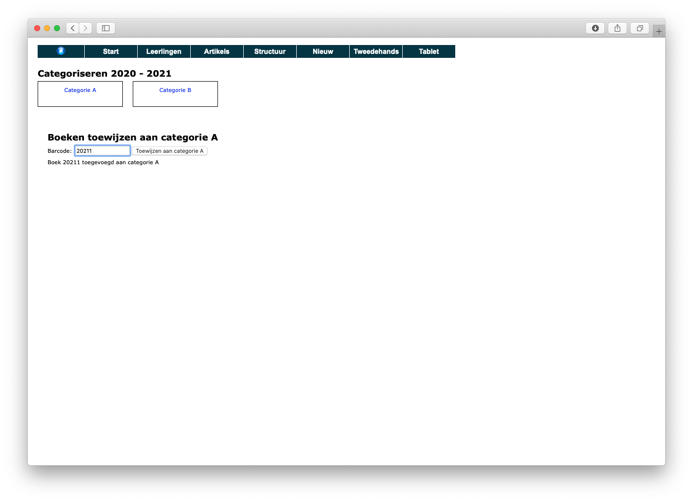
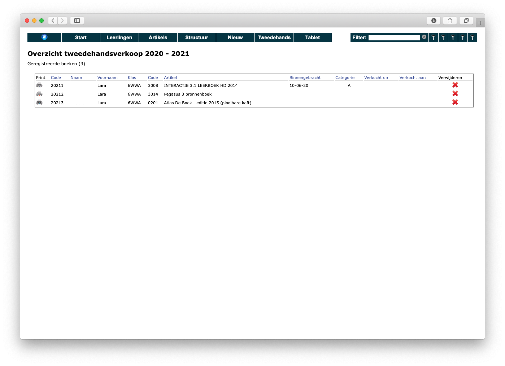

## Overzicht inleveringen
In de module Boekenverkoop kan je via **Tweedehands - overzicht** alle geregistreerde fiches opvolgen. Elke lijn is een fiche. In de kolom 'Binnengebracht' kan je zien wanneer een boek effectief werd ingeleverd.

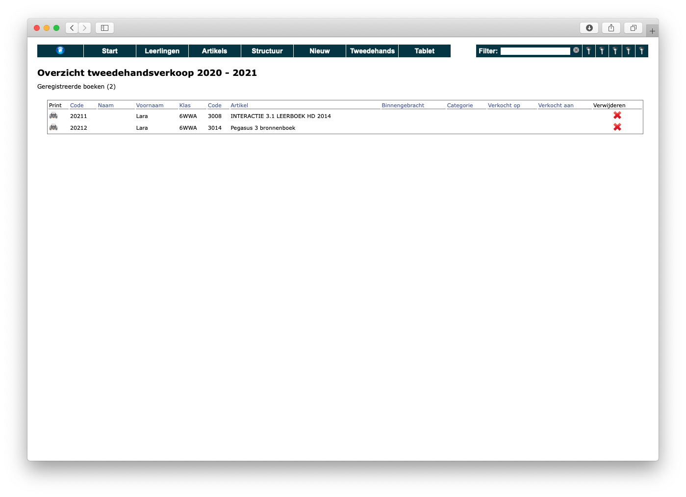