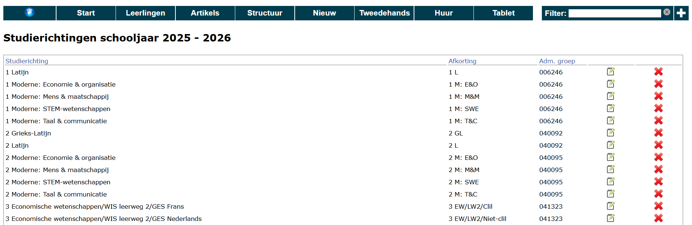
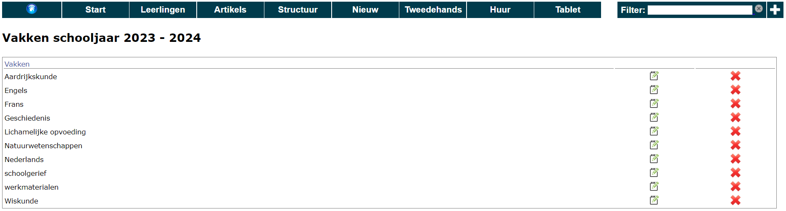
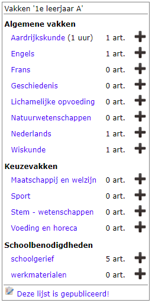
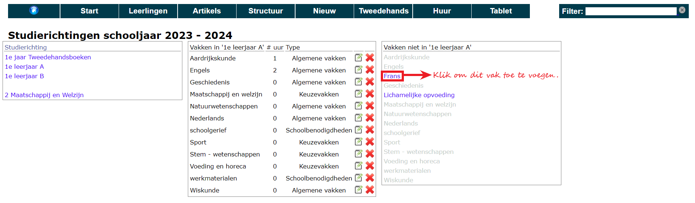
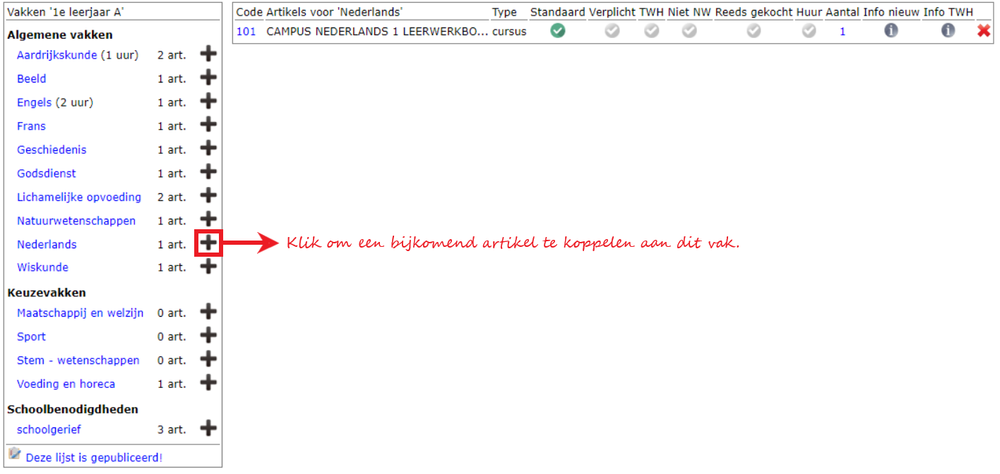

Zodra het schooljaar is aangemaakt, kan er gestart worden met het opzetten van de structuur. Die structuur is een combinatie van vakken, studierichtingen, types van vakken (bv. Algemene vakken, richtingsvakken, keuzevakken, ...) en artikels.

## 1. Studierichtingen, vakken en vaktypes ingeven

Bij een eerste opzet van de module Boekenverkoop kan de helpdesk van Toolbox lijsten met studierichtingen, vakken en vaktypes (in Excel of CSV formaat) importeren op de databank om het overtypwerk te reduceren. Alle koppelingen moeten echter wel in de module zelf gebeuren, maar kunnen de volgende jaren worden steeds overgenomen worden van het voorgaande jaar.

### 1.1 Studierichtingen
In het menu **Structuur => Studierichtingen** kan je alle studierichtingen ingeven door te klikken op de witte plus. Elke studierichting bestaat uit een volledige benaming en een afkorting. Daarnaast kan je ook het nummer van de administratieve groep ingeven. Dit is geen verplicht veld, maar als je dat wel doet, kan je gebruik maken van enkele extra handige functionaliteiten. Zo wordt er bij het starten van de  bestelling via de webshop (Toolbox voor leerlingen) automatisch de studierichting geselecteerd waarvoor de leerling heeft ingeschreven. Ouders of leerlingen kunnen zelf een andere studierichting selecteren indien gewenst. Verder kan je dan in de module Inschrijvingen ook een vergelijking opvragen tussen de inschrijvingen en de bestellingen van de boekenpakketten. Klik [hier](/inschrijvingen/boekenverkoop/) voor meer info over de werking van deze laatste functionaliteit.

Werk je met tweedehandsboeken? Maak dan voor elk studiejaar één aparte studierichting met als code 'TWH' aan. Voor het vierde jaar kan de code dan zijn '4TWH' en als naam '4e jaar - Tweedehands'.

*Klik op de afbeelding om te vergroten.*

### 1.2 Vakken

Via het menu **Structuur => Vakken** kan je alle vakken invoeren, eveneens met de witte plus. Moeten de leerlingen ook andere materialen kunnen bestellen zoals schoolgerei, werkmaterialen, persoonlijke beschermingsmiddelen, ...? Dan kan je voor elke categorie van artikels een apart vak aanmaken. In een latere fase ga je aan elk vak artikels koppelen. Op die manier blijft alles mooi overzichtelijk in de webshop. Werk je met tweedehandsboeken? Voorzie dan ook 1x het vak 'Tweedehands'.

*Klik op de afbeelding om te vergroten.*

### 1.3 Vaktypes

Via het menu **Structuur => Vaktypes** kan je categorieën van vakken ofwel 'vaktypes' specifiëren. Dit is facultatief te gebruiken, maar maakt het wel mogelijk om een duidelijk ingedeelde webshop aan te bieden. Enkele voorbeelden van mogelijke vaktypes: 
- Algemene vakken 
- Richtingsvakken
- Keuzevakken
- Schoolbenodigdheden
- Varia
- ...

In een latere fase kan je aan elk vak (op niveau van de studierichting) een vaktype koppelen. Bij het openen van de webshop (of bij Structuur => Vakken-Artikels) zal je zien dat alle vakken die behoren tot hetzelfde vaktype netjes gegroepeerd worden en dat de naam van het vaktype de tussentitel is van die groep met artikels. 

## 2. Vakken aan studierichtingen koppelen

Als de studierichtingen, vakken en vaktypes klaarstaan, kan via **Structuur => Studierichtingen-Vakken** ingesteld worden welke vakken er ingericht worden in elke studierichting. Dat gebeurt door in de linkse kolom de studierichting te selecteren en vervolgens in de rechtse kolom de gewenste vakken aan te vinken. De toegevoegde vakken verschijnen vervolgens in de middelste kolom en worden in de rechtse kolom in het grijs weergegeven. De niet toegevoegde vakken blijven in het blauw staan.

Je kan een vak verwijderen uit de studierichting via het rode kruisje <LegacyAction img="remove.png"/>. Het vak zal dan in de rechterkolom opnieuw in het blauw getoond worden. Het vak wordt dus enkel ontkoppeld van deze studierichting en niet volledig verwijderd uit Toolbox. Indien je het vak wel volledig wil verwijderen uit de module Boekenverkoop ga je via het menu **Structuur => Vakken**. 

In de middelste kolom kan je per vak optioneel nog twee zaken toevoegen: het aantal uur dat een vak wordt gegeven binnen die richting en het vaktype. Dat laatste gegeven komt vanuit de lijst van Vaktypes (te vinden onder Structuur). 

## 3. Artikels aan vakken koppelen op niveau van de studierichting
Bij **Structuur > Vakken - Artikels** kan je aangeven welke artikels een leerling dient aan te kopen voor een bepaald vak in een bepaalde studierichting. Om dit te kunnen doen, moeten eerst alle voorgaande stappen zijn afgerond alsook de algemene lijst met artikels zijn ingevoerd via het menu **Artikels**. Om een artikel te koppelen aan een vak, klik je op de zwarte plus achter de naam van het vak. Vervolgens verschijnt er een zoekvenster waarin je kan zoeken naar artikel. Vink elk toe te voegen artikel aan en sluit het venster.

Per artikel worden de bijkomende opties getoond aan de hand van vinkjes: Is het een verplicht - via de school - aan te kopen artikel? Kan het artikel tweedehands aangekocht worden? Is het te huur? Deze instellingen worden automatisch overgenomen van de artikels, maar kunnen hier nog gewijzigd worden. De wijzigingen die je hier doet, worden niet doorgevoerd naar de algemene artikelinstellingen. De verkoopprijs voor tweedehands- en huurboeken kan eveneens enkel ingesteld worden bij de artikels.  

Een artikel verwijderen uit de studierichting/vak kan via het rode kruisje achteraan.

Onderaan de lijst met vakken kan je aangeven of een studierichting klaar is voor publicatie of niet. Indien niet gepubliceerd, zullen leerlingen een melding krijgen bij het selecteren van die richting. De icoontjes voor de naam van de studierichting worden hier ook door aangepast zodat het visueel duidelijk is welke richtingen gepubliceerd zijn en welke niet.

## 4. Boekenlijsten en andere rapporten

Via **Structuur => Vakken - Artikels** kan je via de pdf-icoontjes rechtsboven allerlei rapporten afdrukken. 
- Boekenlijst voor een bepaalde studierichting
- Boekenlijsten voor alle studierichtingen 
- Overzichtslijst per jaar/vak: Per studiejaar wordt een overzicht getoond van alle verschillende vakken met daaronder de studierichting en welke artikelen er voor die studierichting (voor dat bepaald vak) gebruikt worden.
- Overzichtlijst per artikel: lijst van alle gebruikte artikelen met daaronder een overzicht aan welke studierichting ze gekoppeld zijn.

:::caution noot
De voetnoot op de boekenlijsten kan je aanpassen in de module **Instellingen => Boekenverkoop**.
:::

## 5. Tweedehandsboeken

Om aan te geven welke tweedehandsboeken ingeleverd mogen worden door leerlingen, moeten er studierichtingen aangemaakt worden met de code 'TWH'. We raden aan om voor elk jaar zo'n 'studierichting' aan te maken. Voor het vierde jaar kan de code dan zijn 4TWH en als naam '4e jaar - Tweedehands'.

Binnen die richting kan je werken met vakken maar het volstaat eigenlijk om één vak (bv. Tweedehands) te voorzien. Binnen elke tweedehands-richting voeg je de boeken toe die leerlingen mogen inleveren. Vink zeker voor elk boek de optie TWH aan in het menu **Structuur => Vakken - artikels**.

Om te controleren of je alle boeken hebt toegevoegd en aangevinkt, ga je naar het menu **Tweedehands => Boekenlijst**. Die lijst toont alle boeken die ingeleverd mogen worden.

