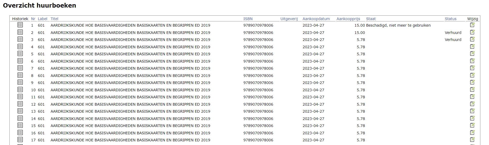
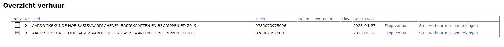

Om een boek 'te huur' aan te kunnen bieden, moet het eerst (slechts 1 exemplaar) ingegeven worden in de lijst met **artikels**. 
Vul zeker volgende velden in:
- Huurprijs
- Verhuur = ja
- Niet nieuw:
    - ja = het boek is enkel beschikbaar voor verhuur en kan door de leerlingen NIET nieuw aangekocht worden
    - nee = de leerlingen hebben de keuze om het boek nieuw aan te kopen of te huren

<Thumbnails img={[
    require('./verhuur4.jpg').default, 
]} />

Via het menu **Huur > Huurboeken** kan je opgeven hoeveel exemplaren van een bepaalde titel de school in haar bezit heeft. Klik op de witte plus om een nieuwe reeks huurboeken toe te voegen. Het label dat hier gevraagd wordt, is het label van dit betreffende boek in de artikellijst. Bij 'Voeg meerdere keren toe' kan je het aantal exemplaren van deze titel opgeven.  

<Thumbnails img={[
    require('./verhuur1.JPG').default, 
]} />

Alle huurboeken worden getoond in een globaal overzicht. Hier is het mogelijk om via <LegacyAction img="lijst.png"/> de historiek van het boek te raadplegen en via <LegacyAction img="edit.png"/> de gegevens of de staat (niet de status) van een specifiek huurboek aan te passen.

Aan elk huurboek wordt automatisch een uniek nummer toegekend. Dit is terug te vinden in de kolom "Nr". Je hebt het nummer nodig voor het uitleveren van de huurboeken en zorgt er dus best voor dat het ergens in/op het boek zelf terug te vinden is.  

 
Via het menu **Huur > Verhuur** zie je een overzicht van alle items die op dat moment verhuurd zijn en kan je makkelijk terugvinden welk boek aan welke leerling is uitgeleend. Ook hier kan je via <LegacyAction img="lijst.png"/> de volledige historiek van een bepaald boek te raadplegen. Met de behulp van de filter kan je zoeken in de tekst (bv. op naam). Je kan ook elke kolom sorteren door bovenaan op de kolomnaam te klikken. Zo kan je bv. sorteren op klas. 

 
 In dit overzicht kan je de verhuur van een boek stopzetten (met of zonder opmerkingen). Het boek wordt vervolgens terug in stock genomen en zal verdwijnen uit dit overzicht tot het opnieuw verhuurd wordt. 