Wanneer je de module Boekenverkoop vorig schooljaar reeds hebt gebruikt, dan kan je in enkele stappen de volledige inrichting van studierichtingen, vakken en vaktypes (= de structuur) overnemen naar het nieuwe schooljaar. Dat bespaart je heel wat werk. 

## Stap 1: Nieuw schooljaar activeren

Activeer in de module boekenverkoop het nieuwe schooljaar. Klik [hier](/boekenverkoop/schooljaar/) voor meer informatie.

## Stap 2: Artikels toevoegen

### a. Artikels met ISBN-nummer
Om de structuur te kunnen kopiëren naar het nieuwe schooljaar, moeten eerst en vooral alle artikels worden toegevoegd aan dit nieuwe schooljaar. De eenvoudigste manier om dit te doen, is via de automatische koppeling met de applicatie van Standaard Boekhandel. Door een druk op de knop wordt via die koppeling de volledige boekenlijst voor secundair onderwijs vanuit de software van Standaard Boekhandel geïmporteerd in Toolbox. Klik [hier](/boekenverkoop/artikels/#1-artikels-ingeven-in-toolbox) voor meer info over het ingeven van artikels in Toolbox. 

Bij het importeren zal je kunnen aangeven of je artikels die je vorig schooljaar reeds gebruikt hebt, wil koppelen aan de instellingen van vorig schooljaar. Met deze actie wordt voor elk reeds gekend artikel de interne code alsook de andere instellingen m.b.t. dit artikel overgenomen. Denk maar aan specificaties rond verhuur, al dan niet verplicht aan te kopen, standaard aan- of uitgevinkt, ... Artikels die je volgend schooljaar voor het eerst zal aanbieden, zal je nog moeten voorzien van een interne code en alle verdere instellingen. Klik [hier](/boekenverkoop/artikels/#2-artikels-instellingen-en-mogelijkheden) voor meer info over de instellingen van een artikel.

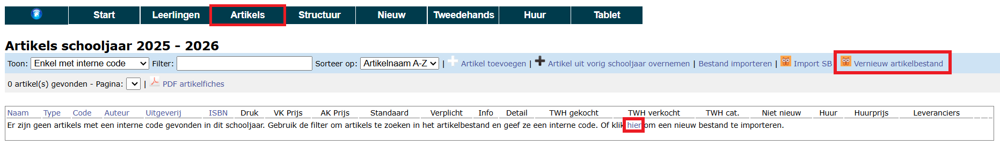

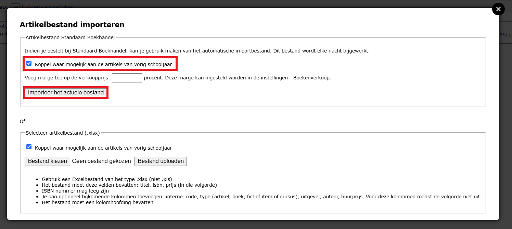

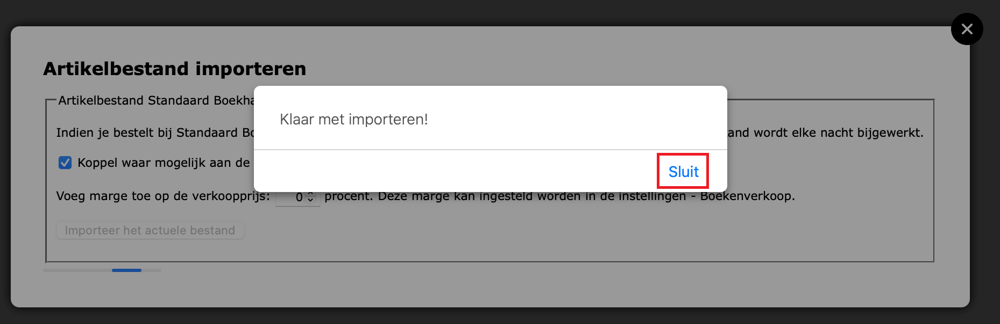

### b. Overige artikels en gewijzigde ISBN-nummers

De koppeling met Standaard Boekhandel neemt enkel boeken en drukwerk met een ISBN-nummer over. Wanneer de school vorig jaar gebruik heeft gemaakt van andere artikels zoals eigen gemaakte cursussen, rekentoestel, turngerief, schrijfgerief, geodriekhoek, ... kunnen die overgenomen worden via de knop <LegacyAction img="plus.png" text="Artikel uit vorig schooljaar overnemen"/>. 

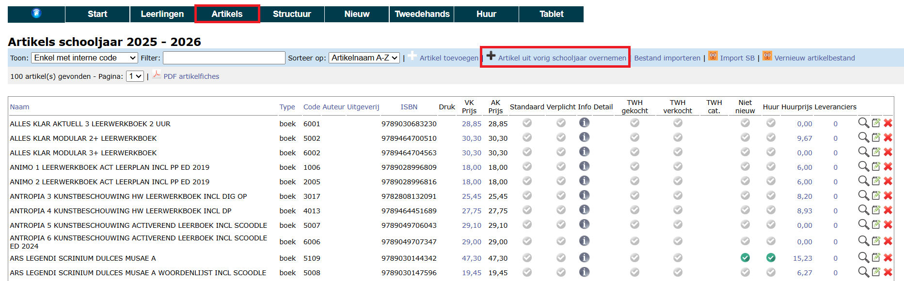

In deze lijst vind je artikelen van 2 categorieën terug: Enerzijds artikels van vorig schooljaar **zonder ISBN-nummer** (eigen cursussen, rekenmachines, ...) en anderszijds **met ISBN-nummer**. Die laatste categorie vraagt extra aandacht. Het gaat hier namelijk om boeken die Toolbox niet heeft kunnen koppelen aan de artikelen uit de meest recente boekenlijst van Standaard Boekhandel. In de meeste gevallen gaat het om titels die volgend schooljaar niet meer beschikbaar zijn of een herwerkte versie van een boek dat een nieuw ISBN-nummer heeft gekregen. Om eenvoudig een onderscheid te kunnen maken tussen de twee categorieën, kan je bovenaan filteren op artikels met of zonder ISBN-nummer. 

Je kan de artikels één voor één overnemen door te klikken op het plus-icoon <LegacyAction img="plus.png"/> achteraan of in bulk door de gewenste artikels vooraan te selecteren en bovenaan te klikken op 'Importeer geselecteerde artikels'. Komt het artikel niet voor in deze lijst, dan zal je het nieuw moeten aanmaken via het menu 'Artikels > Arikels > Artikel toevoegen'. Klik [hier](/boekenverkoop/artikels/#14-manueel-ingeven) voor meer info.

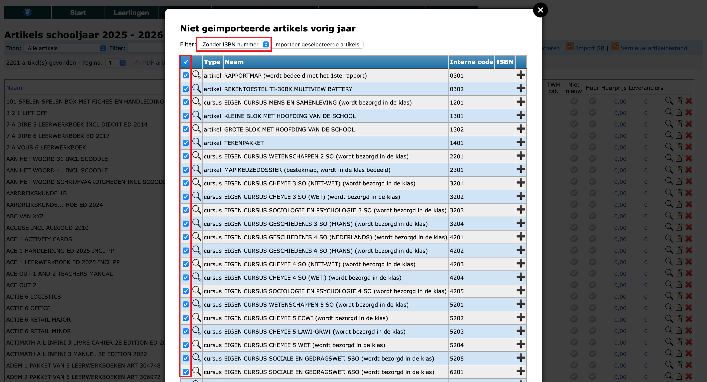

Klik op het vergrootglas <LegacyAction img="zoeken.png"/> om na te gaan aan welke studierichting(en) en welk vak het artikel vorig jaar gekoppeld was. 

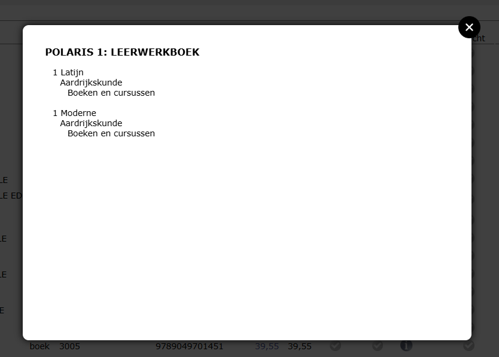

:::danger Opgelet
Kijk in deze lijst de artikels **mét ISBN-nummer** goed na alvorens ze over te nemen naar het nieuwe schooljaar!
::: 

Mogelijk is het boek volgend schooljaar niet meer beschikbaar of is het ISBN-nummer gewijzigd o.w.v. een herwerking. In dat laatste geval, neem je **dit** artikel **niet** mee over naar het nieuwe schooljaar, maar werk je verder met het vernieuwde artikel uit de import van Standaard Boekhandel. Voorzie dat nieuwe artikel van dezelfde interne code als het 'oude' artikel uit deze lijst en het nieuwe arikel zal automatisch correct gekoppeld worden aan de juiste studierichting en het vak. Dat is uiteraard enkel het geval wanneer het artikel vorig jaar reeds gekoppeld was.   

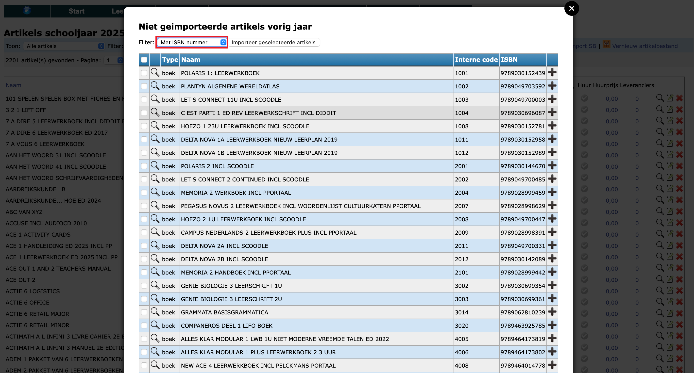

## Stap 3: Structuur kopiëren 

Van zodra de artikels zijn toegevoegd, kan je de structuur en alle koppelingen van vorig schooljaar overnemen. 
Open in het menu 'Structuur' één voor één elk onderdeel en importeer telkens uit vorig schooljaar. 

### Studierichtingen

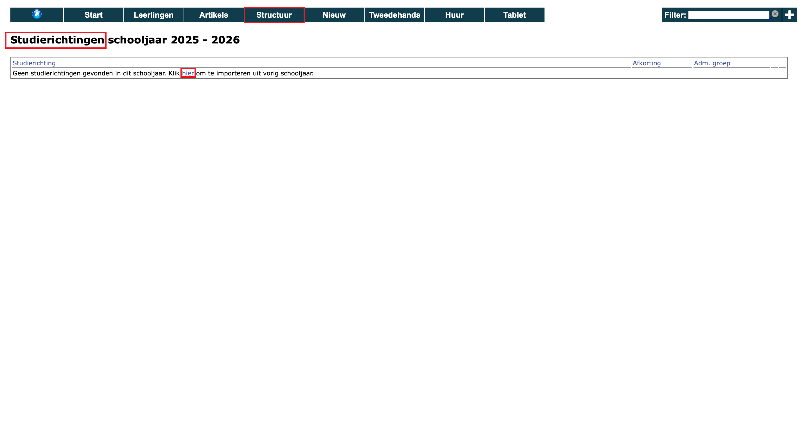

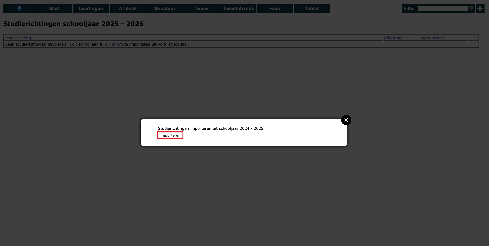

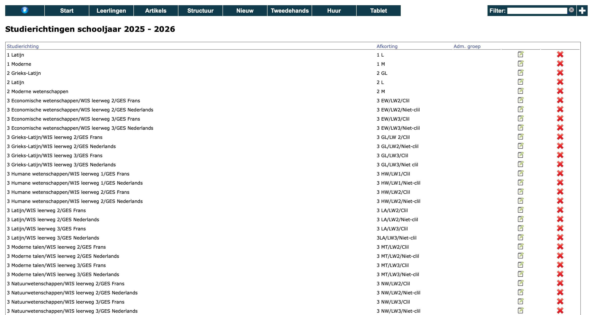

### Vakken

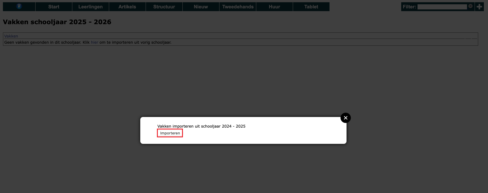

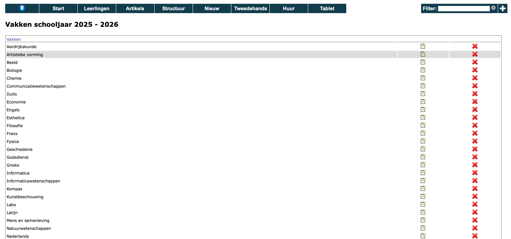

### Vaktypes

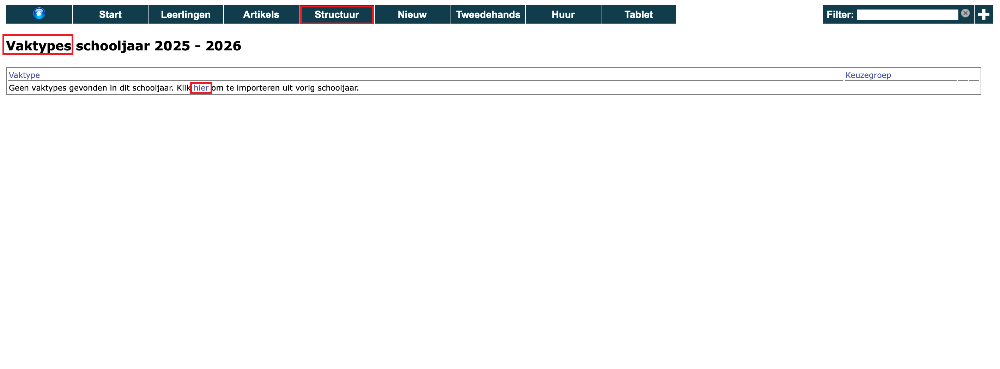

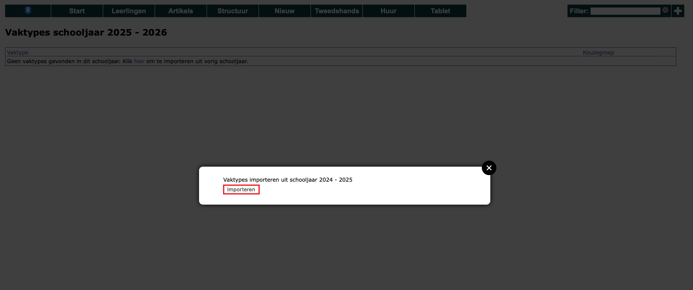

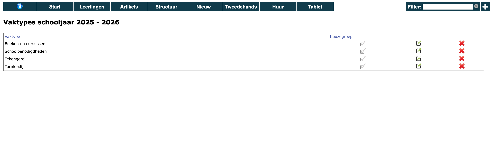

### Studierichtingen - Vakken

In dit menu worden de vakken gekoppeld aan een bepaalde studierichting. 

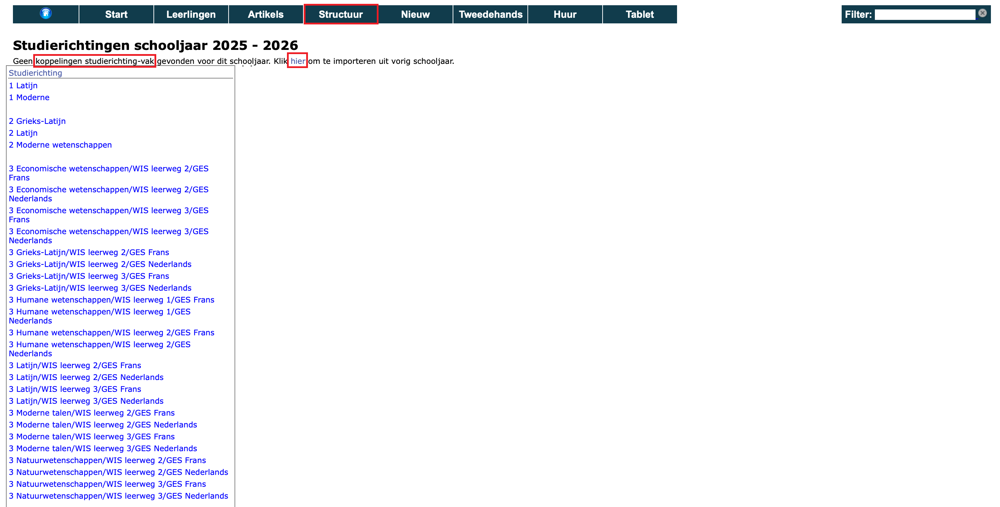

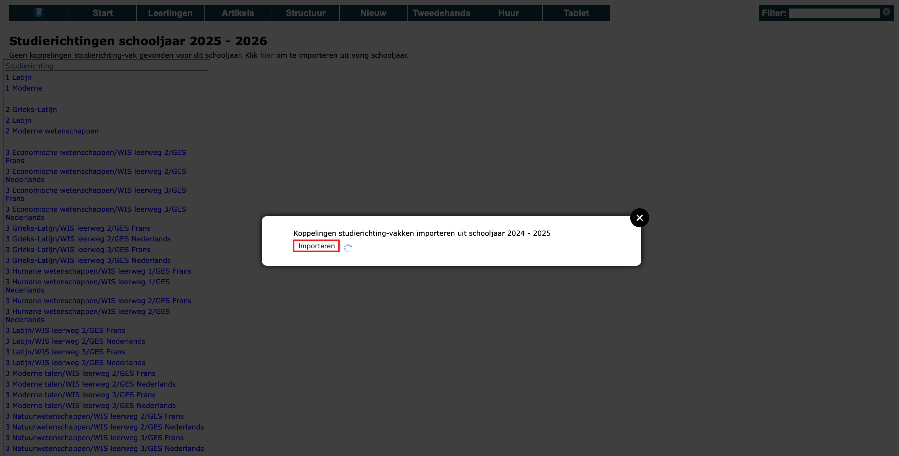

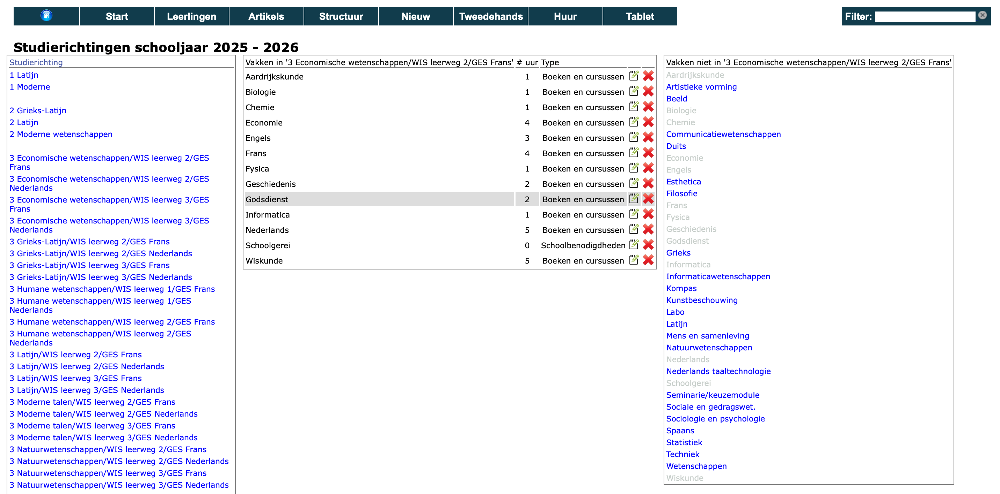

### Vakken - Artikels

In dit menu worden de artikels gekoppeld aan de vakken in een bepaalde studierichting. 

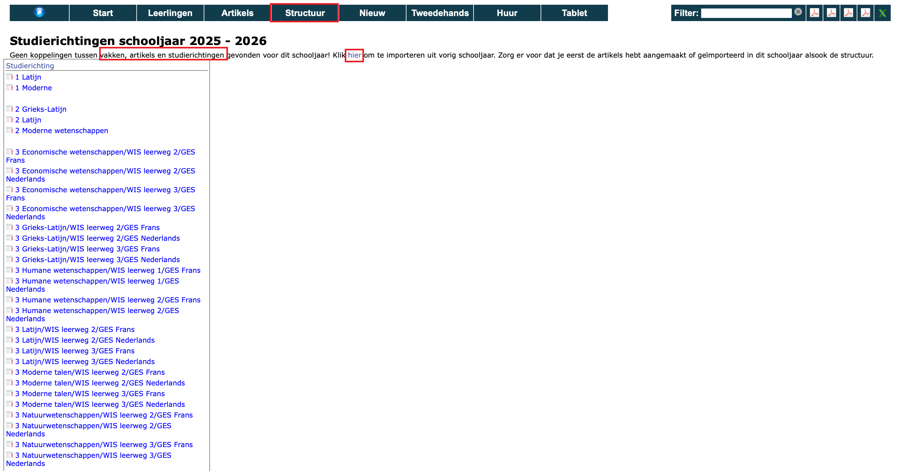

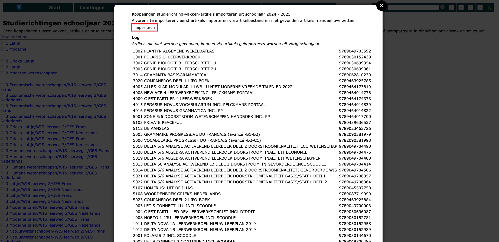

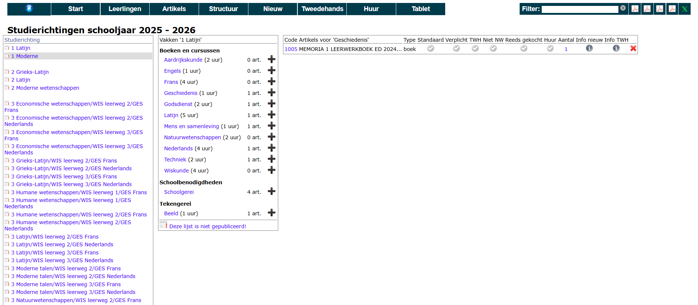

## Stap 4: Nieuwe artikels koppelen

Maak je volgend schooljaar gebruik van volledig nieuwe artikels, dan zal je die nog moeten koppelen aan een studierichting en een vak via het menu Structuur > Vakken - Artikels. Klik [hier](/boekenverkoop/structuur/#3-artikels-aan-vakken-koppelen-op-niveau-van-de-studierichting) voor meer info. 

