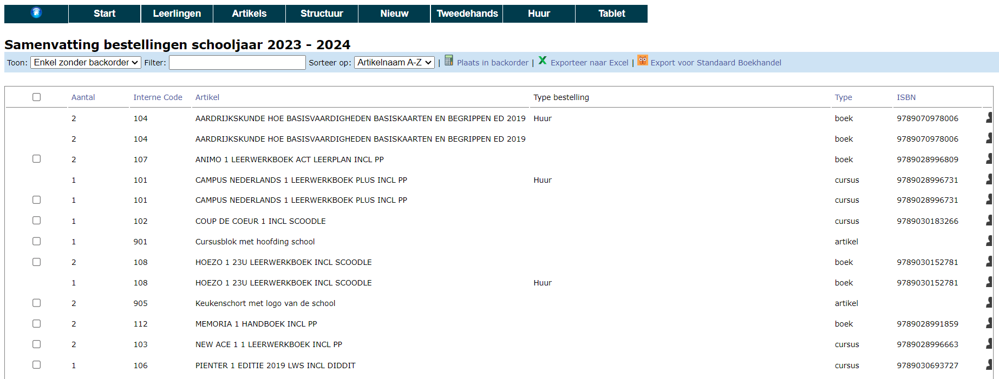
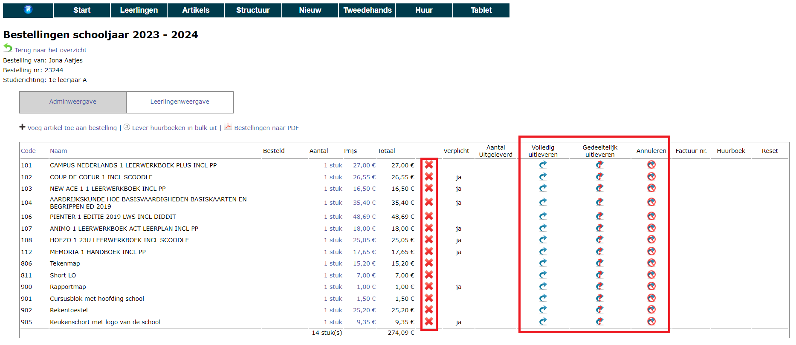

## 1. Bestelling opvolgen & wijzigen

In de administratiemodule kan je via **Nieuw => Bestellingen** de bestellingen opvolgen. Je ziet er alle leerlingen met het aantal bestelde items alsook de studierichting die ze hebben geselecteerd, datum en tijd van de bestelling en de status van de bestelling. Een lege status wil zeggen dat het gaat om een nieuwe bestelling waarvoor er nog geen acties zijn ondernomen. 

Via de knop <LegacyAction img="pdf.png" text="Bestellingen naar PDF"/> genereer je voor de geselecteerde leerlingen individuele bestelbonnen. Indien je werkt met perceel 2 in het raamcontract van DOKO heeft Standaard Boekhandel dit bestand nodig om de pakketten per leerling samen te stellen. Lever dit bestand dus aan samen met de algemene bestelbon (zie verder of klik [hier](/boekenverkoop/bestelling/#samenvatting-bestellingen)).

Je kan elke bestelling in detail bekijken door op het icoontje voor de naam van de leerling te klikken. Vervolgens krijg je een lijst van bestelde artikels. In dit overzicht kan je de bestelling van een leerling aanpassen door artikels toe te voegen of te verwijderen. Je kan ook kiezen om deze lijst in de Leerlingenweergave te bekijken. Deze weergave heeft een andere lay-out, maar bevat dezelfde gegevens. 

## 2. Bestelling toevoegen (manueel)

Vanuit de administratiemodule (**Nieuw => Bestellingen**) kan je ook zelf bestellingen toevoegen, bijvoorbeeld voor leerlingen die je manueel hebt toegevoegd aan de lijst van leerlingen. Deze leerlingen hebben namelijk geen toegang tot de webshop. Een bestelling toevoegen kan via de witte plus-knop. Daar krijg je een lijst te zien van alle leerlingen die nog geen bestelling hebben geplaatst.
Wanneer je op de zwarte plus klikt, wordt een nieuwe bestelling aangemaakt. Als eerste vul je best de studierichting in die de leerling gaat volgen. Vervolgens kan je via de Leerlingenweergave makkelijk aanvinken welke artikels de leerling wenst te bestellen. Vul je de studierichting niet in, dan wordt er geen boekenlijst getoond en moet je manueel alle artikels toevoegen.

## 3. Geplaatste bestelling overzetten naar andere leerling
Wanneer ouders een bestelling plaatsen via de webshop (Toolbox voor leerlingen) kan het voorkomen dat zij verkeerdelijk een bestelling plaatsen via de account van broer of zus (indien die naar dezelfde school gaat); ook al gaan daar heel wat meldingen aan vooraf. Hierdoor komt de bestelling op de verkeerde leerling te staan. In dat geval kan een administrator via het menu **Nieuw => Bestellingen** de bestelling overzetten naar de juiste leerling. Klik bovenaan op de naam van de leerling en selecteer de juiste leerling. De bestelling wordt vervolgens integraal overgezet naar de andere leerling. 

De bestelling overzetten kan enkel wanneer er nog geen items werden uitgeleverd. Je kan eventueel de uitlevering resetten om de bestelling alsnog te kunnen overzetten. 

## 4. Samenvatting bestellingen & bestelling plaatsen bij leverancier

Onder **Nieuw => Samenvatting bestellingen** kan je per artikel zien hoeveel exemplaren er van dat artikel werden besteld door de leerlingen. Standaard worden enkel de artikelen zonder backorder getoond, omdat dit artikelen zijn waarvoor de school zelf nog geen bestelling heeft geplaatst bij de leverancier. Deze weergave kan je eenvoudig wijzigen door de selectie bij 'Toon' te wijzigen. 

Dit overzicht kan je als school gebruiken om zelf de nodige artikelen bij de leverancier te bestellen. Deze bestellijst kan je exporteren naar Excel en er is ook een export voor Standaard Boekhandel beschikbaar om de bestelling te kunnen plaatsen. Indien je werkt met perceel 2 uit het DOKO-raamcontract heeft Standaard Boekhandel bovenop deze algemene bestelling ook nog een detailstaat nodig van de bestellingen per leerling. Die individuele bestelbonnen vind je terug via **Nieuw => Bestellingen => Bestelling naar PDF**. 

Heb je de bestelling geplaatst bij de boekenleverancier, neem dan de bestelde artikelen in backorder door ze aan te vinken en bovenaan te klikken op <LegacyAction img="calculator.png" text="Plaats in backorder"/>. Ook de gekoppelde bestellingen van de leerlingen krijgen nu de status 'in backorder' in het menu **Nieuw => Bestellingen => kolom Status**. Zo kan je makkelijk een onderscheid maken tussen de bestellingen die mee in de backorder zitten en de nieuwe bestellingen die nog niet zijn doorgegeven aan de leverancier. Via het menu **Nieuw => Backorders** vind je een lijst van de verschillende backorders met daarbij de datum en het uur waarop de backorder is aangemaakt. 

## 5. Bestelling uitleveren

Het uitleveren van bestellingen kan op 2 manieren. 

### 5.1 Adminmodule 
Het is mogelijk om een bestelling uit te leveren vanuit de adminmodule via het menu **Nieuw => Bestellingen** door vooraan de bestelling van een leerlingen te openen m.b.v. het klembordicoon <LegacyAction img="list.png"/>.

- <LegacyAction img="uitleveren.png"/> Lever een artikel volledig uit. Van zodra een item wordt uitgeleverd, verschijnt er in de kolom 'Factuurnr.' een factuurnummer. Zolang deze factuur niet is betaald of verwerkt, worden alle volgende items die je uitlevert aan dezelfde factuur toegevoegd. Is de factuur al wel betaald of verwerkt, dan zal voor dit uitgeleverde artikel een nieuwe (bijkomende) factuur worden aangemaakt. Het factuurnummer is een blauwe link. Door hierop te klikken, open je de factuur. Van hieruit kan je ook de betaling ingeven.  
Ook het uitleveren van de huurboeken gebeurt via deze weg. Elk huurboek heeft een uniek nummer dat best zichtbaar op het boek wordt aangebracht. Dit uniek nummer moet je tijdens het uitleveren invullen. Op die manier wordt het huurboek gekoppeld aan de leerling. Klik [hier](/boekenverkoop/verhuur/) voor meer info over huurboeken en het labelen ervan. 

- <LegacyAction img="gedeeltelijk_uitleveren.png"/>Lever een artikel gedeeltelijk uit. Indien er meerdere stuks besteld zijn, maar niet alles kan worden uitgeleverd, kan je in een volgende stap het aantal uitgeleverde stuks opgeven. De overige stuks worden automatisch in nalevering gezet. Deze knop kan eveneens gebruikt worden om nog niets uit te leveren (bv. o.w.v. niet op voorraad), maar al wel aan te rekenen via de factuur. Gebruik hiervoor in de volgende stap de knop 'Lever later uit maar factureer reeds'. Ook in dit geval wordt het betreffende item in nalevering geplaast. Na te leveren items kunnen steeds opgevraagd worden via het menu **Nieuw => Naleveringen**.
- <LegacyAction img="annuleren.png"/> Een artikel annuleren. Dit item wordt niet mee aangerekend, maar blijft wel zichtbaar in de bestelling. 
- <LegacyAction img="remove.png"/> Een artikel volledig verwijderen. Dit item wordt niet mee aangerekend en wordt volledig verwijderd uit de bestelling. 
- <LegacyAction img="back.png"/> Een hogervermelde actie ongedaan maken (behalve verwijderen). Dit kan gebruikt worden zolang de factuur niet werd betaald of verwerkt. Het item zal van de factuur verwijderd worden. De overige icoontjes worden opnieuw beschikbaar voor gebruik. 

:::caution info
Bij een nalevering blijven volgende icoontjes <LegacyAction img="uitleveren.png"/> en <LegacyAction img="gedeeltelijk_uitleveren.png"/> beschikbaar om eventueel een item volledig verder uit te leveren. 
:::

### 5.2 Tabletmodus

Het uitleveren kan ook gebeuren door middel van een tablet (bv. iPad). In het menu kan je daarvoor een optie Tablet vinden. Op die pagina kan je de Tablet versie in- of uitschakelen. Je kan er ook een sleutel mee voorzien waarmee de pagina wordt beveiligd. Om de pagina te openen, scan je met de tablet de QR code en ga je naar de URL.

<Thumbnails img={[
    require('./nieuw12.png').default, 
    require('./nieuw13.png').default, 
]} />

Daar kan je zoeken naar de leerling, de bestelling openen en het uitleveren starten. Alle acties die je daar uitvoert, zijn ook meteen zichtbaar in de bestelling in de adminmodule. Je kan ook (niet bestelde) artikels toevoegen via de tablet door de interne code in te vullen. In het menu Artikels kan je overigens een PDF afdrukken waarin voor elk artikel een pagina is voorzien met de interne code, de naam van het artikel en de verkoopprijs.

<Thumbnails img={[
    require('./nieuw15.png').default, 
    require('./nieuw16.png').default, 
]} />

<Thumbnails img={[
    require('./nieuw17.png').default, 
    require('./nieuw14.png').default, 
]} />

Ook het uitleveren van de huurboeken gebeurt via deze weg. Elk huurboek heeft een uniek nummer dat best zichtbaar op het boek wordt aangebracht. Dit uniek nummer moet je tijdens het uitleveren invullen of scannen met een barcode scanner. Op die manier wordt het huurboek gekoppeld aan de leerling. Klik [hier](/boekenverkoop/verhuur/) voor meer info over huurboeken en het labelen ervan. 

## 6. Bestelling betalen

Als het uitleveren is voltooid, ga je naar het menu **Nieuw => Facturen**. Daar kan je via het icoon <LegacyAction img="list.png"/> de factuur van de leerling oproepen. 

In dit scherm kan je de betaling van de factuur registreren met de link **Voeg betaling toe**.
Heeft de leerling tweedehandsboeken ingeleverd, dan kan je die ook hier toevoegen bij wijze van (deel)betaling van de factuur.

- Indien je het totaalbedrag wil aanrekenen, kan je daar op klikken. Het bedrag wordt dan automatisch overgenomen naar het veld 'Bedrag'. 
- Selecteer vervolgens de betaalwijze. Hier kan je kiezen uit:
    - **Bancontact**: De school moet zelf beschikken over een bancontacttoestel. Zorg ervoor dat dit correct is ingesteld zodat aan het einde van de dag iedere betaling als aparte transactie op de rekening komt. Op die manier kan je bij elke betaling op het bancontacttoestel een referentie meegeven. Vul hier het factuurnummer in dat je te zien krijgt in het betaalscherm. Voer je dat correct in, dan zal de betaling automatisch afgepunt kunnen worden in Exact Online. 
    - **POM**: Wanneer je deze betaalwijze selecteert, zal er onmiddellijk een QR code tevoorschijn komen. Ouders kunnen deze code scannen om het ingevoerde bedrag te betalen. Om gebruik te kunnen maken van deze betaalmethode moet er een contract zijn afgesloten met POM. Tarieven raadplegen en POM activeren kan via https://app.pom.be/nl/connect/koba-toolbox/tarieven. POM gebruikt eveneens het factuurnummer als betaalreferentie. Ook in dit geval zal de factuur automatisch afgepunt worden in Exact Online. 
    -  **Cash, onderwijscheque, overschrijving, andere**: Voor deze betaalmethodes is er geen verdere verwerking voorzien in de module Boekenverkoop. Volg de betalingen zelf op in Exact online. Voor cashbetalingen moet de betaling ook nog geregistreerd worden in het kasdagboek. Dat kan ook in de module Kas in Toolbox, indien hier gebruik van wordt gemaakt. 

        

-  Via het menu **Nieuw => Betalingen** kan er een overzicht opgevraagd worden per betaalmiddel. Standaard staat de datum van vandaag ingevuld. Die kan je aanpassen door in het datumveld te klikken. Indien je een overzicht wil van alle soorten betaalmiddelen, laat je het veld bij 'Betaalmiddel' leeg. Wil je een overzicht van alle betalingen van het hele schooljaar, maak dan het datumveld leeg. 

## 7. Crediteren
Heeft een leerling een artikel besteld en betaald, dan kan je dit niet meer annuleren in de bestelling. Je kan wel een creditnota maken. Dat gebeurt vanuit de (betaalde) factuur. Daar klik je achteraan op de blauw pijl in de kolom 'Crediteren'.
Als je nu in het menu **Nieuw => Creditnota's** gaat kijken, zal je zien dat er een creditnota (CN) werd aangemaakt. Die CN kan je terugbetalen of je kan deze CN als (deel)betaling toevoegen aan een nieuwe factuur van deze leerling.

## 8. Afbetaling
Kan een leerling de factuur niet ineens betalen, dan kan in het scherm van de factuur i.p.v. een betaling een afbetaling worden toegevoegd. Hierin wordt het voorschot en het aantal termijnen waarin afbetaald mag worden genoteerd. Vervolgens kan hier een PDF van afgedrukt worden.

## 9. Facturen boekhoudkundig verwerken
Nadat de facturen (automatisch) werden gegenereerd bij het uitleveren van de materialen, moeten ze nog worden overgezet naar het boekhoudpakket Exact Online. Ga hiervoor naar het menu **Nieuw => Facturen**. Standaard worden alle facturen getoond, maar je kan de facturen ook filteren op status. Zo kan je bv. enkel de facturen opvragen die nog verwerkt moeten worden of enkel de facturen die reeds verwerkt zijn. Er kan ook een onderscheid gemaakt worden tussen betaalde en onbetaalde facturen. 

Via de checkboxen vooraan kan je de facturen één voor één aanvinken. Gebruik de checkbox bovenaan om alle facturen ineens aan te vinken. Klik vervolgens op de link bovenaan 'Zet geselecteerde facturen over'. Na deze actie komen de facturen niet meteen terecht in het boekhoudpakket, maar wel in de module Leerlingenrekeningen. Vanuit die module kunnen de facturen op de gebruikelijke manier worden overgezet naar Exact Online. Verwerkte facturen worden in de module Boekenverkoop gemarkeerd met een geel tandwieltje achteraan. 

Ga naar de **module Leerlingenrekeningen** om de facturen verder te verwerken naar Exact Online. Selecteer in het startscherm eerst de school 'Import facturen Boekenverkoop' en vervolgens het betreffende schooljaar. Selecteer tot slot de juiste notagroep.

Ga naar het **menu Facturen**, selecteer de facturen en zet ze over naar Exact online via dit icoontje <LegacyAction img="verwerking.png"/>.

:::caution goed om weten
Zet de facturen over naar Exact Online alvorens je de bankbestanden oplaadt. Dan worden betalingen die zijn uitgevoerd via POM of Bancontact (mits gebruik gemaakt van de referentie) automatisch afgepunt. 
:::

## 10. Naleveringen

Alle items die je in de bestelling slechts gedeeltelijk hebt uitgeleverd of hebt gemarkeerd als 'niet uitgeleverd, maar wel reeds gefactureerd' kunnen opgevolgd worden via het menu **Nieuw => naleveringen**. Daar vind je een lijn per item dat nog nageleverd moet worden. Het is dus goed mogelijk dat een leerling meerdere keren in de lijst voorkomt, omdat er voor die leerling nog meerdere artikelen nageleverd moeten worden. 

Via de filter rechtsboven kan je de zoekresultaten beperken tot één bepaalde leerling of één bepaald artikel. Via de checkboxen vooraan kan je de gewenste items selecteren en in bulk uitleveren. 

Via de blauwe kolomkoptitels kan je de resultaten sorteren en er is eveneens een export naar Excel mogelijk via het Excel icoontje rechtsboven. 

