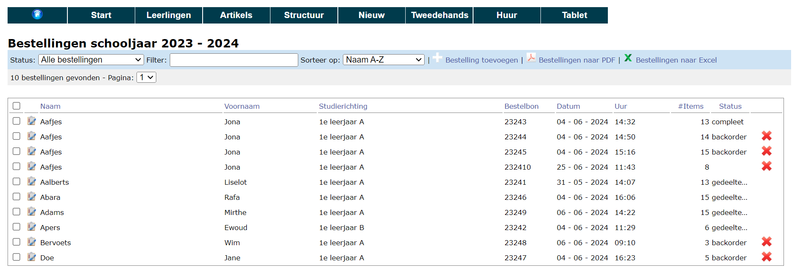

## Bestelling opvolgen 

In de administratiemodule kan je via **Nieuw => Bestellingen** de bestellingen opvolgen. Je ziet er alle leerlingen met het aantal bestelde items en ook de studierichting die ze hebben geselecteerd.

Onder **Nieuw => Samenvatting bestellingen** kan je per artikel zien hoeveel er besteld werd. Dit overzicht kan je dus als school gebruiken om zelf de nodige hoeveelheden bij de leverancier te bestellen.

Je kan elke bestelling bekijken door op het icoontje voor de naam van de leerling te klikken. Daar krijg je een lijst van bestelde artikels. Je kan ook kiezen om deze lijst in de Leerlingenweergave te bekijken. Dat is de weergave zoals de leerlingen het zien als ze een bestelling plaatsen.

Vanuit de administratiemodule kan je ook zelf bestellingen toevoegen, bijvoorbeeld voor leerlingen die je manueel hebt toegevoegd aan de lijst van leerlingen. Dat kan via de witte plus-knop. Daar krijg je een lijst van alle leerlingen die nog geen bestelling hebben geplaatst.
Als je dan op de zwarte plus klikt, wordt een nieuwe bestelling aangemaakt. Als eerste vul je best de studierichting in die de leerling gaat volgen. Dan kan je vervolgens via de Leerlingenweergave makkelijker aanvinken welke artikels de leerling wenst te bestellen. Vul je de studierichting niet in, dan moet je manueel alle artikels toevoegen.

## Bestelling uitleveren

Vanuit de bestelling van een leerling kan je nog wijzigigen doorvoeren aan de bestelling: artikels toevoegen, verwijderen, aantal stuks wijzigen, ... Van hieruit kan je ook het uitleveren regelen. Je kan elk artikel uitleveren (volledig) of je kan de optie 'Gedeeltelijk uitleveren' gebruiken. Bij die laatste kan je dan nog kiezen om reeds te factureren maar nog niet uit te leveren (nalevering) of om een deel van het bestelde aantal stuks te leveren en een ander deel na te leveren.

Ook het uitleveren van de huurboeken gebeurt via deze weg. Elk huurboek heeft een uniek nummer dat best zichtbaar op het boek wordt aangebracht. Dit uniek nummer moet je tijdens het uitleveren invullen. Op die manier wordt het huurboek gekoppeld aan de leerling. 

Als je iets uitlevert, wordt er automatisch een factuur aangemaakt. Zolang de factuur niet betaald is, worden er items aan toegevoegd.
Heb je iets foutief uitgeleverd en is de factuur nog niet betaald, dan kan je met de reset pijl de actie ongedaan maken.

Het uitleveren kan ook gebeuren door middel van een tablet (bv. iPad). In het menu kan je daarvoor een optie Tablet vinden. In die pagina kan je de Tablet versie in- of uitschakelen. Je kan er ook een sleutel mee voorzien waarmee de pagina wordt beveiligd. Om de pagina te openen, scan je met de tablet de QR code en ga je naar de URL.

<Thumbnails img={[
    require('./nieuw12.png').default, 
    require('./nieuw13.png').default, 
]} />

<Thumbnails img={[
    require('./nieuw14.png').default, 
]} />

Daar kan je zoeken naar de leerling, de bestelling openen en het uitleveren starten. Alle acties die je daar uitvoert, zijn ook zichtbaar in de bestelling op de computer. Je kan ook (niet bestelde) artikels toevoegen via de tablet door de interne code in te vullen. Onder artikels kan je overigens een PDF afdrukken waarin voor elk artikel een pagina is voorzien met de interne code, de naam van het artikel en de verkoopprijs.

<Thumbnails img={[
    require('./nieuw15.png').default, 
    require('./nieuw16.png').default, 
]} />

<Thumbnails img={[
    require('./nieuw17.png').default, 
]} />

## Bestelling betalen

Als het uitleveren is voltooid, ga je naar Nieuw - Facturen. Daar kan je via het icoontje <LegacyAction img="list.png"/> de factuur van de leerling oproepen. In dat scherm kan je de betaling van de factuur registreren met de link **Voeg betaling toe**.
Heeft de leerling boeken ingeleverd, dan kan je die ook hier toevoegen bij wijze van (deel)betaling van de factuur.

## Crediteren
Heeft een leerling een artikel besteld en betaald, dan kan je dit niet meer annuleren in de bestelling. Je kan wel een creditnota maken. Dat gebeurt vanuit de (betaalde) factuur. Daar klik je achteraan op de blauw pijl onder Crediteren.
Als je nu in het menu Nieuw - Creditnota's gaat kijken, zal je zien dat er een creditnota (CN) werd aangemaakt. Die CN kan je cash terugbetalen of je kan deze CN als (deel)betaling toevoegen aan een nieuwe factuur van deze leerling.

## Afbetaling
Kan een leerling de factuur niet betalen, dan kan een afbetaling worden toegevoegd. Hierin wordt het voorschot en het aantal termijnen waarin afbetaald mag worden genoteerd. Vervolgens kan hier een PDF van afgedrukt worden.

## Facturen boekhoudkundig verwerken
Nadat de facturen (automatisch) werden gegenereerd bij het uitleveren van de materialen, moeten ze nog worden overgezet naar het boekhoudpakket Exact Online. Ga hiervoor naar het menu **Nieuw => Facturen**. Via de checkboxen achteraan kan je de facturen één voor één aanvinken. Gebruik de checkbox bovenaan om alle facturen ineens aan te vinken. Klik vervolgens op de link bovenaan 'Zet geselecteerde facturen over'. Na deze actie komen de facturen niet meteen terecht in het boekhoudpakket, maar wel in de module Leerlingenrekeningen. 

Ga naar de **module Leerlingenrekeningen** om de facturen verder te verwerken naar Exact Online. Selecteer in het startscherm de school 'Import facturen Boekenverkoop' en het betreffende schooljaar. Selecteer tot slot de juiste notagroep.

Ga naar het **menu Facturen** en zet de facturen over naar Exact online via dit icoontje <LegacyAction img="verwerking.png"/>.

:::caution goed om weten
Zet de facturen over naar Exact Online alvorens je de bankbestanden oplaadt. Dan worden betalingen die zijn uitgevoerd via POM of Bancontact (mits gebruik gemaakt van de referentie) automatisch afgepunt. 
:::