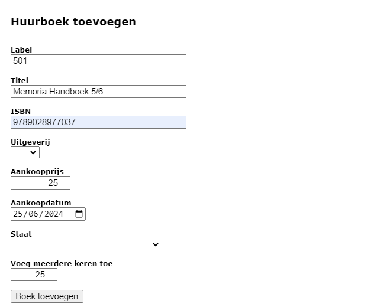
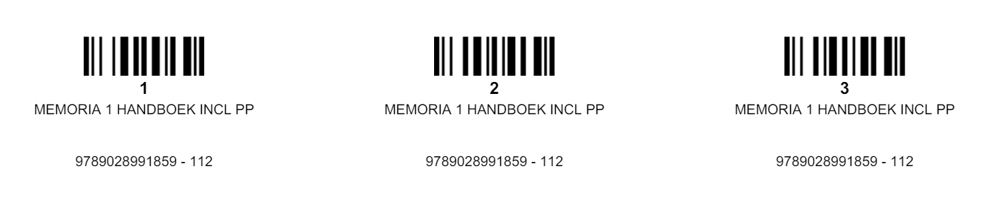
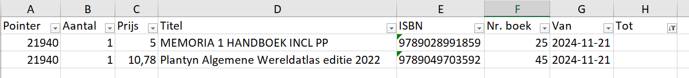
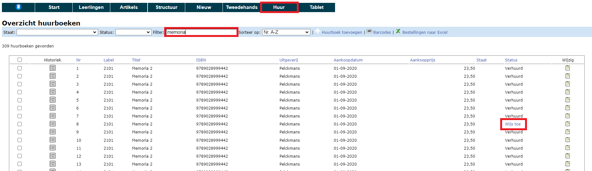

## 1. Huurboek als artikel

Om een boek 'te huur' aan te kunnen bieden, moet het eerst (slechts 1 exemplaar) ingegeven worden in de lijst met artikels in het menu **Artikels**. Klik [hier](../artikels#1-artikels-ingeven-in-toolbox) om te lezen hoe je artikels kan aanmaken of importeren. 
Vul bij het betreffende artikel zeker volgende velden in:
- Huurprijs
- Verhuur = ja
- Niet nieuw:
    - ja = het boek is enkel beschikbaar voor verhuur en kan door de leerlingen NIET nieuw aangekocht worden
    - nee = de leerlingen hebben de keuze om het boek nieuw aan te kopen of te huren

<Thumbnails img={[
    require('./verhuur4.png').default, 
]} />

## 2. Huurboeken ingeven, beheren & barcodes genereren

Via het menu **Huur > Huurboeken** kan je opgeven hoeveel exemplaren van een bepaalde titel de school in haar bezit heeft. Klik op de witte plus om een nieuwe reeks huurboeken toe te voegen. Het **label** dat hier gevraagd wordt, kan je vrij kiezen. In dit veld kan je zowel tekst als cijfers ingeven. Indien je ervoor kiest om een titel meerdere keren toe te voegen, zal elk exemplaar hetzelfde label krijgen. Geef hier bv. de **interne code** in van dit betreffende boek in de artikellijst om nog makkelijker na te gaan met welk artikel dit huurboek overeenkomt. Indien het gaat om boeken in nieuwstaat, laat dan  het veld 'Staat' leeg. Bij 'Voeg meerdere keren toe' kan je het aantal beschikbare exemplaren van deze titel opgeven.  

Alle huurboeken worden getoond in een globaal overzicht. Hier is het mogelijk om via <LegacyAction img="lijst.png"/> de historiek van het boek te raadplegen en via <LegacyAction img="edit.png"/> de gegevens of de staat (niet de status) van een specifiek huurboek aan te passen.

Aan elk huurboek wordt automatisch een uniek nummer toegekend. Dit is terug te vinden in de kolom "Nr". Je hebt het nummer nodig voor het uitleveren van de huurboeken en zorgt er dus best voor dat het ergens in/op het boek zelf terug te vinden is. Hiervoor kan je ook barcodes afdrukken door de gewenste boeken aan te vinken en vervolgens te klikken op volgend icoon <LegacyAction img="barcode.png" text="Barcodes"/>. Kleef het etiket aan de binnenkant van het boek en maak gebruik van weerbestendige etiketten om een langere levensduur te garanderen. Voorlopig kunnen de barcodes enkel nog maar gescand worden bij het uitleveren van de boeken, maar op termijn zal die functie ook beschikbaar worden voor het inleveren. 

## 3. Overzicht verhuurde boeken & verhuur stopzetten
Via het menu **Huur > Verhuur** zie je een overzicht van alle items die op dat moment verhuurd zijn en kan je makkelijk terugvinden welk boek aan welke leerling is uitgeleend. Ook hier kan je via <LegacyAction img="lijst.png"/> de volledige historiek van een bepaald boek raadplegen. Met de behulp van de filter kan je zoeken in de tekst (bv. op naam). Je kan ook elke kolom sorteren door bovenaan op de kolomnaam te klikken. Zo kan je bv. sorteren op klas. 

 
 In dit overzicht kan je de verhuur van een boek stopzetten (met of zonder opmerkingen). Het boek wordt vervolgens terug in stock genomen en zal verdwijnen uit dit overzicht tot het opnieuw verhuurd wordt. 

 Via het Excel-icoon exporteer je een volledige lijst naar Excel. Dit bestand bevat niet enkel de boeken die op dit moment verhuurd zijn, maar ook de historiek van alle boeken die ooit verhuurd zijn geweest. Op basis van deze lijst kan je bv. op een eenvoudige manier huur aanrekenen via de module Leerlingenrekeningen. Hiervoor filter je eerst de gewenste resultaten uit de lijst. Klik [hier](/leerlingenrekeningen/Importeren/#4-externe-gegevens) voor meer info over het importeren van externe gegevens in de module Leerlingenrekeningen. 

 

 ## 4. Huurboek wisselen
 Het kan voorkomen dat een leerling van huurboek moet wisselen, bv. omdat het verkregen huurboek beschadigd was. Indien hiervoor geen kosten in rekening moeten worden gebracht, kan je het oorspronkelijke huurboek stopzetten zoals hierboven omschreven in het menu Huur > Verhuur. Vervolgens wijs je het nieuwe huurboek toe via het menu Huur > Huurboeken. 

Via het tekstveld 'Filter' bovenaan kan je zoeken op (een deel uit) de titel van het boek. Achteraan in de kolom 'Status' kan je zien welke boeken reed verhuurd zijn en welke niet. De beschikbare boeken kunnen toegewezen worden door te klikken op de blauwe linktekst 'Wijs toe'. Vervolgens kan je de leerling selecteren aan wie je het huurboek wil toewijzen. Dit heeft geen financiële consequenties. Er zal dus geen nieuw factuur worden gegenereerd. 

