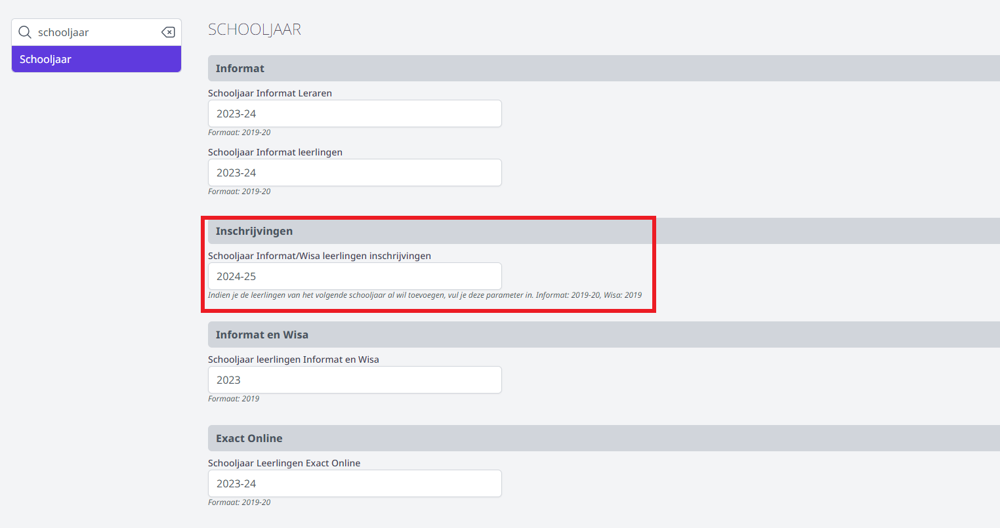
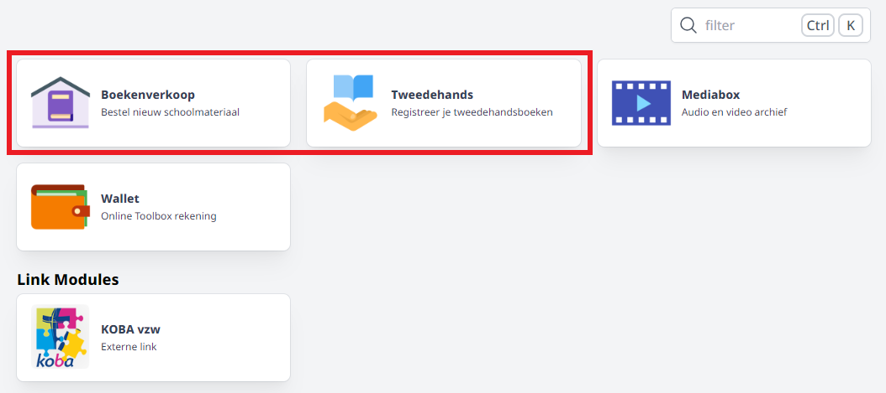
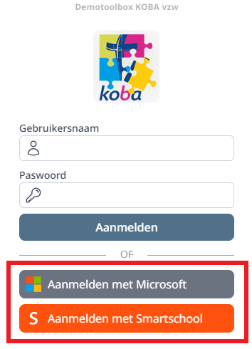
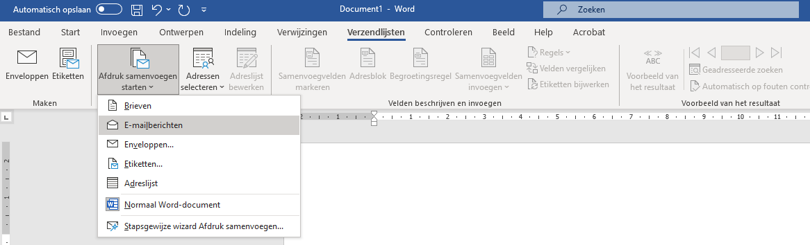
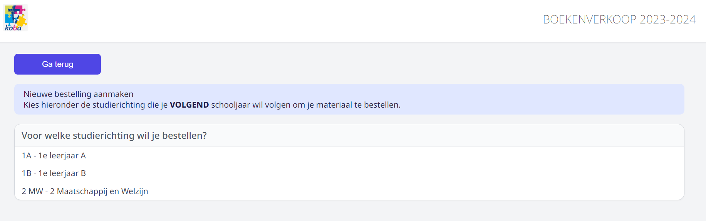
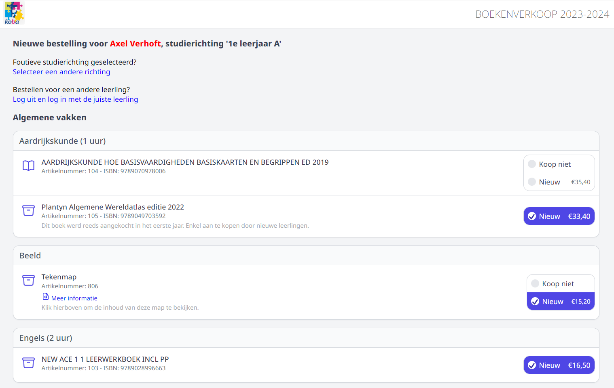
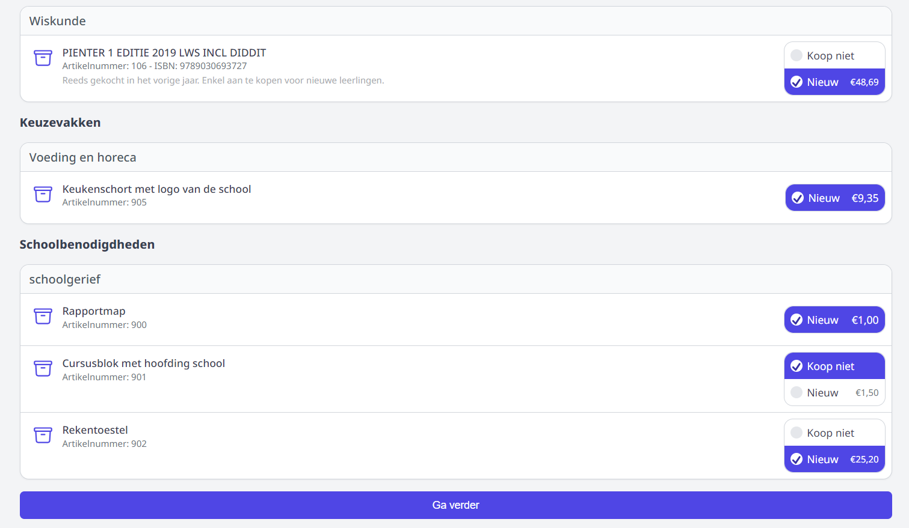
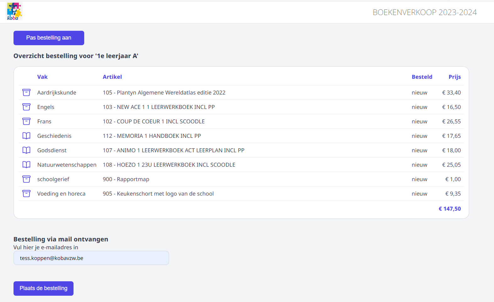
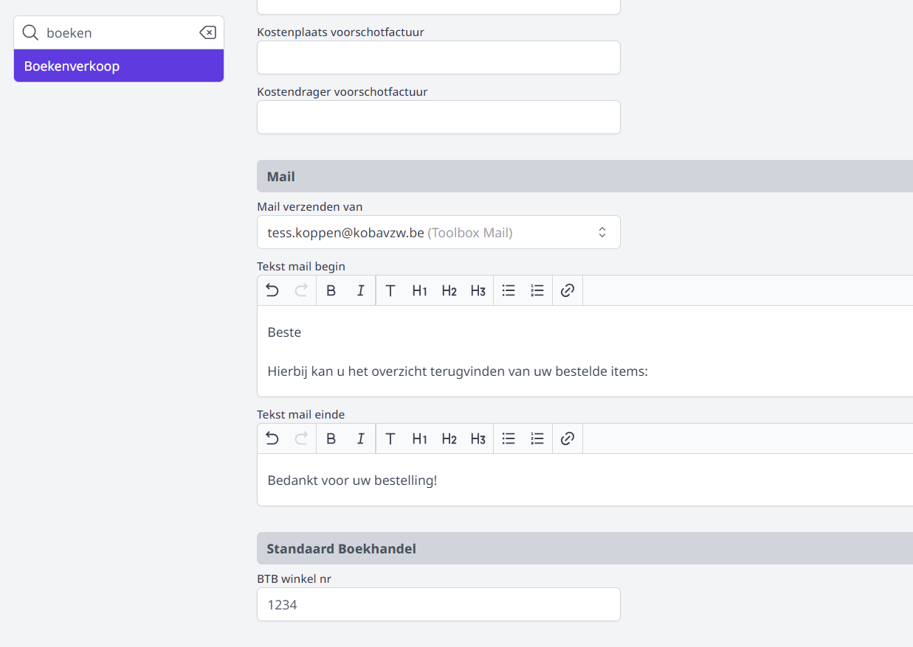
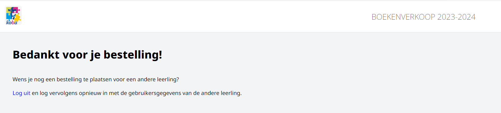

## 1. Leerlingen synchroniseren met de module Boekenverkoop

Van zodra het schooljaar is aangemaakt in de module Boekenverkoop én het schooljaar actief staat voor ouders/leerlingen, kan via de module **Synchronisatie Leerlingen => Synchroniseer met Boekenverkoop** de lijst van leerlingen voor de boekenverkoop worden opgevuld. Pas als een leerling een account heeft in Toolbox én ook gesynchroniseerd werd met de boekenverkoop, kan hij/zij een bestelling plaatsen!

De leerlingen worden opgehaald uit de administratieve software Informat of Wisa. 

Om op het einde van het schooljaar reeds de leerlingen van volgend schooljaar op te halen, kan je in de module **Instellingen => Schooljaar** in het veld 'Schooljaar Informat/Wisa leerlingen inschrijvingen' het volgende schooljaar invullen. Let op dat je het correcte datumformaat gebruikt. Voor informat is dat bv. 2024-25, voor Wisa bv. 2024. 

Daarna zal Toolbox de leerlingen voor het nieuwe schooljaar ophalen. Als er vervolgens wordt gesynchroniseerd met de module Boekenverkoop, komen die nieuwe leerlingen ook in de lijst van de boekenverkoop terecht in klas TBINSCHR. Dit alles vindt plaats in de module **Synchronisatie Leerlingen**:
- Stap 1: Gegevens ophalen
- Stap 2: Synchroniseer gegevens
- Stap 3: Synchroniseer met Boekenverkoop

Het is dus belangrijk om nieuwe inschrijvingen zo snel mogelijk administratief te verwerken en te synchroniseren met Toolbox en Boekenverkoop. Idealiter wordt die taak dan ook overgelaten aan de leerlingenadministratie.

Indien een leerling niet (meteen) kan worden toegevoegd via de administratie, is het mogelijk om die leerling manueel toe te voegen aan de lijst d.m.v. via de witte plus rechtsboven. Voor die leerlingen zal achteraan het icoontje 'Overzetten' <LegacyAction img="back.png"/> actief worden. Van zodra er voor de manueel toegevoegde leerling een 'echte' (lees: via Informat/Wisa toegevoegde) leerling wordt aangemaakt, kan de manueel toegevoegde leerling via dit icoon overgezet worden naar de administratieve leerling.

:::caution
Manueel toegevoegde leerlingen kunnen **niet** inloggen op het leerlingenplatform en kunnen dus zelf ook geen bestelling plaatsen! Probeer het gebruik van manueel toegevoegde leerlingen zoveel als mogelijk te beperken. 
:::

## 2. Webshop

### 2.1 Toolbox voor leerlingen
Leerlingen kunnen boeken bestellen of hun tweedehandsboeken registreren via de **Toolbox voor leerlingen**. Die is te vinden in de submap leerling. Indien de url naar de Toolbox van de school bv. https://mijnschool.tbvs.be is, dan is de url naar de bijhorende Toolbox voor leerlingen https://mijnschool.tbvs.be/leerling. 

### 2.2 Inloggen

Leerlingen kunnen op verschillende manieren inloggen in de Toolbox voor leerlingen:
- via gebruikersnaam en wachtwoord. 
- via single sign on met Smartschool, Google of Office 365. Om hiervan gebruik te kunnen maken, moet dit ingesteld zijn in de module **Instellingen** (van de schooltoolbox) **=> Toolbox leerlingen**. Bij gebruik van de single sign on met Smartschool kunnen ook co-accounts inloggen op de Toolbox voor leerlingen met hun persoonlijke co-account. Het is dan mogelijk om aan alle (co-)accounts een Smartschoolbericht te versturen met daarin de URL naar de Toolbox voor leerlingen. Leerlingen en/of co-accounts zijn onmiddellijk ingelogd in de Toolbox voor leerlingen na het klikken op de link en moeten niet eerst opnieuw hun inloggegevens invullen.   

Nieuwe leerlingen moeten sowieso inloggen met gebruikersnaam en wachtwoord aangezien zij nog niet beschikken over een account in Smartschool, Google of Office. Die inloggegevens zijn terug te vinden in de module **Synchronisatie leerlingen**. Helemaal onderaan kan je een Excel-bestand downloaden. In dit bestand vind je niet alleen de inloggegevens voor Toolbox, maar ook de e-mailadressen van de leerplichtverantwoordelijken. Deze gegevens worden opgehaald uit Informat en zijn rechtstreeks in dat pakket in te voeren of aan te passen. Het Excel-bestand maakt het mogelijk om via een mail merge een gepersonaliseerde mail te sturen naar de ouders met daarin de algemene info i.v.m. de boekenverkoop, maar daarnaast ook de persoonlijke inloggegevens voor Toolbox. 

Een mail merge maak je in MS Word via het lint 'Verzendlijsten':
- Ga via 'Afdruk samenvoegen starten' naar 'E-mailberichten'. 
- Stel je e-mailbericht op en koppel het eerder gedownloade en opgeslagen Excel-bestand (via Adressen selecteren). 
- Via 'Samenvoegvelden invoegen' kan je de benamingen van de kolomkoppen (bv. naam, voornaam, gebruikersnaam, ...) uit je Excel-bestand kiezen. Wanneer het e-mailbericht verstuurd wordt, zullen op basis van de Excel-lijst de toegevoegde samenvoegvelden worden ingevuld en zal het bericht bijgevolg gepersonaliseerd worden. Gebruik dus minimaal de samenvoegvelden voor gebruikersnaam en paswoord. 

### 2.3 Bestelling plaatsen

Eens ingelogd in de Toolbox voor Leerlingen kunnen de leerlingen hun bestelling van nieuw materiaal plaatsen via de module Boekenverkoop. 
- In het eerste scherm kunnen ze kiezen om een PDF te downloaden van de boekenlijst, meteen de bestelling te plaatsen of een eerder geplaatste bestelling te bekijken. 

    <Thumbnails img={[
        require('./webshop1.PNG').default, 
    ]} />

- Wanneer leerlingen nieuwe een bestelling plaatsen, moeten ze zelf selecteren welke studierichting ze volgend schooljaar gaan volgen. 

    

- Om een item te bestellen, zetten ze achteraan elk artikel het gewenste vinkje aan.
    - De items die als 'verplicht' staan genoteerd in de structuur, zijn reeds aangevinkt en kunnen niet worden uitgevinkt door de ouders. In dat geval wordt de optie 'Koop niet' niet getoond. Indien men een verplicht item toch niet wenst aan te kopen, moet men hiervoor contact opnemen met de school. Een personeelslid met rechten in de module Boekenverkoop (in de schooltoolbox) kan de bestelling aanpassen via het menu Nieuw => Bestellingen. 
    - De items die als 'standaard' staan genoteerd in de structuur, zijn reeds aangevinkt in de webshop, maar kunnen door de ouders nog wel worden uitgevinkt. In dat geval wordt de optie 'Koop niet' wel getoond.
    - Indien een item niet standaard of verplicht is, zal men sowieso een keuze moeten maken tussen 'koop' of 'koop niet'. Indien men voor een bepaald artikel geen keuze heeft gemaakt, zal men hiervan een melding krijgen. Men kan dan ook niet verdergaan met het plaatsen van de bestelling tot er voor dat artikel een keuze is gemaakt. 
    - Meer info over de verschillende opties zoals 'Standaard, verplicht, huur, niet nieuw, ... ' vind je [hier](../artikels#1-artikels-ingeven-in-toolbox) terug. 

    
    

- Van zodra men op 'Ga verder' klikt, krijgt men een overzicht van de bestelde items te zien. Is deze bestelling niet volledig correct, dan kan men op dit punt de bestelling nog aanpassen via de knop bovenaan. Daarmee komt men terug in voorgaand scherm terecht en kan men de bestelling alsnog aanpassen. Indien de bestelling correct is, dient men onderaan een e-mailadres in te vullen en op de knop 'Plaats de bestelling' te klikken. Vanaf dat moment kan de bestelling niet meer gewijzigd worden. Indien een wijziging nodig is, moet men hiervoor contact opnemen met de school. 

    

- De bevestiging van de bestelling wordt ook steeds verstuurd via mail naar het e-mailadres dat de ouders zelf hebben ingevoerd bij het plaatsen van de bestelling. Hiervoor moet er in de module **Instellingen => Boekenverkoop** een afzender worden geselecteerd en een tekst worden ingesteld. Kan je geen afzender selecteren, dan moet er nog een e-mailconfiguratie worden ingesteld in de module **Instellingen => E-mail**. Klik [hier](/e-mail) voor meer informatie omtrent die configuratie. 

    

- Na het plaatsen van de bestelling krijgt men onderstaand bericht te zien. Als de leerlingen/ouders opnieuw naar het startscherm van deze module gaan, kunnen ze ervoor kiezen om de geplaatste bestelling te raadplegen.  

    

