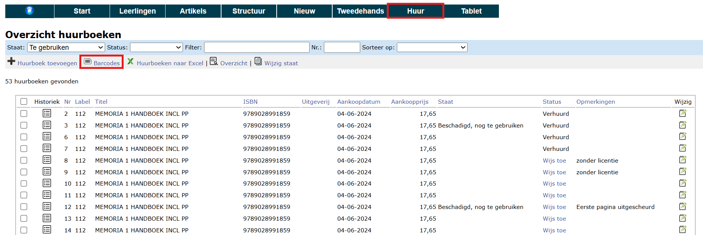

## 1. Huurboek als artikel

Om een boek 'te huur' aan te kunnen bieden, moet het eerst (slechts 1 exemplaar) ingegeven worden in de lijst met artikels in het menu **Artikels**. Klik [hier](../artikels#1-artikels-ingeven-in-toolbox) om te lezen hoe je artikels kan aanmaken of importeren. 
Vul bij het betreffende artikel zeker volgende velden in:
- Huurprijs
- Verhuur = ja
- Niet nieuw:
    - ja = het boek is enkel beschikbaar voor verhuur en kan door de leerlingen NIET nieuw aangekocht worden
    - nee = de leerlingen hebben de keuze om het boek nieuw aan te kopen of te huren

<Thumbnails img={[
    require('./verhuur4.png').default, 
]} />

## 2. Huurboeken ingeven, beheren & barcodes genereren

Via het menu **Huur > Huurboeken** kan je opgeven hoeveel exemplaren van een bepaalde titel de school in haar bezit heeft. Klik op de witte plus om een nieuwe reeks huurboeken toe te voegen. Het **label** dat hier gevraagd wordt, kan je vrij kiezen. In dit veld kan je zowel tekst als cijfers ingeven. Indien je ervoor kiest om een titel meerdere keren toe te voegen, zal elk exemplaar hetzelfde label krijgen. Geef hier bv. de **interne code** in van dit betreffende boek in de artikellijst om nog makkelijker na te gaan met welk artikel dit huurboek overeenkomt. Indien het gaat om boeken in nieuwstaat, laat dan  het veld 'Staat' leeg. Bij 'Voeg meerdere keren toe' kan je het aantal beschikbare exemplaren van deze titel opgeven.  

Alle huurboeken worden getoond in een globaal overzicht. Hier is het mogelijk om via <LegacyAction img="lijst.png"/> de historiek van het boek te raadplegen. 

Aan elk huurboek wordt automatisch een uniek nummer toegekend. Dit is terug te vinden in de kolom "Nr". Je hebt het nummer nodig voor het uitleveren van de huurboeken en zorgt er dus best voor dat het ergens in/op het boek zelf terug te vinden is. Hiervoor kan je ook barcodes afdrukken door de gewenste boeken aan te vinken en vervolgens te klikken op volgend icoon <LegacyAction img="barcode.png" text="Barcodes"/>. Kleef het etiket aan de binnenkant van het boek en maak gebruik van weerbestendige etiketten om een langere levensduur te garanderen. De barcodes kunnen zowel bij het uitleveren als het inleveren van de boeken gescand worden. Klik [hier](/boekenverkoop/verhuur/#5-inleveren-in-bulk) voor meer info over het inleveren in bulk met behulp van de barcodes.   

Je kan de gegevens of de staat (niet de status) van een specifiek huurboek aanpassen door middel van het edit icoontje  <LegacyAction img="edit.png"/>. In dit scherm is het ook mogelijk om een opmerking mee te geven die enkel van toepassing is voor dit huurboek, bv. de aard van de schade. 

Indien er meerdere boeken zijn waarvan de staat moet worden aangepast, kan dat ook in bulk gebeuren. Selecteer eerst de boeken waarvan je de staat wil wijzigen. Klik daarna op volgend icoon <LegacyAction img="artikels.png" text="Wijzig staat"/> en kies de juiste staat voor deze boeken.  

## 3. Huurboeken toewijzen 

Het uitleveren van huurboeken aan **leerlingen** gebeurt op nagenoeg dezelfde wijze als het uitleveren van andere boeken en materialen. Klik [hier](/boekenverkoop/bestelling/#6-bestelling-uitleveren) voor de procedure. Elk huurboek heeft een uniek nummer dat best zichtbaar op het boek wordt aangebracht. Dit uniek nummer moet je tijdens het uitleveren invullen of scannen met een barcode scanner. Op die manier wordt het huurboek gekoppeld aan de leerling.

Het toewijzen van huurboeken aan **leraren** gebeurt rechtstreeks in het menu **Huur => Huurboeken**. Klik in de kolom 'Status' op 'Wijs toe' en selecteer de leraar waaraan je het boek wens uit te lenen. Door deze manier van toewijzen wordt er **geen factuur opgemaakt**. De procedure eindigt hier. 

:::caution opgelet
Gebruik deze procedure enkel voor het toewijzen van huurboeken aan leraren. Voor leerlingen mag deze functie enkel toegepast worden voor het wisselen van een reeds aangerekend huurboek. Klik [hier](/boekenverkoop/verhuur/#6-huurboek-wisselen) voor meer info.

*Klik op de afbeelding om te vergroten.*
:::

## 4. Overzicht verhuurde boeken & verhuur stopzetten

In het menu **Huur => Huurboeken** kan je een overzicht raadplegen <LegacyAction img="detail.png" text="Overzicht"/> van **alle** huurboeken. Dit overzicht bevat naast de algemene gegevens van een huurboek ook de staat, de status en het aantal exemplaren. Op die manier kan je makkelijk nagaan hoeveel exemplaren er verhuurd zijn en hoeveel er nog beschikbaar zijn voor verhuur. Voor elke verschillende combinatie 'staat-status' wordt er een aparte lijn getoond. Een uitgebreider rapport kan geëxporteerd worden naar Excel via het daarbij horende icoon. 

Via het menu **Huur => Verhuur** zie je een overzicht van alle items die op dat moment verhuurd zijn en kan je makkelijk terugvinden welk boek aan welke leerling is uitgeleend. Ook hier kan je via <LegacyAction img="lijst.png"/> de volledige historiek van een bepaald boek raadplegen. Met de behulp van de filter kan je zoeken in de tekst (bv. op naam). Je kan ook elke kolom sorteren door bovenaan op de kolomnaam te klikken. Zo kan je bv. sorteren op klas. 

 
 In dit overzicht kan je de verhuur van een boek stopzetten (met of zonder opmerkingen). Het boek wordt vervolgens terug in stock genomen en zal verdwijnen uit dit overzicht tot het opnieuw verhuurd wordt. 

 Via het Excel-icoon exporteer je een volledige lijst naar Excel. Dit bestand bevat niet enkel de boeken die op dit moment verhuurd zijn, maar ook de historiek van alle boeken die ooit verhuurd zijn geweest. Op basis van deze lijst kan je bv. op een eenvoudige manier huur aanrekenen via de module Leerlingenrekeningen. Hiervoor filter je eerst de gewenste resultaten uit de lijst. Klik [hier](/leerlingenrekeningen/Importeren/#4-externe-gegevens) voor meer info over het importeren van externe gegevens in de module Leerlingenrekeningen. 

 

 ## 5. Inleveren in bulk 
In vorige paragraaf werd uitgelegd hoe je elk boek apart kan terugnemen aan het einde van het schooljaar. Via het menu **Huur => Bulk terugname** is het ook mogelijk om de huurboeken in bulk terug te nemen. In dat geval wordt de terugname van de boeken best georganiseerd volgens de staat van het boek. 
- Controleer de staat van de ingeleverde huurboeken en maak verschillende stapels op basis van de staat die je wil toekennen. 
- Selecteer de staat die je wil toekennen aan de reeks boeken. 
    - Wanneer de boeken nog prima in orde zijn, selecteer je de eerst optie, namelijk het leeg veld. Dit betekent dat er geen opmerkingen zijn over de staat van het boek, aangezien het nog in prima staat is.  
    - Als een titel volgend schooljaar niet meer in gebruik zal zijn, kan je kiezen voor de status 'Afgevoerd'. 
    - Huurboeken die de status 'Afgevoerd' of 'Beschadigd, niet meer te gebruiken' hebben gekregen, zullen niet meer standaard in het overzicht met huurboeken getoond worden. 

        <Thumbnails img={[
            require('./bulk_scan2.png').default, 
        ]} />

- Klik in het veld 'Scan code' en start met scannen. Je zal merken dat bij elke scan het nummer van het huurboek wordt ingevuld. Je krijgt onderaan ook een melding te zien wanneer het huurboek succesvol werd teruggenomen. Deze functie kan ook zonder scanapparaat gebruikt worden. In dat geval typ je gewoonweg het nummer van het huurboek in het veld 'Scan code' en gebruik je de enter-toets om te bevestigen.
 

 ## 6. Huurboek wisselen
 Het kan voorkomen dat een leerling van huurboek moet wisselen, bv. omdat het verkregen huurboek beschadigd was. Indien hiervoor geen kosten in rekening moeten worden gebracht, kan je het oorspronkelijke huurboek stopzetten zoals hierboven omschreven in het menu Huur > Verhuur. Vervolgens wijs je het nieuwe huurboek toe via het menu Huur > Huurboeken. 

Via het tekstveld 'Filter' bovenaan kan je zoeken op (een deel uit) de titel van het boek. Achteraan in de kolom 'Status' kan je zien welke boeken reed verhuurd zijn en welke niet. De beschikbare boeken kunnen toegewezen worden door te klikken op de blauwe linktekst 'Wijs toe'. Vervolgens kan je de leerling selecteren aan wie je het huurboek wil toewijzen. Dit heeft geen financiële consequenties. Er zal dus geen nieuw factuur worden gegenereerd. 

