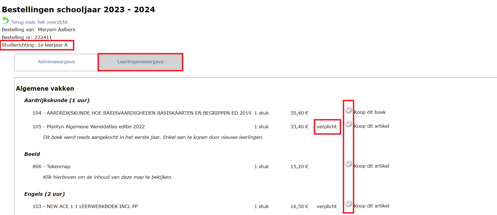
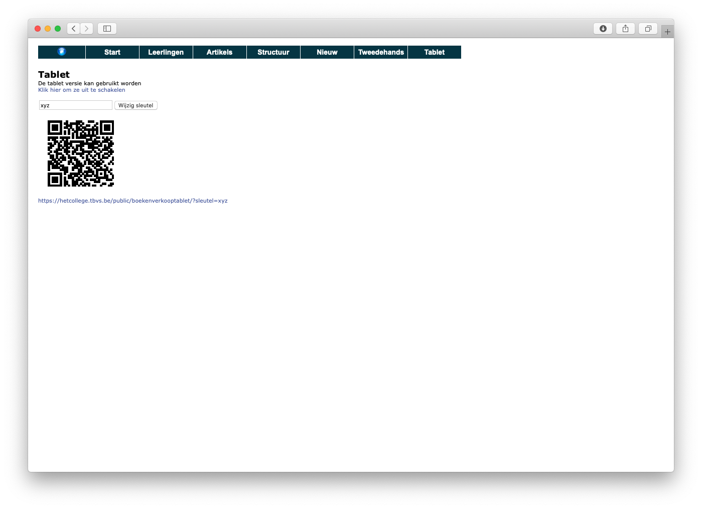

## 1. Bestelling opvolgen & wijzigen

In de administratiemodule kan je via **Nieuw => Bestellingen** de bestellingen opvolgen. Je ziet er alle leerlingen die reeds een bestelling hebben geplaatst met het aantal bestelde items alsook de studierichting die ze hebben geselecteerd, datum en tijd van de bestelling en de status van de bestelling. 
    - Een **lege status** wil zeggen dat het gaat om een nieuwe bestelling waarvoor er nog geen acties zijn ondernomen. 
    - De **status backorder** wil zeggen dat de bestelling geplaatst is bij de leverancier. Lees bij [punt 5](/boekenverkoop/bestelling/#5-samenvatting-bestellingen--bestelling-plaatsen-bij-leverancier) hoe je bestellingen in backorder kan plaatsen.
    - De **status compleet** geeft weer dat de bestelling volledig is afgehandeld. De uitlevering aan de leerling heeft in dat geval ook plaatsgevonden. 

In de kolom **Betaalstatus** wordt weergegeven of een bestelling al dan niet betaald is. De betaling kan je ingeven bij de factuur. Zie verder in het menu [Betalingen en facturen](/boekenverkoop/betalingen_facturen/). Niet-betaalde bestellingen kan men nog wijzigen of verwijderen. 

:::info enkel voor rechtstreekse betalingen via de webshop 
Indien de optie 'Bestelling betalen met POM' is geactiveerd in de module Instellingen > Boekenverkoop, kunnen ouders de bestelling onmiddellijk betalen via de webshop. Een bestelling waarvan de betaling via POM geslaagd is, krijgt onmiddellijk de betaalstatus 'Betaald'. Voor bestellingen waarvan de betaling mislukt of niet uitgevoerd is, blijft de kolom leeg. Wanneer ouders op een later moment de betaling uitvoeren via de POM betaallink, zal de status onmiddellijk en automatisch wijzigen naar 'Betaald'. 
:::

*Klik op de afbeelding om te vergroten*

### 1.1 Bestelbon per leerling genereren

Via de knop <LegacyAction img="pdf.png" text="Bestellingen naar PDF"/> genereer je voor de geselecteerde leerlingen individuele bestelbonnen. Indien je werkt met perceel 2 in het raamcontract van DOKO heeft Standaard Boekhandel dit bestand nodig om de pakketten per leerling samen te stellen. Lever dit bestand dus aan samen met de algemene bestelbon (zie verder of klik [hier](#5-samenvatting-bestellingen--bestelling-plaatsen-bij-leverancier)).

### 1.2 Overzicht leerlingen zonder bestelling 

Klik op deze knop <LegacyAction img="leerlingen.png" text="Leerlingen zonder bestelling"/> om een overzicht op te vragen van alle leerlingen die nog geen bestelling hebben geplaatst. 

Via de module [Inschrijvingen](/inschrijvingen) is het mogelijk om een vergelijking te maken tussen de **bestellingen in de module Boekenverkoop** en de **(her)inschrijvingen van leerlingen**. Die vergelijking vind je terug bij het onderdeel **Verwerking** helemaal onderaan. Deze functionaliteit maakt het mogelijk om heel snel op te sporen welke leerlingen al wel hebben (her)ingeschreven, maar nog geen boekenpakket hebben besteld of andersom. Je kan er ook nagaan of leerlingen voor de juiste studierichting een boekenpakket hebben besteld. 

 Klik [hier](/inschrijvingen/boekenverkoop/) voor meer info over de werking van deze functionaliteit. 

### 1.3 Detail bestelling bekijken of wijzigen

Je kan elke bestelling in detail bekijken door in het overzicht op het icoontje <LegacyAction img="list.png"/> voor de naam van de leerling te klikken. Vervolgens krijg je een lijst van bestelde artikels te zien. In dit overzicht kan je de bestelling van een leerling aanpassen door artikels toe te voegen of te verwijderen. Je kan ook kiezen om deze lijst in de Leerlingenweergave te bekijken. Deze weergave heeft een andere lay-out, maar bevat dezelfde gegevens. 

*Klik op de afbeelding om te vergroten*

## 2. Bestelling toevoegen (manueel)

Vanuit de administratiemodule (**Nieuw => Bestellingen**) kan je ook zelf bestellingen toevoegen, bijvoorbeeld voor leerlingen die je manueel hebt toegevoegd aan de lijst van leerlingen. Deze leerlingen hebben namelijk geen toegang tot de webshop. Een bestelling toevoegen kan via de witte plus-knop. Daar krijg je een lijst te zien van alle leerlingen die nog geen bestelling hebben geplaatst.
Wanneer je op de zwarte plus klikt, wordt een nieuwe bestelling aangemaakt. Als eerste vul je best de studierichting in die de leerling gaat volgen. Vervolgens kan je via de Leerlingenweergave makkelijk aanvinken welke artikels de leerling wenst te bestellen. Vul je de studierichting niet in, dan wordt er geen boekenlijst getoond en moet je manueel alle artikels toevoegen.

*Klik op de afbeelding om te vergroten*

## 3. Geplaatste bestelling overzetten naar andere leerling
Wanneer ouders een bestelling plaatsen via de webshop (Toolbox voor leerlingen) kan het voorkomen dat zij verkeerdelijk een bestelling plaatsen via de account van broer of zus (indien die naar dezelfde school gaat); ook al gaan daar heel wat meldingen aan vooraf. Hierdoor komt de bestelling op de verkeerde leerling te staan. In dat geval kan een administrator via het menu **Nieuw => Bestellingen** de bestelling overzetten naar de juiste leerling. Klik bovenaan op de naam van de leerling en selecteer de juiste leerling. De bestelling wordt vervolgens integraal overgezet naar de andere leerling. 

De bestelling overzetten kan enkel wanneer er nog geen items werden uitgeleverd. Je kan eventueel de uitlevering resetten om de bestelling alsnog te kunnen overzetten. 

*Klik op de afbeelding om te vergroten*

## 4 POM betaallink 

Wanneer je werkt met de onmiddellijke betaling via POM in de webshop, kan je hier de betaallink terugvinden voor het geval de bestelling niet onmiddellijk werd betaald. Deze betaallink kan je kopiëren en aan de ouders bezorgen om de bestelling alsnog te betalen. 

*Klik op de afbeelding om te vergroten*

## 5. Samenvatting bestellingen & bestelling plaatsen bij leverancier

Onder **Nieuw => Samenvatting bestellingen** kan je per artikel zien hoeveel exemplaren er van dat artikel werden besteld door de leerlingen. Standaard worden enkel de artikelen zonder backorder getoond, omdat dit artikelen zijn waarvoor de school zelf nog geen bestelling heeft geplaatst bij de leverancier. Deze weergave kan je eenvoudig wijzigen door de selectie bij 'Toon' te wijzigen. 

Dit overzicht kan je als school gebruiken om zelf de nodige artikelen bij de leverancier te bestellen. Deze bestellijst kan je exporteren naar Excel en er is ook een export voor Standaard Boekhandel beschikbaar om de bestelling te kunnen plaatsen. Indien je werkt met perceel 2 uit het DOKO-raamcontract heeft Standaard Boekhandel bovenop deze algemene bestelling ook nog een detailstaat nodig van de bestellingen per leerling. Die individuele bestelbonnen vind je terug via **Nieuw => Bestellingen => Bestelling naar PDF**. 

Heb je de bestelling geplaatst bij de boekenleverancier, neem dan de bestelde artikelen in backorder door ze aan te vinken en bovenaan te klikken op <LegacyAction img="calculator.png" text="Plaats in backorder"/>. Ook de gekoppelde bestellingen van de leerlingen krijgen nu de status 'in backorder' in het menu **Nieuw => Bestellingen => kolom Status**. Zo kan je makkelijk een onderscheid maken tussen de bestellingen die mee in de backorder zitten en de nieuwe bestellingen die nog niet zijn doorgegeven aan de leverancier. Via het menu **Nieuw => Backorders** vind je een lijst van de verschillende backorders met daarbij de datum en het uur waarop de backorder is aangemaakt. 

*Klik op de afbeelding om te vergroten*

## 6. Bestelling uitleveren

Het uitleveren van bestellingen kan op verschillende manieren. 
- Ofwel lever je bestelling per bestelling en **item per item uit**. Dit biedt een goede hulp bij het samenstellen van de boekenpakketten. Per item kan je aanvinken of je het volledig of gedeeltelijk uitlevert of dat het nog nageleverd wordt. Bij een nalevering heb je ook steeds de keuze om het item al wel aan te rekenen op de factuur. Meer info over deze manier van uitleveren vind je bij [6.1 Adminmodule](/boekenverkoop/bestelling/#61-via-adminmodule) en [6.2 Tabletmodus](/boekenverkoop/bestelling/#62-via-tabletmodus).
- Daarnaast is het ook mogelijk om de (geselecteerde) bestellingen **in bulk** uit te leveren. Door daarna de facturen meteen over te zetten naar de module Leerlingenrekeningen, kunnen ze van daaruit (digitaal) aan de ouders worden bezorgd en eventueel al worden betaald alvorens de pakketten worden opgehaald door de leerlingen. Meer info over het uitleveren in bulk vind je bij [6.3 In bulk](/boekenverkoop/bestelling/#63-in-bulk).
- Voor bestellingen die onmiddellijk in de webshop betaald werden via **POM** hebben alle artikels automatisch de status 'Nalevering' gekregen. De reden hiervoor is dat Toolbox pas een factuur kan genereren wanneer een item effectief is uitgeleverd en dat moet in dit geval onmiddellijk gebeuren om de POM-betaling te kunnen registreren. Wanneer je de items effectief gaat uitleveren, kan dat ook via de [6.1 Adminmodule](/boekenverkoop/bestelling/#61-via-adminmodule) en de [6.2 Tabletmodus](/boekenverkoop/bestelling/#62-via-tabletmodus).

### 6.1 Via adminmodule 
Het is mogelijk om een bestelling uit te leveren vanuit de adminmodule via het menu **Nieuw => Bestellingen** door vooraan de bestelling van een leerlingen te openen m.b.v. het klembordicoon <LegacyAction img="list.png"/>.

- <LegacyAction img="uitleveren.png"/> Lever een artikel volledig uit. Van zodra een item wordt uitgeleverd, verschijnt er in de kolom 'Factuurnr.' een factuurnummer. Zolang deze factuur niet is betaald of verwerkt, worden alle volgende items die je uitlevert aan dezelfde factuur toegevoegd. Is de factuur al wel betaald of verwerkt, dan zal voor dit uitgeleverde artikel een nieuwe (bijkomende) factuur worden aangemaakt. Het factuurnummer is een blauwe link. Door hierop te klikken, open je de factuur. Van hieruit kan je ook de betaling ingeven.  
Ook het uitleveren van de huurboeken gebeurt via deze weg. Elk huurboek heeft een uniek nummer dat best zichtbaar op het boek wordt aangebracht. Dit uniek nummer moet je tijdens het uitleveren invullen. Op die manier wordt het huurboek gekoppeld aan de leerling. Klik [hier](/boekenverkoop/verhuur/) voor meer info over huurboeken en het labelen ervan. 

- <LegacyAction img="gedeeltelijk_uitleveren.png"/>Lever een artikel gedeeltelijk uit. Indien er meerdere stuks besteld zijn, maar niet alles kan worden uitgeleverd, kan je in een volgende stap het aantal uitgeleverde stuks opgeven. De overige stuks worden automatisch in nalevering gezet. Deze knop kan eveneens gebruikt worden om nog niets uit te leveren (bv. o.w.v. niet op voorraad), maar al wel aan te rekenen via de factuur. Gebruik hiervoor in de volgende stap de knop 'Lever later uit maar factureer reeds'. Ook in dit geval wordt het betreffende item in nalevering geplaast. Na te leveren items kunnen steeds opgevraagd worden via het menu **Nieuw => Naleveringen**.
- <LegacyAction img="annuleren.png"/> Een artikel annuleren. Dit item wordt niet mee aangerekend, maar blijft wel zichtbaar in de bestelling. 
- <LegacyAction img="remove.png"/> Een artikel volledig verwijderen. Dit item wordt niet mee aangerekend en wordt volledig verwijderd uit de bestelling. 
- <LegacyAction img="back.png"/> Een hogervermelde actie ongedaan maken (behalve verwijderen). Dit kan gebruikt worden zolang de factuur niet werd betaald of verwerkt. Het item zal van de factuur verwijderd worden. De overige icoontjes worden opnieuw beschikbaar voor gebruik. 

:::caution info
Bij een nalevering blijven volgende icoontjes <LegacyAction img="uitleveren.png"/> en <LegacyAction img="gedeeltelijk_uitleveren.png"/> beschikbaar om eventueel een item volledig verder uit te leveren. 
:::

*Klik op de afbeelding om te vergroten*

### 6.2 Via tabletmodus

Het uitleveren kan ook gebeuren door middel van een tablet (bv. iPad) of smartphone. In het menu kan je daarvoor een optie Tablet vinden. Op die pagina kan je de Tablet versie in- of uitschakelen. Je kan er ook een sleutel mee voorzien waarmee de pagina wordt beveiligd. Om de pagina te openen, scan je met de tablet de QR code en ga je naar de URL. Personeelsleden of jobstudenten die mee uitleveren, hoeven niet ingelogd te zijn in Toolbox. Het volstaat om met een mobiel toestel de QR code te scannen of de link te bezorgen aan deze personeelsleden en men kan starten met uitleveren. 

Bestellingen die via de tabletmodus worden uitgeleverd, kunnen door een administrator verder worden opgevolgd via de adminmodule. Bij het uitleveren via de tabletmodus zullen er in de adminmodule eveneens automatisch facturen worden aangemaakt. Die kunnen op exact dezelfde manier worden opgevolgd of gewijzigd. 

<Thumbnails img={[
    require('./nieuw12.png').default, 
    require('./nieuw13.png').default, 
]} />

Daar kan je zoeken naar de leerling, de bestelling openen en het uitleveren starten. Alle acties die je daar uitvoert, zijn ook meteen zichtbaar in de bestelling in de adminmodule. Je kan ook (niet bestelde) artikels toevoegen via de tablet door de interne code in te vullen. In het menu Artikels kan je overigens een PDF afdrukken waarin voor elk artikel een pagina is voorzien met de interne code, de naam van het artikel en de verkoopprijs.

<Thumbnails img={[
    require('./nieuw15.png').default, 
    require('./nieuw16.png').default, 
]} />

<Thumbnails img={[
    require('./nieuw17.png').default, 
    require('./nieuw14.png').default, 
]} />

Ook het uitleveren van de huurboeken gebeurt via deze weg. Elk huurboek heeft een uniek nummer dat best zichtbaar op het boek wordt aangebracht. Dit uniek nummer moet je tijdens het uitleveren invullen of scannen met een barcode scanner. Op die manier wordt het huurboek gekoppeld aan de leerling. Klik [hier](/boekenverkoop/verhuur/) voor meer info over huurboeken en het labelen ervan. 

### 6.3 In bulk
- Ga naar het menu **Nieuw => Bestellingen**. 

- Selecteer de bestellingen die je ineens volledig wil uitleveren. Je kan eventueel vooraf filteren op status, bv. enkel de bestellingen in backorder of de bestellingen zonder status. Bestellingen met de status 'gedeeltelijk' zijn reeds gedeeltelijk uitgeleverd en kunnen via deze weg niet verder uitgeleverd worden. Dat kan enkel nog door de bestelling te openen. Volg in dit geval de richtlijnen onder punt [6.1 Adminmodule](/boekenverkoop/bestelling/#61-via-adminmodule).

- Klik bovenaan op <LegacyAction img="bulk.png" text="Bestellingen in bulk uitleveren"/>.

*Klik op de afbeelding om te vergroten*

De status van de geselecteerde bestellingen zal vervolgens wijzigen naar 'compleet'. Voor elke bestelling werd achterliggend ook meteen een factuur aangemaakt voor alle uitgeleverde items.

Zolang een factuur nog niet verwerkt is naar de module Leerlingenrekeningen, is het nog steeds mogelijk om de uitlevering volledig of gedeeltelijk terug ongedaan te maken. Open hiervoor de betreffende bestelling via het klembordicoon <LegacyAction img="list.png"/> en klik achter het gewenste item op <LegacyAction img="back.png"/>. Het item zal terug van de factuur verwijderd worden. De overige icoontjes worden opnieuw beschikbaar voor gebruik. Meer info over de icoontjes vind je terug onder punt [6.1 Adminmodule](/boekenverkoop/bestelling/#61-via-adminmodule).

## 7. Naleveringen

Alle items die je in de bestelling slechts gedeeltelijk hebt uitgeleverd of hebt gemarkeerd als 'niet uitgeleverd, maar wel reeds gefactureerd' kunnen opgevolgd worden via het menu **Nieuw => naleveringen**. Daar vind je een lijn per item dat nog nageleverd moet worden. Het is dus goed mogelijk dat een leerling meerdere keren in de lijst voorkomt, omdat er voor die leerling nog meerdere artikelen nageleverd moeten worden. 

Via de filter rechtsboven kan je de zoekresultaten beperken tot één bepaalde leerling of één bepaald artikel. Via de checkboxen vooraan kan je de gewenste items selecteren en in bulk uitleveren. 

Via de blauwe kolomkoptitels kan je de resultaten sorteren en er is eveneens een export naar Excel mogelijk via het Excel icoontje rechtsboven. 

Naleveringen kunnen ook steeds in de bestelling van de leerling (via het menu menu **Nieuw => Bestellingen**) worden opgevolgd en aangeduid als zijnde volledig uitgeleverd. 

*Klik op de afbeelding om te vergroten*