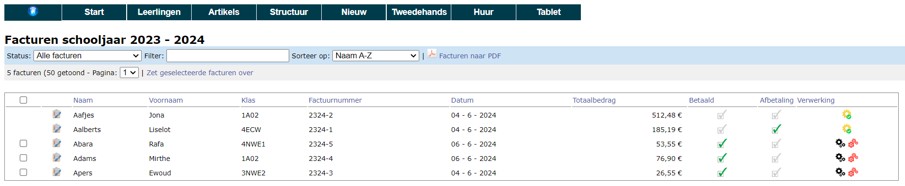
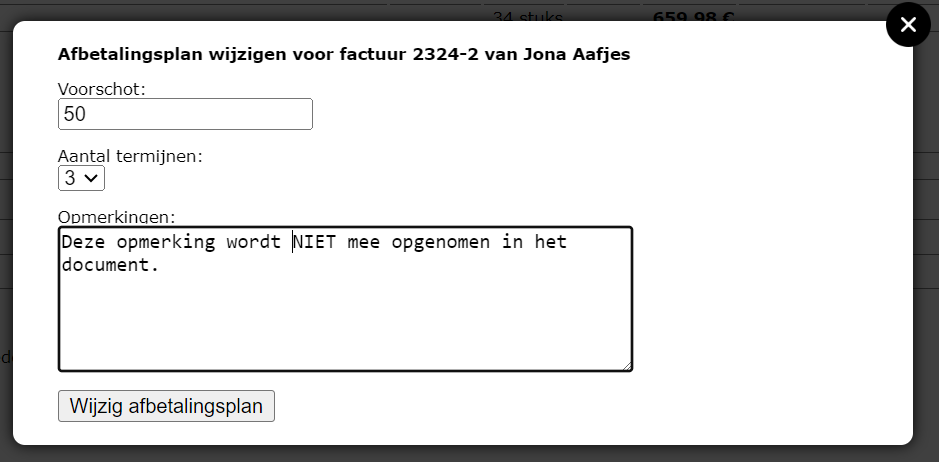
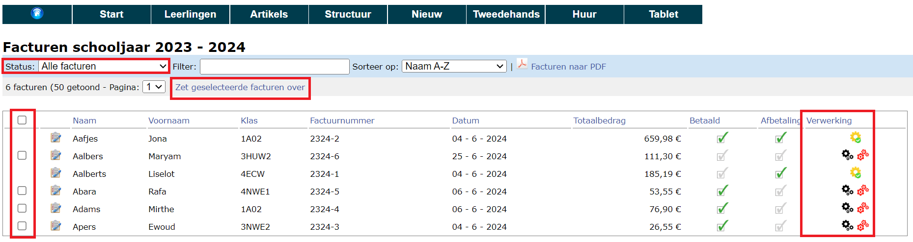

## 1. Bestelling betalen

Als het uitleveren is voltooid, ga je naar het menu **Nieuw => Facturen**. Daar kan je via het icoon <LegacyAction img="list.png"/> de factuur van de leerling oproepen. De factuur kan onmiddellijk betaald worden bij afhaling of kan achteraf betaald worden. Hieronder kom je meer te weten over de onmiddellijke betaling van een bestelling en de verschillende betaalmodaliteiten. Wil je de bestelling achteraf via factuur laten betalen, lees dan verder bij [4. Facturen boekhoudkundig verwerken](/boekenverkoop/betalingen_facturen/#4-facturen-boekhoudkundig-verwerken).

In detailscherm van de factuur kan je de betaling registreren met de link **Voeg betaling toe**.
Heeft de leerling tweedehandsboeken ingeleverd, dan kan je die ook hier toevoegen bij wijze van (deel)betaling van de factuur. 

Wanneer er gebruik gemaakt is van een **voorschotfactuur**, kan je het voorschot op dezelfde manier toevoegen als (deel)betaling. Een voorschotfactuur moet steeds aangemaakt worden in de module Leerlingenrekeningen. Om die voorschotfactuur te kunnen raadplegen in de module Boekenverkoop, moet er een link zijn tussen de twee. Dit dient te gebeuren in de module **Instellingen => Boekenverkoop**. Selecteer bij 'Voorschot' de gewenste notagroep om de koppeling met de boekenverkoop te maken. 

Wanneer je een betaling toevoegt, verschijnt er een pop-up. 
- Indien je het totaalbedrag wil aanrekenen, kan je daar op klikken. Het bedrag wordt dan automatisch overgenomen naar het veld 'Bedrag'. 
- Selecteer vervolgens de betaalwijze. Hier kan je kiezen uit:
    - **Bancontact**: De school moet zelf beschikken over een bancontacttoestel. Zorg ervoor dat dit correct is ingesteld zodat aan het einde van de dag iedere betaling als aparte transactie op de rekening komt. Op die manier kan je bij elke betaling op het bancontacttoestel een referentie meegeven. Vul hier het factuurnummer in dat je te zien krijgt in het betaalscherm. Voer je dat correct in, dan zal de betaling automatisch afgepunt kunnen worden in Exact Online. 
    - **POM**: Wanneer je deze betaalwijze selecteert, zal er onmiddellijk een QR code tevoorschijn komen. Ouders kunnen deze code scannen om het ingevoerde bedrag te betalen. Om gebruik te kunnen maken van deze betaalmethode moet er een contract zijn afgesloten met POM. Tarieven raadplegen en POM activeren kan via https://app.pom.be/nl/connect/koba-toolbox/tarieven. POM gebruikt eveneens het factuurnummer als betaalreferentie. Ook in dit geval zal de factuur automatisch afgepunt worden in Exact Online. 
    -  **Cash, onderwijscheque, overschrijving, andere**: Voor deze betaalmethodes is er geen verdere verwerking voorzien in de module Boekenverkoop. Volg de betalingen zelf op in Exact online. Voor cashbetalingen moet de betaling ook nog geregistreerd worden in het kasdagboek. Dat kan ook in de module Kas in Toolbox, indien hier gebruik van wordt gemaakt. 

        

-  Via het menu **Nieuw => Betalingen** kan er een overzicht opgevraagd worden per betaalmiddel. Standaard staat de datum van vandaag ingevuld. Die kan je aanpassen door in het datumveld te klikken. Indien je een overzicht wil van alle soorten betaalmiddelen, laat je het veld bij 'Betaalmiddel' leeg. Wil je een overzicht van alle betalingen van het hele schooljaar, maak dan het datumveld leeg. 

## 2. Crediteren
Heeft een leerling een artikel besteld en betaald, dan kan je dit niet meer annuleren in de bestelling. Je kan wel een creditnota maken. Dat gebeurt vanuit de (betaalde) factuur. Daar klik je achteraan op de blauw pijl in de kolom 'Crediteren'.
Als je nu in het menu **Nieuw => Creditnota's** gaat kijken, zal je zien dat er een creditnota (CN) werd aangemaakt. Die CN kan je terugbetalen of je kan deze CN als (deel)betaling toevoegen aan een nieuwe factuur van deze leerling.

## 3. Afbetaling
Kan een leerling de factuur niet ineens betalen, dan kan in het scherm van de factuur i.p.v. een betaling een afbetaling worden toegevoegd. Hierin wordt het voorschot en het aantal termijnen waarin afbetaald mag worden genoteerd. Vervolgens kan hier een PDF van afgedrukt worden.

## 4. Facturen boekhoudkundig verwerken
Nadat de facturen (automatisch) werden gegenereerd bij het [uitleveren](/boekenverkoop/bestelling/#5-bestelling-uitleveren) van de materialen, moeten ze nog worden overgezet naar het boekhoudpakket Exact Online. Dat gebeurt steeds met een tussenstap. Eerst zet je de facturen over naar de module Leerlingenrekeningen en van daaruit naar Exact Online. Ga hiervoor in de module Boekenverkoop naar het menu **Nieuw => Facturen**. Standaard worden alle facturen getoond, maar je kan de facturen ook filteren op status. Zo kan je bv. enkel de facturen opvragen die nog verwerkt moeten worden of enkel de facturen die reeds verwerkt zijn. Er kan ook een onderscheid gemaakt worden tussen betaalde en onbetaalde facturen. 

Via de checkboxen vooraan kan je de facturen één voor één aanvinken. Gebruik de checkbox bovenaan om alle facturen ineens aan te vinken. Klik vervolgens op de link bovenaan 'Zet geselecteerde facturen over'. Aangezien de facturen op verschillende manieren betaald kunnen worden (onmiddellijk of achteraf), moet je bij dit factuurtype nog wat extra info opgeven alvorens je kan overzetten naar de module Leerlingenrekeningen, nl. welke referentie er op de factuur moet komen.

- **Factuurnummer boekenverkoop**: Deze optie moet worden aangeduid bij facturen die reeds betaald zijn bij afhaling (cash, met BC of POM). Bij deze betalingen werd het factuurnummer uit de module Boekenverkoop gebruikt als referentie. Dit nummer zal ook worden overgenomen in de module Leerlingenrekeningen en vervolgens in Exact Online. Op die manier kunnen de betaling en de factuur tegenover elkaar worden afgepunt. De verwerking in de module Leerlingenrekeningen is in dit geval puur administratief/boekhoudkundig. De facturen worden over het algemeen niet meer aan de ouders bezorgd.
- **Gestructureerde mededeling**: Wanneer het boekenpakket niet meteen bij afhaling werd betaald, kan de factuur overgezet worden naar de module Leerlingenrekeningen met een gestructureerde mededeling. Vanuit de Leerlingenrekeningen kunnen de facturen vervolgens worden afgedrukt of digitaal verstuurd. De ouders kunnen dan gebruik maken van de gestructureerde mededeling (OGM-nummer) voor de betaling, waardoor de factuur ook weer automatisch kan worden afgepunt in Exact Online. Indien de school gebruik maakt van POM, kan die QR code ook getoond worden op deze facturen.  

Bij het overzetten kan je eveneens kiezen om de facturen over te zetten naar een bepaalde (reeds bestaande) notagroep of om een nieuwe notagroep aan te maken. In dat laatste geval, worden de facturen aangemaakt in een aparte school 'Import boekenverkoop'. Die school wordt automatisch aangemaakt wanneer je de eerste keer facturen overzet vanuit de module Boekenverkoop. Vanuit de module Leerlingenrekeningen kunnen de facturen op de gebruikelijke manier worden overgezet naar Exact Online. 

Verwerkte facturen worden in de module Boekenverkoop gemarkeerd met een geel tandwieltje achteraan <LegacyAction img="eol.png"/>. Dit geeft aan dat de facturen zijn overgezet naar de module Leerlingenrekeningen. Dat wil niet zeggen dat ze ook al zijn overgezet naar Exact Online. Dit kan enkel in de module Leerlingenrekeningen opgevolgd worden. 

:::caution TIP
Zet de facturen over naar Exact Online alvorens je de bankbestanden oplaadt. Dan worden betalingen die zijn uitgevoerd via POM of Bancontact (mits gebruik gemaakt van de referentie) automatisch afgepunt. 
:::