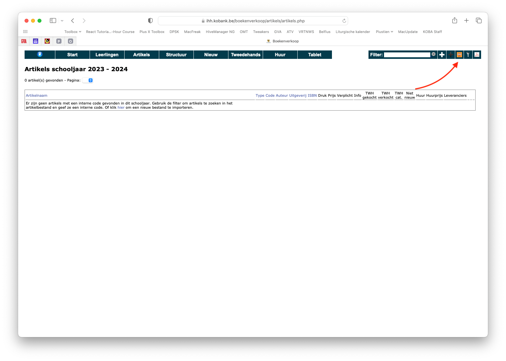
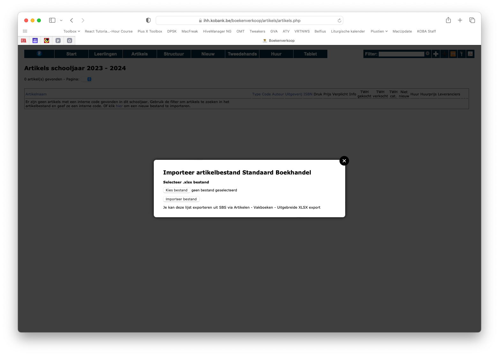
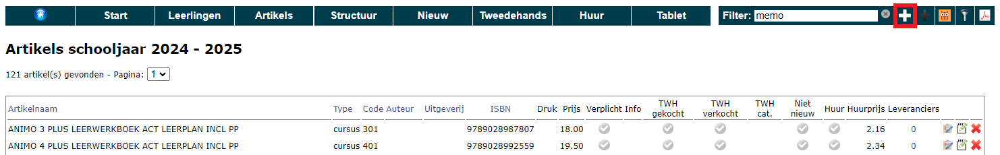
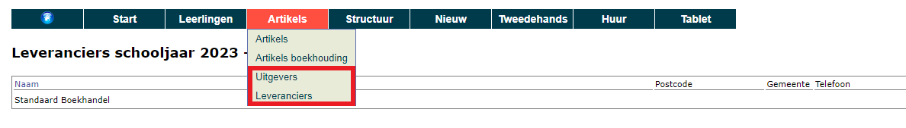
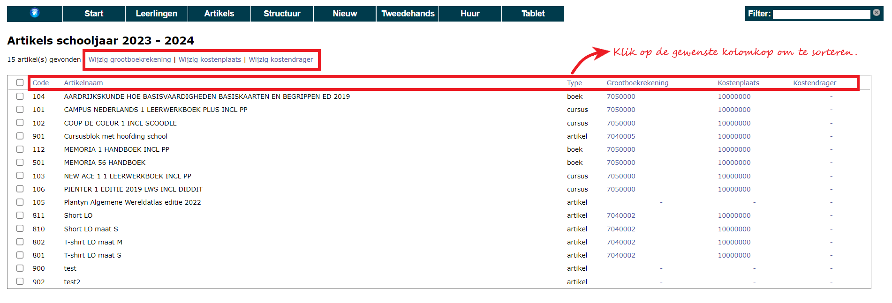

Vooraleer je boekenlijsten of materiaallijsten kan aanmaken per studierichting, moeten alle artikels die je wil aanbieden via het leerlingenplatform worden ingevoerd bij het menu **Artikels**. Dit kunnen boeken zijn met een ISBN nummer, maar evengoed eigen cursussen of andere materialen zoals turngerief, rekenmachines, werkmaterialen... In dit artikelbestand mag elk artikel maar 1x voorkomen. Enkele voorbeelden: 
- Wil je een bepaald boek in meerdere studierichtingen aanbieden? Dan neem je het item toch maar 1x op in het artikelbestand aangezien het artikel in elke studierichting hetzelfde is. 
- Heb je een reeks dezelfde huurboeken op voorraad? Registreer ook dan het item maar 1x in de artikellijst. In het menu **Huur** zal je het aantal beschikbare exemplaren van een bepaald item kunnen instellen en je inventaris beheren. 

## Artikels ingeven in Toolbox
Het eerste jaar dat er gebruik wordt gemaakt van de module Boekenverkoop is de artikellijst nog leeg. Er zijn dan 3 mogelijke methodes om de gewenste artikels in te voeren in Toolbox. De volgende jaren kan je steeds de artikels van vorig schooljaar opnieuw ophalen. Dit heeft als voordeel dat alle koppelingen (tussen studierichtingen, vakken en artikels) die de vorige schooljaren werden gelegd ook mee worden overgenomen. Meer info hierover vind je in het onderdeel [Structuur](/boekenverkoop/structuur/).  

### 1. Import via Excel-bestand

Heb je een Excel-bestand van je artikelen ter beschikking? Dan kan die lijst geïmporteerd worden door de helpdesk van Toolbox. 

Het artikelbestand moet minimaal volgende kolommen bevatten: 
- naam artikel (titel boek)
- ISBN nummer
- interne code (voor meer info zie: [Artikels: Instellingen en mogelijkheden](/boekenverkoop/artikels/#artikels-instellingen-en-mogelijkheden))
- verkoopprijs

Optioneel kunnen deze kolommen ook toegevoegd worden: 
- informatie (= info die je in het platform voor leerlingen wil tonen bij dit artikel. Bv. 'Reeds aangekocht in het 1e jaar. Enkel aan te kopen door nieuwe leerlingen.')
- uitgeverij
- auteur(s)
- druk
- tweedehands aan te kopen (!!! Gebruik volgende kolommen enkel indien je werkt met tweedehandsboeken): 
    - 0 = niet tweedehands aan te kopen 
    - 1 = wel tweedehands aan te kopen 
- tweedehands te verkopen:  
    - 0 = niet tweedehands te verkopen 
    - 1 = wel tweedehands te verkopen

Indien het boek tweedehands kan ingeleverd of gekocht worden, moeten ook de aan- en verkoopprijzen voor categorie A en B voorzien worden. Dat wil zeggen dat er dus nog 4 extra kolommen zijn: 
- ap_cat_a = aankoopprijs voor tweedehandsboeken van categorie A (lees: tweedehandsboeken die nog in zeer goede staat zijn)
- ap_cat_b = aankoopprijs voor tweedehandsboeken van categorie B (lees: tweedehandsboeken die in gebruikte staat zijn, maar nog verkoopbaar)
- vp_cat_a = verkoopprijs voor tweedehandsboeken van categorie A
- vp_cat_b = verkoopprijs voor tweedehandsboeken van categorie B

Als de school een marge wil nemen op de tweedehandsboeken, dan moet de aankoopprijs lager liggen dan de verkoopprijs van het boek. De aankoopprijs is namelijk de prijs die de school betaalt aan een leerling wanneer die een tweedehandsboek terug inlevert. De verkoopprijs is de prijs die de leerling betaalt wanneer die een tweedehandsboek aankoopt via de school.

Na de import kan je elk artikel nog individueel aanpassen of zelfs terug verwijderen. Voor meer info, ga naar [Artikels: Instellingen en mogelijkheden](/boekenverkoop/artikels/#artikels-instellingen-en-mogelijkheden).

### 2. Via de applicatie van Standaard Boekhandel (SBS)

Indien je gebruik maakt van de applicatie van Standaard Boekhandel is het mogelijk om zelf de boekenlijst (Excel) te uploaden in Toolbox. Dat doe je in het menu **Artikels** via het icoon <LegacyAction img="SBS.png"/>. In SBS vind je de export bij Artikelen > Vakboeken > Uitgebreide XLSX export. 

Na de import kan je elk artikel nog individueel aanpassen of zelfs terug verwijderen. Voor meer info, ga naar [Artikels: Instellingen en mogelijkheden](/boekenverkoop/artikels/#artikels-instellingen-en-mogelijkheden).

### 3. Manueel ingeven

Het is steeds mogelijk om manueel artikels toe te voegen door middel van de witte plus-knop, ook wanneer er reeds een bestand werd geïmporteerd (zie hoger). Voor meer info over de in te vullen velden zie [Artikels: Instellingen en mogelijkheden](/boekenverkoop/artikels/#artikels-instellingen-en-mogelijkheden).

## Artikels: instellingen en mogelijkheden

Elk gebruikt artikel moet in het programma een **interne code** krijgen. Die code kan de school vrij kiezen en moet bestaan uit 3 of 4 cijfers. Voor de duidelijkheid raden we aan om de algemene artikels (turnbroek, rekenmachine, werkmaterialen ...) een code te geven die begint met 0, 8 of 9, bv. 001, 002, 821, 913, ... Artikels die specifiek voor een studiejaar zijn voorzien (bv. boek derde jaar) laat je best beginnen met het jaar (bv. 317). De code is ook uniek per artikel. Wordt een artikel in meerdere jaren en/of in meerdere studierichtingen gebruikt, dan geef je dat artikel toch maar 1x in en dit dus met 1 interne code. Bv. het boek Memoria 5/6 krijgt code 521, omdat het voor het eerst gebruikt wordt in het vijfde jaar, maar het zal ook gekoppeld worden aan studierichtingen in het 6de jaar. 

Achteraan elk artikel staan enkele icoontjes. Het eerste icoontje <LegacyAction img="list.png"/> geeft een weer aan welke studierichtingen/vakken een artikel gekoppeld is.
Met het tweede icoontje <LegacyAction img="edit.png"/> kan je een artikel wijzigen en met het derde icoontje <LegacyAction img="remove.png"/> kan je een artikel verwijderen.

Als een artikel tweedehands verkocht of gekocht kan worden of wanneer een boek te huur wordt aangeboden, kleuren de vinkjes bij het betreffende artikel groen <LegacyAction img="vinkjeGroenRond.png"/>. Als voor een artikel informatie werd toegevoegd, verschijnt hier ook een icoontje voor <LegacyAction img="info.png"/>. Door 'niet nieuw' in te stellen op 'ja', kan een boek enkel gehuurd worden of tweedehands worden aangekocht en dus **niet nieuw**. In dat geval verschijnt er ook een groen vinkje in de bijhorende kolom. Al deze zaken kan je instellen of wijzigen via dit icoontje <LegacyAction img="edit.png"/> achteraan het artikel. 

Wanneer een artikel tweedehands wordt aangeboden, verschijnt er in het overzicht volgend icoontje <LegacyAction img="geld.png"/>. Door hier op te klikken kan de prijs van het tweedehandsboek worden ingesteld. De aankoopprijs is de prijs die de school betaalt wanneer het boek terug wordt overgenomen van een leerling. De verkoopprijs is de prijs die de leerling betaalt bij aankoop van het tweedehandsboek. 

Indien bij het menu **Artikels => Uitgevers of Leveranciers** zijn aangemaakt, kan je die bij het ingeven of wijzigen van een artikel ook koppelen aan dat betreffende artikel.

## Artikels boekhouding

Bij het uitleveren van de bestellingen worden er automatisch leerlingenfacturen gegenereerd. Die facturen kunnen overgezet worden naar het boekhoudpakket Exact Online. Om die import correct te laten verlopen, is het belangrijk dat aan elk artikel de juiste boekhoudkundige parameters gekoppeld zijn. Check dit zeker nog een laatste keer vooraleer je gaat uitleveren. Boekhoudkundige parameters aan een artikel koppelen kan via het menu **Artikels => Artikels boekhouding**. Daar vind je dezelfde artikels terug als in het algemeen artikelbestand. 

- Om de boekhoudkundige parameters van **één artikel** aan te passen, klik je in één van de drie laatste kolommen achteraan het artikel. 
- Om de boekhoudkundige parameters van **meerdere artikels** ineens aan te passen, vink je de gewenste artikels vooraan aan en klik je bovenaan op één van de drie parameters die je wil wijzigen. 

