Vooraleer je boekenlijsten of materiaallijsten kan aanmaken per studierichting, moeten alle artikels die je wil aanbieden via het leerlingenplatform worden ingevoerd bij het menu **Artikels**. Dit kunnen boeken zijn met een ISBN nummer, maar evengoed eigen cursussen of andere materialen zoals turngerief, rekenmachines, werkmaterialen... In dit artikelbestand mag elk artikel maar 1x voorkomen. Enkele voorbeelden: 
- Wil je een bepaald boek in meerdere studierichtingen aanbieden? Dan neem je het item toch maar 1x op in het artikelbestand aangezien het artikel in elke studierichting hetzelfde is. 
- Heb je een reeks dezelfde huurboeken op voorraad? Registreer ook dan het item maar 1x in de artikellijst. In het menu **Huur** zal je het aantal beschikbare exemplaren van een bepaald item kunnen instellen en je inventaris beheren. 

## Artikels ingeven in Toolbox
Het eerste jaar dat er gebruik wordt gemaakt van de module Boekenverkoop is de artikellijst nog leeg. Er zijn dan 3 mogelijke methodes om de gewenste artikels in te voeren in Toolbox. De volgende jaren kan je steeds de artikels van vorig schooljaar opnieuw ophalen. Dit heeft als voordeel dat alle koppelingen (tussen studierichtingen, vakken en artikels) die de vorige schooljaren werden gelegd ook mee worden overgenomen. Meer info hierover vind je in het onderdeel [Structuur](/boekenverkoop/structuur/).  

### 1. Import via Excel-bestand

Heb je een Excel-bestand van je artikelen ter beschikking? Dan kan je de artikels eenvoudig importeren via het menu **Artikels => Bestand importeren**. Om correct te kunnen importeren, moet het bestand op een specifieke manier zijn opgebouwd. Hiervoor kan je volgend sjabloon gebruiken: [Importbestand boekenverkoop](./importbestand_artikels.xlsx). Let op dat je de structuur van het bestand behoudt en het bestand opslaat als .xlsx (en niet .xls). 

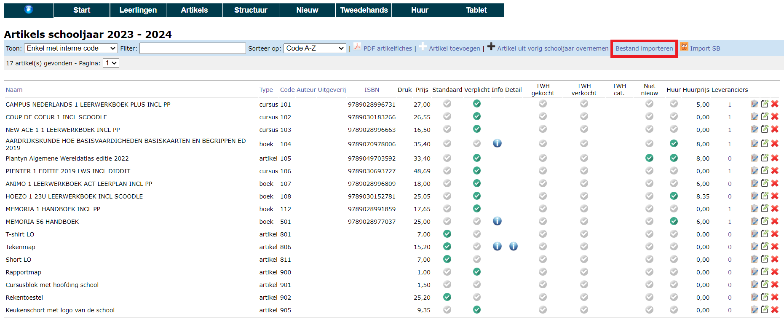

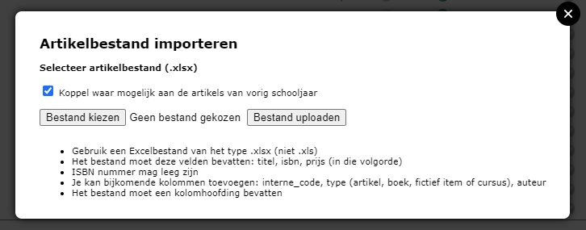

- Indien gewenst kan je ervoor kiezen om de koppeling die vorig schooljaar reeds werd gelegd, te behouden. Hiervoor moet de interne code of het ISBN-nummer van het artikel overeenkomen met dat van vorig jaar. 
- Klik op 'Bestand kiezen'. 
- Selecteer het gewenste bestand.
- Klik vervolgens op 'Bestand uploaden'.

Na de import kan je elk artikel nog individueel aanpassen of zelfs terug verwijderen. Voor meer info, ga naar [Artikels: Instellingen en mogelijkheden](/boekenverkoop/artikels/#artikels-instellingen-en-mogelijkheden).

### 2. Via de applicatie van Standaard Boekhandel (SBS)

Indien je gebruik maakt van de applicatie van Standaard Boekhandel (SBS) voor het beheren van je boekenlijst kan je in die applicatie een export maken die je vervolgens kan importeren in Toolbox. De export vind je in SBS terug bij Artikelen => Vakboeken => Uitgebreide XLSX export. Dit Excel-bestand kan je in de module Boekenverkoop importeren via het menu **Artikels** door te klikken op volgend icoon <LegacyAction img="SBS.png"/>. 

Na de import kan je elk artikel nog individueel aanpassen of zelfs terug verwijderen. Voor meer info, ga naar [Artikels: Instellingen en mogelijkheden](/boekenverkoop/artikels/#artikels-instellingen-en-mogelijkheden).

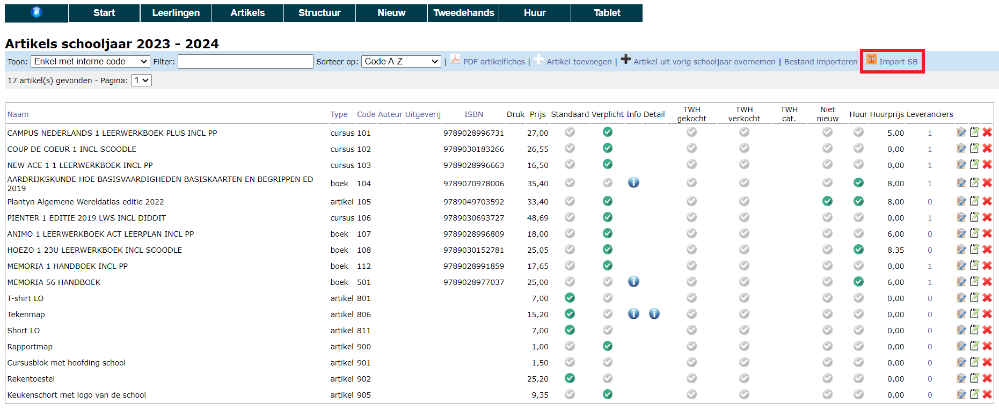
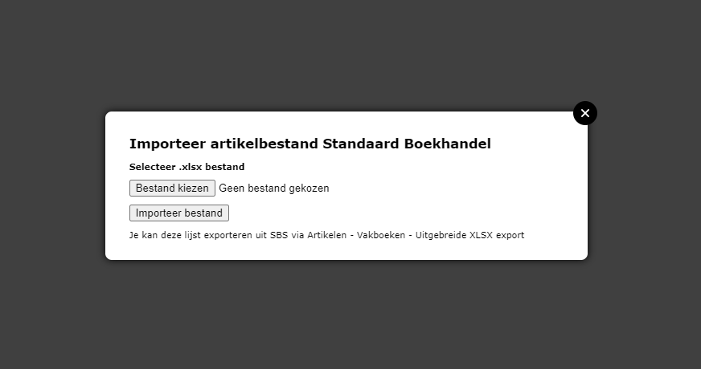

### 3. Manueel ingeven

Het is steeds mogelijk om manueel artikels toe te voegen door middel van de witte plus-knop, ook wanneer er reeds een bestand werd geïmporteerd (zie hoger). Voor meer info over de in te vullen velden zie [Artikels: Instellingen en mogelijkheden](/boekenverkoop/artikels/#artikels-instellingen-en-mogelijkheden).

## Artikels: instellingen en mogelijkheden

In het overzicht met artikels vind je helemaal achteraan elk artikel enkele icoontjes terug. 
- Het eerste icoontje <LegacyAction img="list.png"/> geeft weer aan welke studierichtingen/vakken een artikel gekoppeld is.

- Met het tweede icoontje <LegacyAction img="edit.png"/> kan je een artikel wijzigen.
- met het laatste icoontje <LegacyAction img="remove.png"/> kan je een artikel verwijderen. Opgelet! Als je een artikel op deze plaats verwijdert, zal het volledig verwijderd worden uit de module Boekenverkoop, ook uit de studierichtingen waaraan het artikel eventueel reeds gekoppeld was. 

Klik je op 'artikel wijzigen' <LegacyAction img="edit.png"/> dan kan je volgende zaken instellen: 

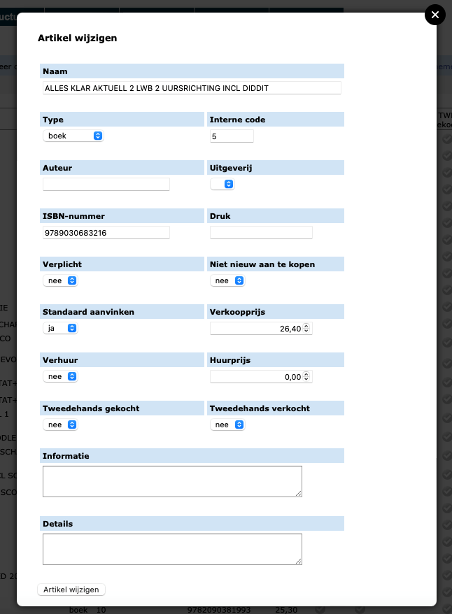

- **Naam**: Dit is de naam van het artikel die ook getoond zal worden in de webshop voor de leerlingen, bv. de titel van een boek.
- **Type**: In de lijst kan je kiezen uit verschillende types, nl. artikel, boek, fictief item of cursus. Op basis van het type zal je later ook makkelijk kunnen zoeken en filteren. 
- **Interne code**: Elk gebruikt artikel moet een interne code krijgen. Die code kan de school vrij kiezen en moet bestaan uit 3 of 4 cijfers. Voor de duidelijkheid raden we aan om de algemene artikels (turnbroek, rekenmachine, werkmaterialen ...) een code te geven die begint met 0, 8 of 9, bv. 001, 002, 821, 913, ... Artikels die specifiek voor een studiejaar zijn voorzien (bv. boek derde jaar) laat je best beginnen met het jaar (bv. 317). De code is ook uniek per artikel. Wordt een artikel in meerdere jaren en/of in meerdere studierichtingen gebruikt, dan geef je dat artikel toch maar 1x in en dit dus met 1 interne code. Bv. het boek Memoria 5/6 krijgt code 521, omdat het voor het eerst gebruikt wordt in het vijfde jaar, maar het zal ook gekoppeld worden aan studierichtingen in het 6de jaar. 
- **Auteur**: Hier kan je de auteur van een boek of cursus ingeven. Dit is een optioneel veld.
- **Uitgeverij**: Indien er uitgeverijen zijn aangemaakt in het menu **Artikels => Uitgevers** kan je die hier selecteren. 
- **ISBN-nummer**: Dit is de unieke code die wordt gebruikt voor boeken én een belangrijk veld om de bestelling te kunnen plaatsen bij Standaard Boekhandel. Voor overige artikels is dit veld optioneel. 
- **Druk**: Slaat op de hoeveelste druk van een bepaald boek. Dit is een optioneel veld.
- **Verplicht**: 
    - **JA**: Dit artikel is in de webshop automatisch aangevinkt. Ouders hebben dan niet de mogelijkheid om het artikel zelf uit te vinken. Uitvinken kan enkel door iemand van de school met adminrechten in de module Boekenverkoop. De administrator doet dit in de Toolboxmodule Boekenverkoop bij **Nieuw => Bestellingen** en niet in de Toolbox voor leerlingen (lees: de webshop).  
    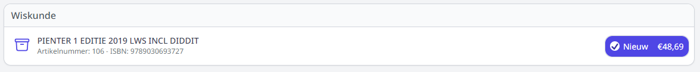
    - **NEE**: Dit artikel is in de webshop niet automatisch aangevinkt. Men krijgt in dit geval 2 keuzemogelijkheden: 'Koop' of 'Koop niet'. Men moet sowieso een keuze maken om verder te kunnen gaan met de bestelling. Het is dus niet mogelijk om per ongeluk artikelen over het hoofd te zien. 
    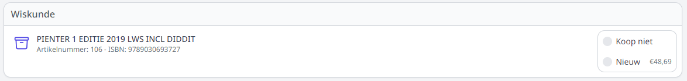
- **Standaard**: 
    - **JA**: Dit artikel is in de webshop automatisch aangevinkt om aan te kopen. In tegenstelling tot de optie 'Verplicht' hebben ouders hier nog wel de mogelijkheid om het artikel zelf uit te vinken en bijgevolg niet aan te kopen. 
    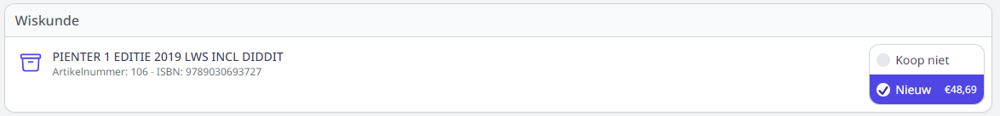
    - **NEE**: Dit artikel is in de webshop niet automatisch aangevinkt. Men krijgt in dit geval 2 keuzemogelijkheden: 'Koop' of 'Koop niet'. Men moet sowieso een keuze maken om verder te kunnen gaan met de bestelling. Het is dus niet mogelijk om per ongeluk artikelen over het hoofd te zien. 
    
- **Niet nieuw aan te kopen**: Deze instelling kan gebruikt worden in combinatie met verhuur of tweedehandsverkoop. 
    - **JA**: Het artikel kan niet nieuw aangekocht worden. Naar gelang de instelling bij 'Verhuur' of 'Tweedehands' kan het artikel respectievelijk enkel gehuurd worden of tweedehands aangekocht.
    - **NEE**: Het artikel kan wel nieuw aangekocht worden. 
- **Verhuur**: 
    - **JA**: Het artikel wordt te huur aangeboden door de school. In combinatie met **Niet nieuw aan te kopen** (=ja) kan je instellen dat het artikel enkel gehuurd kan worden. 
    - **NEE**: Het artikel kan enkel nieuw of tweedehands aangekocht worden. 
- **Verkoopprijs**: De prijs die de leerling moet betalen voor het artikel. In het geval van huur zal ook de nieuwprijs van het artikel getoond worden, zodat het voor de ouders transparant is hoeveel zij besparen met het huren van het boek.
- **Huurprijs**: De huurprijs die de leerling moet betalen voor het artikel. 
- **Tweedehands gekocht**: Zet op **JA** indien de school het artikel na gebruik terugkoopt van de leerling. 
- **Tweedehands verkocht**: Zet op **JA** indien het artikel door de school tweedehands wordt aangeboden. Gebruik je een ander platform voor tweedehandsverkoop of regelen de leerlingen dit onderling, stel beide velden dan in op **NEE**. 
- **Informatie**: Je kan in de webshop een extra omschrijving of meer informatie meegeven bij een artikel. Deze info wordt onmiddellijk getoond in de webshop.
    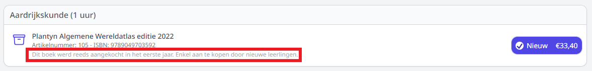
- **Details**: Wanneer het veld 'Informatie' niet volstaat, kan je nog meer info meegeven over een bepaald artikel. Hiervoor vul je het veld 'Details' in. De details worden niet automatisch getoond in de webshop. Door te klikken op 'Meer informatie' kan men de details raadplegen. 
    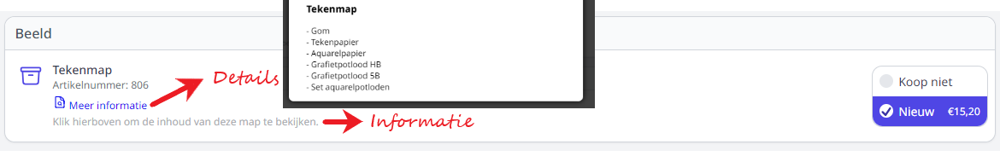

### Instellingen raadplegen of wijzigen in het overzicht
Wanneer voor een artikel **informatie of details** werden toegevoegd, verschijnt in het globaal overzicht volgend icoontje <LegacyAction img="info.png"/>. Klik op dit icoontje en de info wordt getoond. 

Een aantal andere instellingen van de artikels worden in het overzicht weergegeven aan de hand van groene of grijze vinkjes <LegacyAction img="vinkjeGroenRond.png"/>. Deze instellingen kan men niet alleen wijzigen via het edit-icoon <LegacyAction img="edit.png"/> achter het artikel, maar ook rechtstreeks in het globaal overzicht door de vinkjes aan te klikken. Door de instellingen daar aan te passen heb je de mogelijkheid om die wijziging ineens door te voeren naar alle studierichtingen waaraan dit artikel gekoppeld is. 

    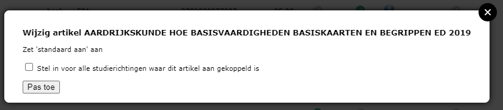

Wanneer een artikel **tweedehands** wordt aangeboden, verschijnt er in het overzicht volgend icoontje <LegacyAction img="geld.png"/>. Door hier op te klikken kan de prijs van het tweedehandsboek worden ingesteld. De aankoopprijs is de prijs die de school betaalt wanneer het boek terug wordt overgenomen van een leerling. De verkoopprijs is de prijs die de leerling betaalt bij aankoop van het tweedehandsboek. Als de school een marge wil nemen op de tweedehandsboeken, dan moet de aankoopprijs dus lager liggen dan de verkoopprijs van het boek. Voor beide prijzen zijn er 2 categorieën voorzien:
- categorie A: tweedehandsboeken die nog in zeer goede staat zijn
- categorie B: tweedehandsboeken die in gebruikte staat zijn, maar nog verkoopbaar

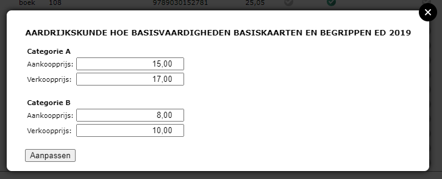

Indien er leveranciers zijn aangemaakt in het menu **Artikels => Leveranciers**, kan je die in het overzicht via de kolom 'Leveranciers' koppelen aan het betreffende artikel door te klikken op het blauwe getal. Dit getal geeft weer hoeveel leveranciers er reeds gekoppeld zijn. 

## Artikels: boekhoudinge parameters

Bij het uitleveren van de bestellingen worden er automatisch leerlingenfacturen gegenereerd. Die facturen kunnen overgezet worden naar het boekhoudpakket Exact Online. Om die import correct te laten verlopen, is het belangrijk dat aan elk artikel de juiste boekhoudkundige parameters gekoppeld zijn. Check dit zeker nog een laatste keer vooraleer je gaat uitleveren. Boekhoudkundige parameters aan een artikel koppelen kan via het menu **Artikels => Artikels boekhouding**. Daar vind je dezelfde artikels terug als in het algemeen artikelbestand. 

- Om de boekhoudkundige parameters van **één artikel** aan te passen, klik je in één van de drie laatste kolommen achteraan het artikel. 
- Om de boekhoudkundige parameters van **meerdere artikels** ineens aan te passen, vink je de gewenste artikels vooraan aan en klik je bovenaan op één van de drie parameters die je wil wijzigen. 

