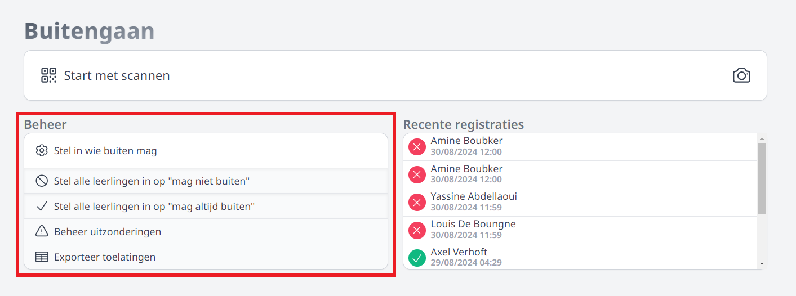

<ImageTitle img="buiten.png">Buitengaan</ImageTitle>

In secundaire scholen hebben heel wat leerlingen toestemming om tijdens de middagpauze de school te verlaten. Aan de schoolpoort wordt er 's middags vaak gecontroleerd of de leerlingen die terug binnenkomen ook effectief die toestemming hadden. 

De module Buitengaan laat enerzijds toe om op een snelle en eenvoudige manier op te lijsten welke leerlingen de school wel of niet mogen verlaten onder de middag. Die gegevens kunnen vervolgens met een druk op de knop ingelezen worden in Smartschool en zelfs getoond worden op de (digitale) leerlingenkaart. Anderzijds kan de module gebruikt worden om de controle aan de schoolpoort uit te voeren. De module is namelijk zeer goed geschikt voor gebruik op een mobiel toestel. De barcodes (van Toolbox) of QR codes (uit Smartschool) van de leerlingen kunnen gescand worden met behulp van een scanapparaat of met de camera van een mobiel toestel (tablet of smartphone). Op die manier zien toezichters meteen (aan de hand van een groen of rood scherm) of een leerling toestemming had om de school te verlaten. 

### Instellen wie toestemming heeft om de school te verlaten

Wie in de module Buitengaan moet kunnen registreren welke leerlingen er al dan niet toestemming hebben om de school tijdens de middagpauze te verlaten, heeft daarvoor het gebruikersrecht 'Buitengaan_beheer' nodig. Dat kan worden toegekend via de module [Gebruikersbeheer](/gebruikersbeheer). 

Via de eerste optie kan je instellen welke leerlingen er tijdens de middagpauze de school mogen verlaten. Die toestemming staat bij nieuwe leerlingen standaard uitgevinkt. Je kan zoeken op naam, op klas of de barcode van een leerling scannen. Vervolgens duid je per dag aan of een leerling toestemming heeft. Je kan een bepaalde keuze ook meteen voor een hele week doorvoeren door vooraan het groene vinkje of het rode kruisje aan te klikken.

Indien de module [Inschrijvingen](/inschrijvingen/inschrijven/herinschrijven/) gebruikt wordt om eigen leerlingen opnieuw in te schrijven, kan daar de module Buitengaan reeds opgevuld worden met gegevens voor volgend schooljaar door de klasleerkracht die de herinschrijving uitvoert. 

Je kan met één klik ook instellen dat er geen enkele leerling de toestemming heeft om de school te verlaten door te klikken op 'Stel alle leerlingen in op 'mag niet buiten''. 

Verder kan je nog een overzicht naar Excel exporteren. Dit bevat de gegevens i.v.m. 'buitengaan' van alle leerlingen op de school.

### Gegevens tonen op de leerlingenkaart 

De gegevens rond 'buitengaan' kunnen getoond worden op de leerlingenkaart van Toolbox of op de digitale leerlingenkaart van Smartschool. Op vertoon van deze kaart kan men aan de schoolpoort makkelijk controleren of de leerling al dan niet toestemming had om de school te verlaten. 

Klik [hier](/leerlingenkaarten) voor meer info om via Toolbox eigen leerlingenkaarten te maken. Deze leerlingenkaarten kunnen ook gebruikt worden in combinatie met de digitale leerlingenkaarten uit Smartschool. Dat maakt het mogelijk om leerlingen die niet over een smartphone beschikken van een fysieke leerlingenkaart te voorzien, terwijl andere leerlingen de digitale leerlingenkaart van Smartschool gebruiken. 

### Export naar Smartschool

Om de gegevens i.v.m. buitengaan te kunnen exporteren naar Smartschool, moet er in Smartschool een extra profielveld (tekstveld) aangemaakt worden met de naam 'Buitengaan'. Als dat profielveld is aangemaakt, moet in Toolbox de koppeling met dat veld gelegd worden. Toolbox moet namelijk weten welk profielveld in Smartschool het moet gaan opvullen met gegevens. Dat doe je in de module Instellingen > Smartschool. 

Het exporteren van de gegevens rond 'buitengaan' naar Smartschool dient te gebeuren in de module Synchronisatie leerlingen > Leerlingengegevens. 

Hieronder vind je een voorbeeld van de digitale leerlingenkaart met de gegevens i.v.m. 'buitengaan'. 

### Digitale controle van leerlingen door te scannen

Leerlingen kunnen hun leerlingenkaart aan de schoolpoort tonen ter controle, maar de barcode of QR code op de kaart kan via de module Buitengaan ook gescand worden. Op die manier kan de controle veel sneller verlopen. De toezichters moeten dan niet meer de toegestane dagen nakijken, maar krijgen meteen een groen of rood scherm te zien. 

Toezichters die de barcodes moeten kunnen scannen, moeten in Toolbox over het gebruikersrecht 'Buitengaan_scannen' beschikken. Dat kan worden toegekend via de module [Gebruikersbeheer](/gebruikersbeheer). 

Lees [hier](/leerlingenkaarten#barcodes-of-qr-codes-genereren) hoe je in Toolbox barcodes kan genereren en leerlingenkaarten kan aanmaken. Indien je de QR codes uit Smartschool wil gebruiken, moeten die eerst geïmporteerd worden in Toolbox via de module Synchronisatie leerlingen > scancodes ophalen. 

Als de barcodes zijn aangemaakt of opgehaald kan je ze via de module Buitengaan scannen. Je kan daarbij kiezen of je een barcodescanner (verbonden aan een extern toestel) of de camera van een mobiel toestel wil gebruiken. Na het scannen van de code zie je meteen of de leerling toelating had om de school te verlaten. 

<Thumbnails img={[
    require('./buiten6.PNG').default, 
]} />

