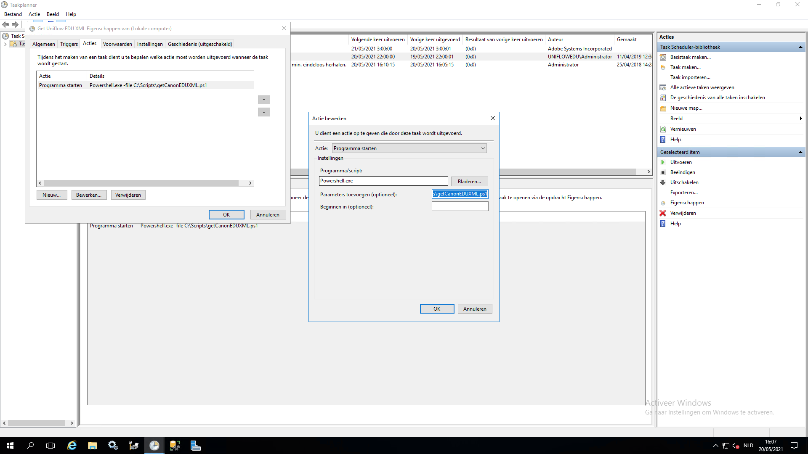

<ImageTitle img="uniflow.png">Canon Uniflow</ImageTitle>

Toolbox kan via de module Uniflow Edu de nodige informatie aanleveren om een Canon Uniflow op te vullen. Toolbox genereert hiervoor een XML die Uniflow kan inlezen. In die XML zit onder andere deze informatie:

- Leerlingen
- Personeel
- Externen
- Klassen en subgroepen
- Koppeling tussen leerlingen en klassen
- Koppeling tussen personeel en klassen (wie ziet welke klassen)
- Koppeling tussen personeel en kostenplaatsen

Per persoon worden meerdere parameters meegestuurd: e-mailadres, login, pointer (uniek nummer uit Informat of Wisa), nummer betaalkaart, pincode, ... 

## Configuratie

Om de XML te kunnen ophalen moet er eerst een unieke (willekeurige) sleutel worden aangemaakt. Die moet ingevuld worden in de instellingen - Uniflow. Vul daarnaast ook de instellingen onder 'School' in: referentie, korte naam en volledige naam. Raadpleeg hiervoor de handleiding van Uniflow.

Bij Schooljaar vul je het huidige schooljaar in. Het formaat: 2020-21.

Standaard wordt de gebruikersnaam die Toolbox genereert (zie Synchronisatie leraren en leerlingen) meegestuurd. Je kan bijkomend nog een extra 'loginnaam' meesturen die afwijkt van de gebruikersnaam zodat Uniflow ook hier op kan koppelen.

Toolbox zal ook de pincode van elke gebruiker meegeven. In het veld Samenstelling kan je invullen hoe die pincode moet worden opgebouwd. Je kan daar gebruik maken van enkele variabelen om de code wat meer te personaliseren.

Als je gebruik maakt van de module Synchronisatie Externen, dan kan je kiezen om die externen ook toe te voegen aan de XML. Zo kunnen externe gebruikers zoals Stagiairs, CLB medewerkers, ... ook toegang geven tot Uniflow. 

Via de module Uniflow Edu kan je de XML opvragen en nakijken. Via die module kan je ook personeelsleden koppelen aan klassen. Op die manier krijgen zij een beperkte lijst van klassen te zien op de display. Je kan die koppeling ook importeren via een lesroosterbestand.

In de loop van het schooljaar kan je nieuwe gebruikers (bv. interims) klassen laten overerven.

## XML Ophalen op Uniflow

De XML moet op regelmatige basis worden ingeladen in Uniflow. Recente versies van Uniflow kunnen de basisgegevens van de school rechtstreeks uit Toolbox ophalen. Je dient enkel de URL van Toolbox, de referentie van de school en de sleutel in te vullen.

<Thumbnails img={[
    require('./uniflow2.png').default, 
    require('./uniflow3.png').default, 
]} />

Oudere versies van Uniflow dienen nog gebruik te maken van het PowerShell script hieronder dat via een Windows taak bijvoorbeeld elke nacht de XML ophaalt en aan Uniflow aanlevert.

```powershell
[Net.ServicePointManager]::SecurityProtocol = [Net.SecurityProtocolType]::Tls12
$wc = New-Object System.Net.WebClient
$wc.DownloadFile('https://mijn.toolbox.be/uniflow_edu/publicGetUniflowEDUXML.php?key=UNIEKESLEUTEL','c:\uniflowedu.xml')

if (Test-Path -Path "c:\uniflowedu.xml") {
    Move-Item -Path "c:\uniflowedu.xml" -Destination "C:\Program Files (x86)\Common Files\NT-ware Shared\Data\EduPlatform\BaseData\uniflowedu.xml"
} 
```

In dit script moet je enkele zaken wijzigen:
- `mijn.toolbox.be` vervangen door het adres van je Toolbox
- `UNIEKESLEUTEL` vervangen door de sleutel die je in de instellingen hebt opgegeven
- het `-Destionation` path instellen naar de Uniflow Hotfolder. Die is afhankelijk van de versie van Uniflow.

Zet dit script in de map c:\Scripts\getCanonEDUXML.ps1

Maak vervolgens een Windows taak aan die dit script dagelijks uitvoert. We vragen om dit bij voorkeur tussen 23u en 6u te laten lopen om onze systemen niet te veel te overbelasten. We vragen ook om dit maximaal twee keer per dag uit te voeren.

