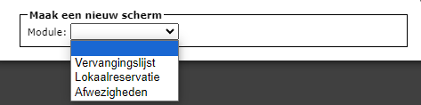
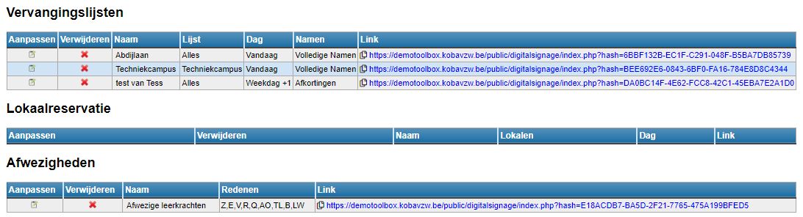
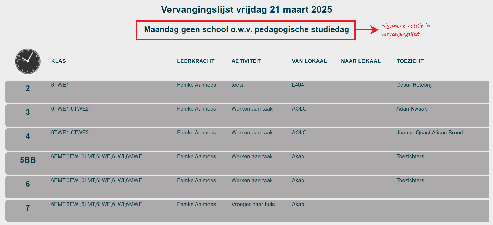
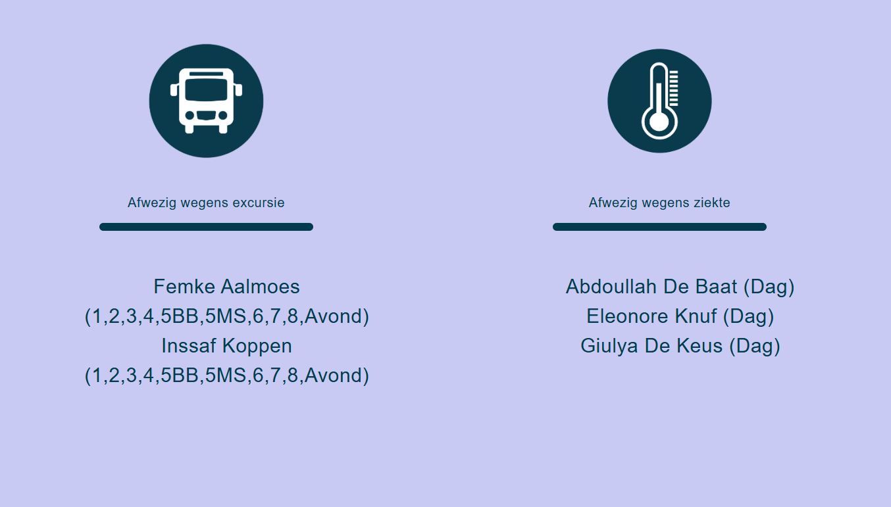

<ImageTitle img="digitalsignage.png">Digital Signage</ImageTitle>

De module Digital Signage stelt je in staat om gegevens uit de modules [Afwezigheden](/afwezigheden), [Vervangingslijsten](/vervangingslijsten) en Lokaalreservaties op een overzichtelijke manier te tonen op een display (bv. tv-scherm in de leraarskamer of inkomhal). Je kan meerdere schermen aanmaken die elk over een unieke URL beschikken. Deze URL kan toegevoegd worden aan de loop in de software die gebruikt wordt voor de schermen (bv. Xibo). Die software zal ervoor zorgen dat de juiste content op het geschikte moment getoond wordt op de aangesloten display.

## 1. Gebruikersrechten toekennen

Om toegang te krijgen tot deze module moet het gebruikersrecht 'digital signage' zijn toegekend via de module [Gebruikersbeheer](/gebruikersbeheer). 

## 2. Scherm aanmaken

- Stap 1: Maak een nieuw scherm aan via de blauwe tekst bovenaan 'Scherm aanmaken'.
- Stap 2: Kies vanuit welke module je gegevens voor het scherm wil halen.  

    

- Stap 3: Geef het scherm een naam en duid aan welke zaken je op het scherm wil tonen. Ook lettertype, lettergrootte, tekst- en achtergrondkleuren kunnen worden aangepast. 

    Bij de vervangingslijsten kan je een scherm aanmaken voor de vervangingen van vandaag, maar ook voor de volgende één of zelfs 2 lesdagen. Op die manier kan je 3 schermen aanmaken en de afwezigheden van de komende dagen ook al tonen op je dipslays. 

    Eveneens bij de vervangingslijsten kan je kiezen voor **automatisch scrollen**. Wanneer er veel vervangingen zijn, kan het gebeuren dat niet alle gegevens op één scherm passen. Het scherm zal dan automatisch scrollen, zodat toch alle afwezigheden getoond worden. 

    Verder kan je bij de vervangingslijsten ook nog instellen om **oude lijnen** te tonen. Als dit *actief* is, worden gedurende de hele dag alle vervangingen getoond, ook al is het lesuur voorbij. Als deze optie *niet actief* is, wordt enkel het huidige lesuur (tot het einde van de les) en alle volgende lesuren getoond. De lesuren die voorbij zijn, zijn dus niet meer zichtbaar op het scherm. 

    Bij het aanmaken van een scherm kan je ook een **automatische vernieuwing** van de pagina opgeven. De pagina wordt dan om de X-aantal (minimaal 60) seconden vernieuwd. Zo kan je de pagina op een Smart TV afspelen zonder tussenkomst van een extra systeem.

    <Thumbnails img={[
    require('./scherm2.PNG').default,
    require('./scherm4.PNG').default,
    ]} />

    <Thumbnails img={[
    require('./scherm3.PNG').default,
    ]} />

- Stap 4: Klik op 'Creëer Scherm'.

Alle aangemaakte schermen worden getoond in een overzicht.

## 3. Scherm wijzigen, verwijderen, publiceren

- Met het potlood <LegacyAction img="edit.png"/> vooraan kan je de instellingen van een scherm wijzigen.

- Gebruik het rode kruisje <LegacyAction img="remove.png"/> om het scherm volledig te verwijderen.

- De link kan je kopiëren en gebruiken in je digital signage software.

## 4. Enkele voorbeelden 

**Vervangingslijst**

**Afwezigheden**

