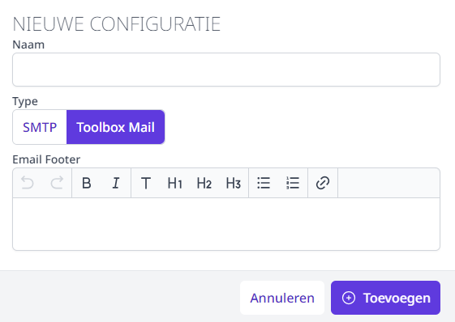
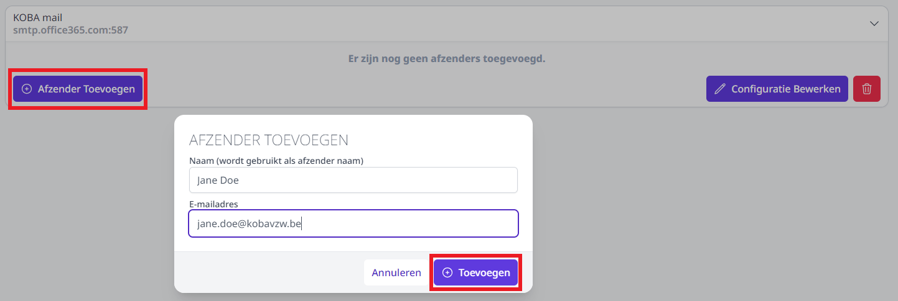

Om de mails te kunnen versturen vanuit diverse modules in Toolbox, moeten de e-mailsettings worden ingevuld in de module Instellingen > E-mail. Deze module is enkel toegankelijk voor Toolbox-beheerders. Om na te gaan wie beheerder is in een Toolbox, klik je in het startscherm op het vraagteken rechts bovenaan.

1. Klik op **Configuratie toevoegen** en geef deze nieuwe configuratie een naam.
2. Kies welk **type mail** je wil configureren (SMTP of Toolbox Mail). Bij SMTP maak je voor elke afzender een volledig nieuwe configuratie aan. Toolbox mail moet slechts 1x geconfigureerd worden per domein. Daarna kan je voor dat domein verschillende afzenders invoeren zonder telkens opnieuw de volledige settings - waaronder ook gebruikersnaam en paswoord - in te geven. 

    - **SMTP**: Vul de SMTP-servergegevens in alsook de gebruikersnaam en het bijhorende paswoord van het account van waaruit je de mails wil versturen.  
    
        <Thumbnails img={[
        require('./email1.PNG').default, 
        ]} />

    - **Toolbox mail**: Deze eenvoudige en veilige manier van mailen moet eenmalig door Toolbox geconfigureerd worden. Neem hiervoor contact op met het Toolbox support team via toolbox@kobavzw.be. Eens de Toolbox mail is ingesteld, volstaat het om een naam in te geven voor deze mailconfiguratie. 

        

3. Voeg minimaal één **afzender** toe. Deze afzender zal je vervolgens in de instellingen van andere modules kunnen selecteren om mails te kunnen versturen vanuit diens naam.  

    - Voor **SMTP** komt de afzender meestal overeen met de account die je voor de configuratie hebt opgegeven. Als je met SMTP werkt, stel je in de meeste gevallen per afzender een nieuwe e-mailconfiguratie in. 
    - Bij het gebruik van de **Toolbox mail** volstaat het om de mail éénmalig te configureren. Vervolgens kan je meerdere afzenders instellen zolang het domein van het e-mailadres overeenkomt met het ingestelde domein. 

        

4. Klik achteraan op het tandwiel om een **testmail** te versturen vanuit een afzender of om een **afzender** terug te **verwijderen**. 

    

5. Selecteer de gewenste afzender voor de betreffende module. Voor volgende modules kan dat rechtstreeks in de module zelf:
    - Activiteiten (bij beheer)
    - Inschrijvingen (bij beheer)
    - Onkosten (bij beheer)
    - Leerlingenrekeningen (in het menu Scholen)
    - Personeelsrekeningen (in het menu Scholen)
    
    Voor volgende modules dient dat te gebeuren in de aparte module Instellingen > *naam van de module*:
      -	Afwezigheden  
      - RL's
      -	Inventaris 
      -	Smartschool (mailen naar co-accounts, bv. bij aanmaak nieuw account of bij reset paswoord)
      - Synchronisatie leraren (mailen van pdf met inloggegevens)
      - Synchronisatie externen (idem)
      - Webshop