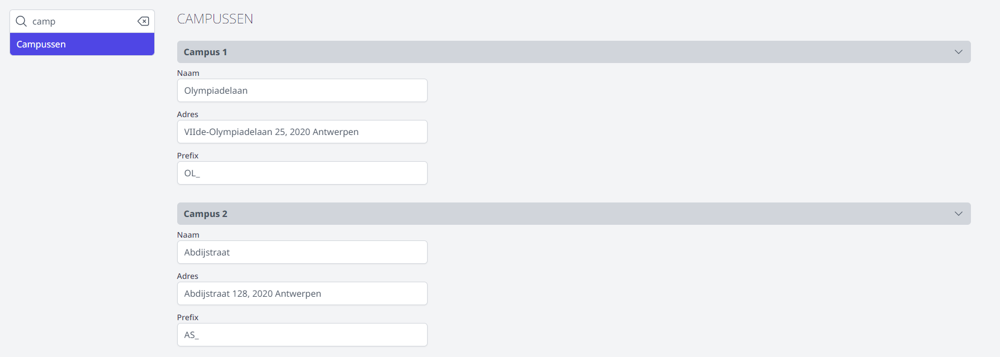

Alvorens de module Fietsvergoeding gebruikt kan worden, moet de beheerder enkele instellingen invullen. Dat gebeurt via de module Instellingen > Fietsvergoeding. 

## 1. Algemeen

### Fietsvergoeding per km

Als eerste moet bepaald worden welke vergoeding men krijgt per gefietste kilometer. Dit bedrag is wettelijk vastgelegd. 

Het wijzigen van deze instelling gebeurt niet met terugwerkende kracht en is dus enkel van toepassing op alle later ingevulde/geselecteerde data.

### Meerdere campussen

Als de school over meerdere campussen beschikt, kan het fietsverkeer tussen de campussen ook in rekening gebracht worden. Hiervoor moet de instelling 'Meerdere campussen' op 'ja' staan.

Om de afstand tussen de verschillende campussen te kunnen ingeven, moeten die campussen eerst gedefinieerd worden in de module Instellingen > Campussen. Wanneer de school maar 1 campus heeft, mag deze instelling leeg blijven.

Als dat is gebeurd, kan je onder Instellingen > Fietsvergoeding helemaal onderaan zien dat er automatisch trajecten worden aangemaakt tussen de verschillende campussen. Daar kan de beheerder dan ook de afstand tussen de campussen instellen.

Eens het traject is ingesteld, is het niet aanbevolen om de afstand nog te wijzigen.

### Uitbetalen per

Voor het uitbetalen kan er gekozen worden om per maand te betalen of twee keer per jaar, namelijk voor de periode van januari-juni en van juli-december. Deze instelling heeft enkel effect op de weergave voor de administratieve verwerking.

### Gebruiker mag digitaal ondertekenen

Als de school van de eindgebruiker een ondertekend papieren document verwacht, dan zet je deze instelling op nee. 

Staat deze instelling op ja, dan kan de gebruiker door middel van een knop zijn fietsvergoeding aanvragen en hoeft hij niets meer op papier binnen te brengen.

## 2. Boekhouding

Vul hier de parameters uit Exact Online in. Wanneer de fietsvergoedingen uit Toolbox worden overgezet naar EOL, zullen standaard deze parameters gebruikt worden.  
Grootboekrekening, kostenplaats, kostendrager en dagboek kunnen rechstreeks in de module Fietsvergoeding bij het Beheer nog gewijzigd worden. Dit kan handig zijn voor scholen die bv. werken met verschillende kostenplaatsen voor de verschillende campussen. Klik [hier](/fietsvergoeding/verwerking/) voor meer informatie. 