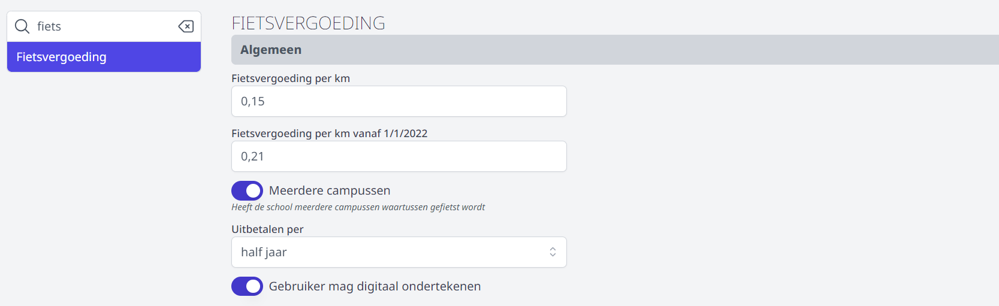
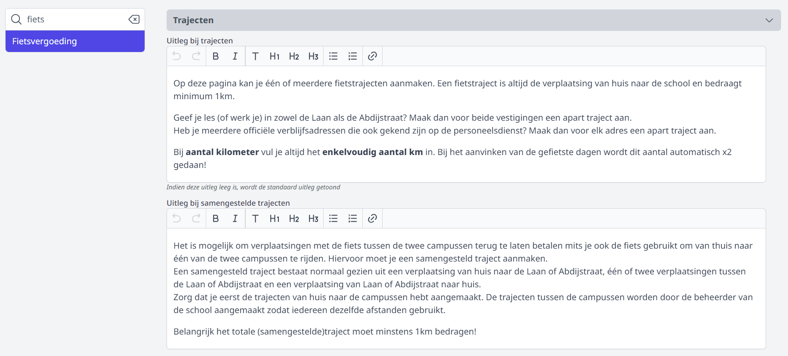

Alvorens de module Fietsvergoeding gebruikt kan worden, moet de Toolboxbeheerder enkele instellingen invullen. Dat gebeurt via de module Instellingen > Fietsvergoeding. Klik rechts bovenaan in Toolbox op het vraagteken om te achterhalen wie beheerder is in jouw Toolbox. 

## 1. Tegel Fietsvergoeding

De tegel fietsvergoeding is voor personeelsleden op 2 manieren bereikbaar. Het is een aparte tegel in Toolbox, maar de module kan ook geopend worden via de module [Onkosten](/onkosten). Daar worden alle mogelijke aanvragen voor onkostenvergoeding gebundeld onder 1 module. De school kan zelf bepalen op welke manier hun personeelsleden de module moeten kunnen bereiken. Je kan één weg inschakelen en de andere uitschakelen, maar het is ook mogelijk om beide wegen aan te zetten. 

- **Aparte tegel**: De aparte tegel in Toolbox kan in- en uitgeschakeld worden door een beheerder via de module Instellingen > Modules. 
- **Via onkostenmodule**: Het onderdeel Fietsvergoeding (de)activeren in de onkostenmodule kan via de module Instellingen > Onkosten.  

    

**Aparte tegel in Toolbox:**

**Geïntegreerd in de module Onkosten:**

## 2. Algemeen

### Fietsvergoeding per km

Als eerste moet bepaald worden welke vergoeding men krijgt per gefietste kilometer. Dit bedrag is wettelijk vastgelegd. 

Het wijzigen van deze instelling gebeurt niet met terugwerkende kracht en is dus enkel van toepassing op alle later ingevulde/geselecteerde data.

### Meerdere campussen

Als de school over meerdere campussen beschikt, kan het fietsverkeer tussen de campussen ook in rekening gebracht worden. Hiervoor moet de instelling 'Meerdere campussen' op 'ja' staan.

Om de afstand tussen de verschillende campussen te kunnen ingeven, moeten die campussen eerst gedefinieerd worden in de module Instellingen > Campussen. Wanneer de school maar 1 campus heeft, mag deze instelling leeg blijven.

Als dat is gebeurd, kan je onder Instellingen > Fietsvergoeding helemaal onderaan zien dat er automatisch trajecten worden aangemaakt tussen de verschillende campussen. Daar kan de beheerder dan ook de afstand tussen de campussen instellen.

Eens het traject is ingesteld, is het niet aanbevolen om de afstand nog te wijzigen.

### Uitbetalen per

Voor het uitbetalen kan er gekozen worden om per maand te betalen of twee keer per jaar, namelijk voor de periode van januari-juni en van juli-december. Deze instelling heeft enkel effect op de weergave voor de administratieve verwerking.

### Gebruiker mag digitaal ondertekenen

Als de school van de eindgebruiker een ondertekend papieren document verwacht, dan zet je deze instelling op nee. 

Staat deze instelling op ja, dan kan de gebruiker door middel van een knop zijn fietsvergoeding aanvragen en hoeft hij niets meer op papier binnen te brengen.

## 3. Boekhouding

Vul hier de parameters uit Exact Online in. Wanneer de fietsvergoedingen uit Toolbox worden overgezet naar EOL, zullen standaard deze parameters gebruikt worden. De BTW code is steeds 0. De betalingsvoorwaarde kan 0 of 00 zijn. Welke jij moet gebruiken, kan je achterhalen in Exact Online > Stamgegevens > Relaties > Betalingsvoorwaarde. 

Grootboekrekening, kostenplaats, kostendrager en dagboek kunnen ook rechstreeks in de module Fietsvergoeding bij het beheer nog gewijzigd worden. Dit kan handig zijn voor scholen die bv. werken met verschillende kostenplaatsen voor de verschillende campussen. Klik [hier](/fietsvergoeding/verwerking/) voor meer informatie i.v.m. de verwerking door een beheerder. 

## 4. Trajecten

Je kan meer uitleg verschaffen over het aanmaken van trajecten. Hier wordt een onderscheid gemaakt tussen gewone enkelvoudige trajecten (naar één campus) en samengestelde trajecten. Deze teksten zal de eindgebruiker te zien krijgen in de module Fietsvergoeding wanneer die een nieuw (samengesteld) traject gaat aanmaken. Bij de eerste tekst neem je best ook onderstaand fragment op: 

:::info uitleg bij trajecten
Bij **aantal kilometer** vul je altijd het **enkelvoudig aantal km** in. Bij het aanvinken van de gefietste dagen wordt dit aantal automatisch x2 gedaan!
:::

## 5. Overige instellingen

### Invulbaar vanaf
Wanneer personeelsleden een heel schooljaar door fietsvergoeding voor de vorige maanden mogen aanvragen, mogen deze velden leeg blijven. Zijn hier echter duidelijke afspraken over gemaakt in de school of de regio, dan kan je de vorige periode dichtzetten door de fietsvergoeding invulbaar te maken vanaf een bepaalde maand. In bovenstaand voorbeeld kunnen gebruikers fietsvergoeding aanvragen vanaf de maand augustus 2024. Voor alle vorige maanden kan er geen aanvraag meer ingediend worden. Het is aangeraden om deze periodes wel in te vullen bij het afsluiten van het boekjaar en bij de halfjaarlijkse afsluit. 

:::info voorbeeld
We zijn in de maand oktober. Personeelsleden krijgen tot 20 oktober de tijd om hun fietsvergoeding voor september in te dienen. Na het verstrijken van deze termijn wordt de maand september dichtgezet. Op 21 oktober zet de beheerder het veld 'Invulbaar vanaf maand' op 10. Vanaf 21 oktober kunnen personeelsleden dus enkel nog fietsvergoeding ingeven voor de maand oktober en niet meer voor september en de maanden daarvoor. 
:::

### Fietsvergoeding in toekomst invullen
Wanneer deze optie wordt aangezet, kunnen personeelsleden geen datums in de toekomst meer induiden. De laatste datum die kan aangeduid worden als hebbende gefietst, is vandaag. 

### maandoverzicht
Personeelsleden kunnen in de module Fietsvergoeding een pdf-document genereren met een maandoverzicht van alle gefietste dagen en trajecten. Aan dit maandoverzicht kan je onderaan een tekst toevoegen. Die tekst kan je hier instellen. 

